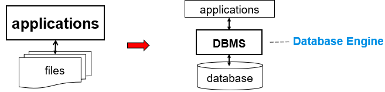
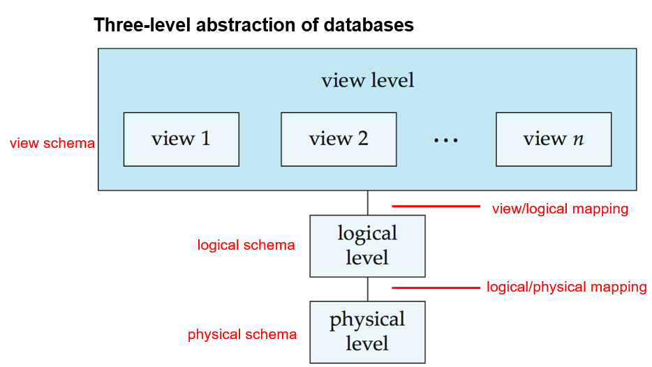
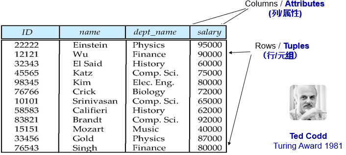
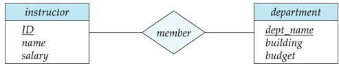
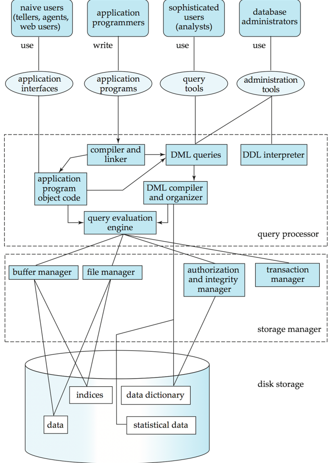
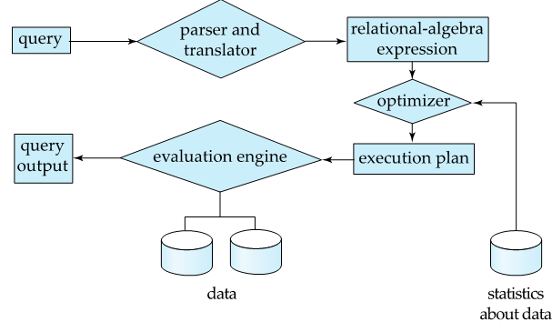
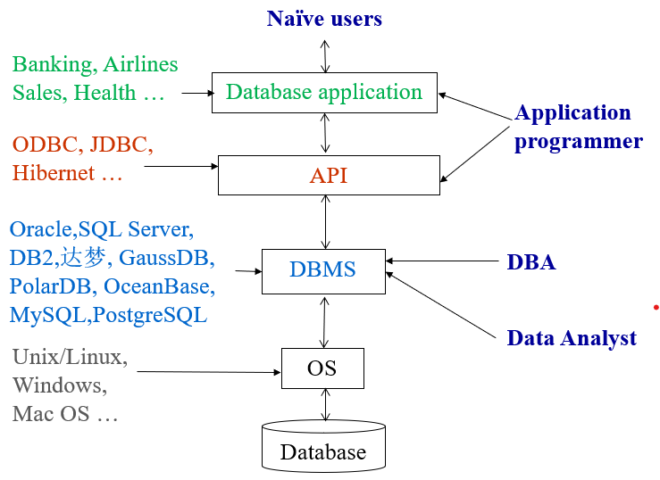

# Chapter1 Introduction

## Database Systems
<center></center>

+ DBMS: Database Management System
    + 其主要目标是提供一种便捷的数据存储和检索的方式
    + Management包括：定义信息存储结构、提供操作信息的机制（增删查改之类）

## Purpose of Database Systems
基于文件系统构建的应用程序会导致：

1. Data redundancy and inconsistency, eg. 多种文件格式、相同的数据存储在多个不同的文件中
2. Data isolation, eg. 数据分散在多个文件中
3. Difficulty in accessing data, eg. 可能需要写一段新代码来访问新的数据
4. Data integrity, 即数据完整性和一致性的约束条件被隐藏在代码细节中而非显示声明
5. Atomicity problems, 即无法确保一个事务中的所有操作要么全部成功执行，要么全部不执行。如果事务中的任何一个操作失败，整个事务必须回滚到初始状态，以确保数据的一致性
6. Concurrent-access anomalies, 并发访问异常
7. Security problems

??? extra "ACID Properties"
    + 原子性（Atomicity）：确保事务中的所有操作要么全部成功执行，要么全部不执行
    + 一致性（Consistency）：事务必须使数据库从一个一致性状态转换到另一个一致性状态，即数据满足所有定义的约束、规则和业务逻辑
    + 隔离性（Isolation）：并发执行的多个事务之间相互隔离、互不干扰，每个事务都感觉不到其他事务的执行过程
    + 持久性（Durability）：一旦事务提交成功，其对数据库所做的修改就会永久保存下来，即使系统出现故障、断电等情况，数据也不会丢失

## View of Data


??? extra "brief explanation"
    + view level：由多个视图组成，每个视图是面向不同用户或应用程序的数据呈现方式，只展示用户感兴趣的部分数据，为不同用户提供了个性化的数据视角。view schema定义这一层的结构。
    + logical level：通过view/logical mappin与视图层相连。逻辑层定义了数据库的整体逻辑结构，描述了数据的组织方式以及数据之间的关系，不涉及数据的物理存储细节。logical scheme定义这一层的结构。
    + physical level：通过logical/physical mapping与逻辑层相连。物理层描述了数据在存储设备上的实际存储方式，包括数据的存储位置、存储结构等物理细节。physical schema定义了这一层的结构。

### Schema and Instance 

> 二者关系类似于变量的`type`和`value`的关系

+ Schema: 数据库的逻辑结构，定义了数据库中包含哪些实体、实体具有哪些属性以及实体之间存在怎样的关系等信息，不包含具体数据
+ Instance: 数据库中实际存储的数据，即数据库中的具体数据

### Data Independence
任一层的修改不会影响其他层

## Data Models 

+ 数据模型是用于描述数据（Data）、数据联系（Data relationships）、数据语义（Data semantics）和数据约束（Data constraints）的工具集合。

+ 常见数据模型类型：
    + 关系模型（Relational model）：以表格形式组织数据，通过行和列存储数据，利用键关联不同表格，是目前应用最广泛的数据模型。
    ??? eg 
        
    + 实体 - 联系数据模型（Entity - Relationship data model）：用于数据库设计阶段，通过实体、属性和联系描述现实世界的数据结构。
    + 基于对象的数据模型（Object - based data models）：包括面向对象数据模型（Object - oriented），将数据和操作封装成对象；对象 - 关系模型（Object - relational），结合了关系模型和面向对象的特点。
    + 半结构化数据模型（Semistructured data model ，XML）：数据结构不严格，XML 是典型代表，常用于数据交换和存储。
    + 其他较旧的模型：网状模型（Network model），以图结构表示数据及联系，节点代表记录，边代表联系；层次模型（Hierarchical model），以树状结构组织数据，有唯一根节点，子节点有父节点。

## Database Languages
### Data Definition Language (DDL)
主要用于定义和管理数据库结构及其组件

??? eg 
    ```sql
    CREATE TABLE Instructor (
        ID CHAR(5),
        Name VARCHAR(20),
        DeptName VARCHAR(20),
        Salary DECIMAL(8, 2),
        PRIMARY KEY (ID)
    );
    ```

+ DDL 编译器会根据语句内容生成一个“表模板”。这个模板定义了表的结构，包括列名、数据类型、约束（如主键、外键）等。
+ DDL 语句执行后，表模板会被存储在 **data dictionary** 中。
+ **data dictionary** 储存了 **metadata**，包括：
    + Database schema
    + Integrity constraints
        + Primary key(唯一标识表中每一行记录的列或列组合)
        + Foreign key(通过Foreign Key来实现，确保一个表中的外键值必须与另一个表中的主键值匹配)
            
        ??? eg 
            ```sql
            CREATE TABLE Employees (
                EmployeeID INT PRIMARY KEY,
                FirstName VARCHAR(50),
                LastName VARCHAR(50),
                DepartmentID INT,
                FOREIGN KEY (DepartmentID) REFERENCES Departments(DepartmentID)
            );
            ```
            则Employees表中的DepartmentID列的值必须在Departments表中的DepartmentID列中存在
    
    + Authorization

### Data Manipulation Language (DML)
> aka query language

> SQL is the most widely used DML

对数据库中的数据进行操作，包括查询、插入、删除、更新等操作。

分两类：

+ Procedural: 用户需要指定如何实现操作

+ Declarative: 用户只需指定需要进行操作的数据，而不需要指定如何实现操作

### SQL Query Language

??? eg 
    ```sql
    SELECT Name, Salary
    FROM Instructor
    WHERE DeptName = 'Physics';
    ```
+ 对于SQL这样的非过程化查询语言，由于其缺乏一些控制结构（如循环、条件判断等），因此不如通用图灵机强大。 
+ SQL同样不支持用户输入、输出到播放设备以及网络间通信等操作。
    + 这样的操作一定得通过一种**host language**来实现，如C、Java等

+ 因此，应用程序的程序一般通过如下二者其中之一来访问到数据库：
    + Language extension to allow embedded SQL
    + SQL API(i.e. Application Programming Interfaces) 例如ODBC/JDBC，这些API允许SQL语句在程序中以字符串的形式传递给DBMS

## Database Design

+ Entity-Relationship Model (实体 - 关系模型)：设计时所确定的实体、属性和联系，并以图形方式表示
    + 图本身没有偏向，实现上可以是关系模型、面向对象模型等

!!! eg
    <center>
    
    </center>

+ 规范化理论：设计数据库时用于减少数据冗余、提高数据一致性和减少数据插入、更新和删除操作的异常

## Database Engine

+ Database Engine被划分为多个模块，各自负责不同的任务。
+ 一个数据库系统的功能组件可以分为：
    + Storage Manager
    + Query Processor
    + Transaction Manager

??? eg "overview"
    <center>
    {width=80%}
    </center>

### Storage Manager
>在 储存于database中的数据 和 应用程序 以及 提交给DBMS的查询之间 提供接口

+ 这一组件主要包括：
    + File Manager
    + Buffer Manager
    + Authorization and Integrity Manager
    + Transaction Manager

由于内存按块读取以及各层缓存之间的速度鸿沟，因此需要buffer 以及 B plus tree 等结构来提高效率

+ 主要负责的任务：
    + 与OS file manager 交互
    + 高效地存储、检索、更新数据

+ Storage Manager 实现了如下几种数据结构，作为物理系统的一部分：
    + Data files：存储database本身
    + Data dictionary：存储metadata，如schema、integrity constraints等
    + Indices：提高查询效率
    + Statistical data


### Query Processor
!!! note "Query Processing"
    1. Parsing and translation 将自然语言转换为关系代数表达式
    2. Optimization 优化查询（利用统计数据、索引、元数据等），选择最佳执行计划
    3. Evaluation 执行查询
    <center>  </center>

+ Query Processor 主要包括：
    + DDL Interpreter
    + DML Compiler
    + Query Evaluation Engine

### Transaction Manager
+ A transaction is a collection of operations that performs a single logical function in a database application
+ Transaction Manager 主要负责：
    + 事务管理
    + 并发控制
    + 故障恢复（例如掉电、系统崩溃等）

## Database Users and Administrators
<center></center>

根据与database系统的交互方式，用户可以分为：

+ Application Programmers: 通过DML调用 与数据库交互
+ Naive Users: 通过已经开发好的某个Application 与数据库交互
+ Database Administrators: 负责数据库的管理、维护、安全等

??? extra "Administrators duties"
    1. Schema definition
    2. Storage structure and access-method definition
    3. Schema and physical-organization modification
    4. Granting of authorization for data access
    5. Routine maintenance
        + 性能优化
        + 定期将数据库备份到远程服务器
        + 确保可用磁盘空间充足，必要时升级磁盘空间