# Chapter 2 The Relational Model

## Structure of Relational Databases
直观来看，一个简单的关系可以可视化为一张表格，其中每一行代表一个元组，每一列代表一个属性。

??? eg 
    

    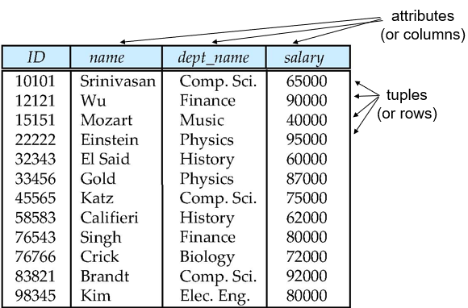
    

### Basic Structure
!!! definition "Relation"
    给定集合 $D_1, D_2, \cdots, D_n$，一个关系 $r$ 是 $D_1 \times D_2 \times \cdots \times D_n$ 的一个子集。

    因此，一个关系可以被视为一个 $n$ 元组 $(a_1, a_2, \cdots, a_n)$ 的集合，其中 $a_i \in D_i$。

    ??? eg 
        

        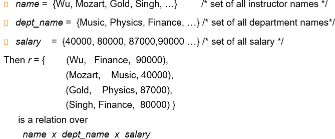
        

### Relational Schema and Instance
+ Schema 是抽象的，描述了关系的结构；而 Instance 是具体的，描述了关系中的元组。
    + $A_1, A_2, \cdots, A_n$ 是 **attributes**, 则 $R = (A_1, A_2, \cdots, A_n)$ 是一个 relation schema
    + $r(R)$ 是指 relation instance $r$ 是定义在 schema $R$ 上的
    + 一个关系当下的值可以用一个表格表示，其中每一行代表一个元组(tuple)，每一列代表一个属性(attribute)

### Attributes
+ Domain 是属性的取值范围
+ Atomic: 属性的值是不可分的，即它应该是一个单一的值而非一个集合
+ Null: 属性的值可以是 NULL，表示未知或不适用；且每一个domain都有一个特殊的值 NULL

## Database Schema and Instances
类似于关系，数据库也有 schema 和 instance 的概念。
??? eg 
    

    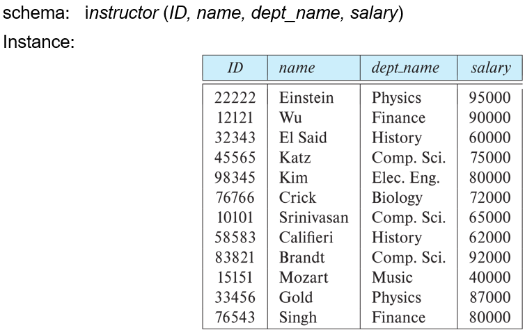
    

## Keys
首先，K $\subseteq$ R，即 K 是 关系 R 的一个子集。

!!! definition "Superkey"
    K 的值足以唯一标识r(R)的一个tuple，则 K 是 R 的 superkey。
    
    例如，$\left\{ ID \right\}$ 和 $\left\{ ID, Name \right\}$ 都是  Instructor 的 superkey。

!!! definition "Candidate Key"
    如果 K 是 superkey，且没有真子集是 superkey，则 K 是 candidate key。

    例如，Instructor 的 candidate key 是 $\left\{ ID \right\}$ 和 $\left\{ Name \right\}$。

!!! definition "Primary Key"
    candidate keys 中的一个被选为 primary key。

!!! definition "Foreign Key"
    + 外键是一个表中的一组Attributes，它引用另一个表中的**主键**
    + Foreign key constraints 确保了引用表$r_1$中的外键A的值必须是被引用表$r_2$中的主键B的值的子集；即对于$r_1$中的每一个元组(行)，属性 $A$ 的值必须在$r_2$的某个元组的主键 $B$ 中出现。
    + Referential integrity: 外键约束确保了引用完整性，即在引用关系r1的任何元组中，出现在指定属性 A 中的值也必须出现在被引用关系 r2 的至少一个元组的指定属性 B 中。

## Schema Diagrams

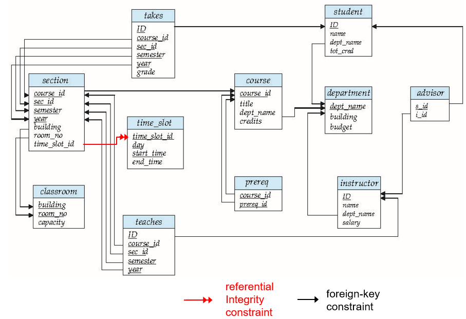

## Relational Query Languages

+ Procedural 而非 Declarative
+ Relational Algebra / Tuple Relational Calculus / Domain Relational Calculus 三者等价
+ 我们主要关注 Relational Algebra
    + 非图灵完备
    + 有6种基本操作
    
## The Relational Algebra
有六种基本操作：

+ Selection **$\sigma$** : 选择满足某一条件的**tuple**

    ??? eg 
        

        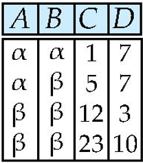
        

        执行 $\sigma_{A=B \land D > 5}(r)$ 得到：
        

        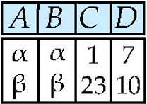
        

+ Projection **$\pi$** : 选择某些**attributes**

    ??? eg 
        

        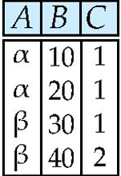
        

        执行 $\pi_{A, C}(r)$ 得到：
        

        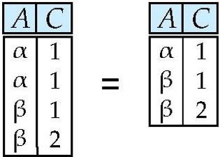
        

    
+ Union **$\cup$** : 两个关系的并集，要求两个关系的 attribute 数量相同，且 attribute 的 domain 应当是兼容的（例如数据类型等应当相同）

    ??? eg 
        

        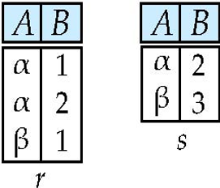
        

        执行 $r \cup s$ 得到：
        

        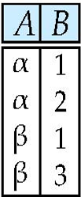
        

+ Set Difference **$-$** : 两个关系的差集，要求与 Union 相同

    ??? eg 
        

        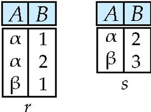
        

        执行 $r - s$ 得到：
        

        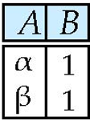
        

+ Cartesian Product **$\times$** : 两个关系的笛卡尔积，即两个关系的所有可能组合

    ??? eg 
        

        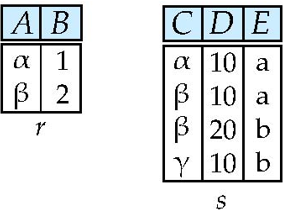
        

        执行 $r \times s$ 得到：
        

        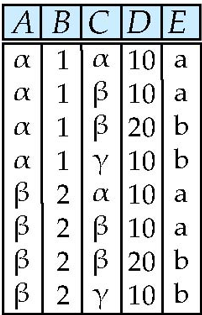
        

+ Rename **$\rho$** : 重命名关系或属性
    + 重命名关系：$\rho_{r_1}(r)$
    + 重命名属性：$\rho_x(A_1, A_2, \cdots, A_n)(r)$

!!! example "Find the largest salary in university"
    + 需要比较不同教师的salary，因此需要重命名一次后用笛卡尔积将所有可能的组合找出：
    

    $Instructor \times \rho_d (Instructor)$
    

    + 进行反选，找出所有不是最大salary的组合：
    

    $\sigma_{Instructor.salary < d.salary}(Instructor \times \rho_d(Instructor)$
    

    + 选择salary属性，原表减去上一步的结果即可：
    

    $\pi_{salary}(Instructor) - \pi_{Instructor.salary}(\sigma_{Instructor.salary < d.salary}(Instructor \times \rho_d(Instructor))$
    

### Additional Operations
+ Intersection **$\cap$** : 两个关系的交集，
可表达为 $r \cap s = r - (r - s)$

    ??? eg 
        

        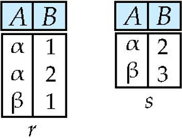
        

        执行 $r \cap s$ 得到：
        

        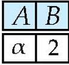
        

+ Natural Join **$\bowtie$** : 两个关系的自然连接，将两个关系相乘，然后选择两个关系中相同属性的值相等的元组

    ??? eg 
        $R = (A, B, C, D)$, $S = (B, D, E)$

        + $r \bowtie s = \Pi_{r.A, r.B, r.C, r.D, s.E}(\sigma_{r.B = s.B \land r.D = s.D}(r \times s))$

    ??? extra "natural join and Theta join"
        + natural join: 满足交换律和结合律
        + theta join: $r \bowtie_{\theta} s = \sigma_{\theta}(r \times s)$

+ Outer Join **$\ltimes$**, **$\rtimes$** **$⟗$**:  避免了连接过程中信息的丢失。先进行自然连接然后将没有匹配的元组补全，缺失的属性用 NULL 填充

    !!! eg 
        

        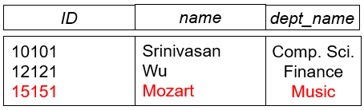
        

        
        === "natural join"
            $Instructor \bowtie teaches$ 得到：
            

            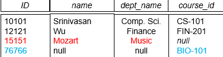
            

        === "left outer join"
            $Instructor \ltimes teaches$ 得到：
            

            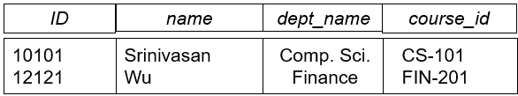
            

        === "right outer join"
            $Instructor \rtimes teaches$ 得到：
            

            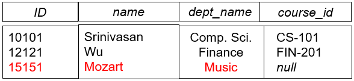
            

        === "full outer join"
            $Instructor ⟗ teaches$ 得到：
            

            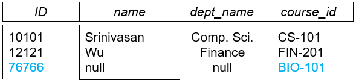
            

    
    !!! note "Outer Join using Joins"
        + 左外连接：左外连接返回关系𝑟中的所有行，以及与𝑠匹配的行。如果没有匹配的行，结果会为𝑠中的列填充空值：
        

        $r \ltimes s = (r \bowtie s) \cup (r - \pi_{R} (r \bowtie s) \times \left\{ NULL, NULL, \cdots \right\})$ 
        

        + 右外连接：右外连接返回关系𝑠中的所有行，以及与𝑟匹配的行。如果没有匹配的行，结果会为𝑟中的列填充空值：
        

        $r \rtimes s = (r \bowtie s) \cup \left\{ NULL, NULL, \cdots \right\} \times (s - \pi_{S} (r \bowtie s))$
        

        + 全外连接：全外连接返回两个关系的所有行，如果没有匹配的行，结果会为对应的列填充空值：
        

        $r ⟗ s = (r \bowtie s) \cup (r - \pi_{R} (r \bowtie s) \times \left\{ NULL, NULL, \cdots \right\}) \cup \left\{ NULL, NULL, \cdots \right\} \times (s - \pi_{S} (r \bowtie s))$
        

+ Semijoin **$\ltimes_{\theta}$** :  $r \ltimes_{\theta} s = \pi_{R}(r \bowtie_{\theta} s)$，后续查询优化中常用

    ??? eg 
        

        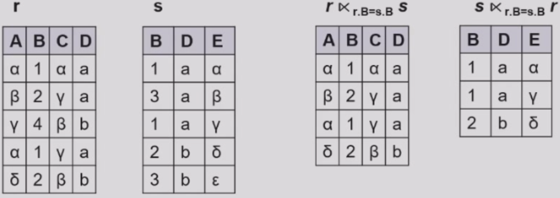
        

        

+ Assignment **$\leftarrow$** 
+ Division **$\div$** : 给定关系 $r(R)$ 和 $s(S)$，满足$S \in R$, $R \div S$ 是使得 $t \times s \in r$ 的最大关系 $t(R-S)$
    + $s$ 的属性集合必须是 $r$ 的属性集合的子集
    + $r \div s$ 的结果是一个关系，其属性集合是 $r$ 的属性集合减去 $s$ 的属性集合
    + $r \div s$ 的结果是 $r$ 中的元组，且这些元组和 $s$ 的笛卡尔积的结果中的每一个元组都能在 $r$ 中找到一个匹配的元组

    ??? eg 
        

        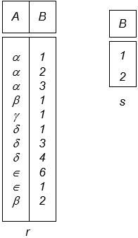
        

        执行 $r \div s$ 得到：
        

        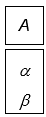
        

$r \div s$ 可以写成：

$$
\begin{align*}
    temp1 & \leftarrow \Pi_{R-S}(r)\\
    temp2 & \leftarrow \Pi_{R-S}((temp1 \times s)- \Pi_{R-S,S}(r))\\
    result & = temp1 - temp2
\end{align*}
$$

<fontsize = 500px>上述 additional operations 都没有增加查询能力，只是为了方便查询。</fontsize>

### Extended Relational Algebra Operations

#### Generalized Projection

在投影的条件中允许使用算术表达式，例如：
$\Pi_{ID, Salary, Salary/12}(Instructor)$
知道年薪可以查询月薪

#### Aggregation Functions and Operations

+ Aggregation Functions: 
    1. AVG: 平均值
    2. SUM: 求和
    3. COUNT: 计数(非空)
    4. MAX: 最大值
    5. MIN: 最小值

+ Aggregation Operations in relational algebra

$_{G_1, G_2, \cdots, G_n}\mathcal{G}_{F_1(A_1), F_2(A_2), \cdots, F_n(A_n)}(E)$

    其中：
    + $G_1, G_2, \cdots, G_n$ 是分组属性
    + $F_1(A_1), F_2(A_2), \cdots, F_n(A_n)$ 是上述五种聚合函数，$A_i$ 是属性
    + $E$ 是任何一个关系代数表达式