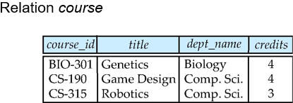
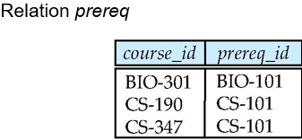
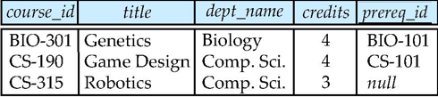
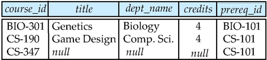
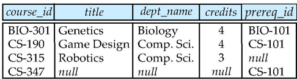
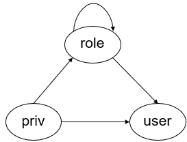

# Chapter 4 Intermediate SQL

## Joined Relation

+ Join 一般用在from子句中，用来连接两个或多个表

+ Join types
    + Inner join
    + Outer join
        + Left outer join
        + Right outer join
        + Full outer join

```sql
A join B  -- 默认是inner join 
on <condition> -- 指定任意连接条件
```

```sql
A join B
using (a1, a2, ..., an) -- 必须指定A和B的相同列名（不需要表名前缀）
```

??? eg
    有如下两个表
    <center></center>
    <center></center>

    === "c natural left outer join p"
        <center></center>
    
    === "c natural right outer join p"
        <center></center>
    
    === "c natural full outer join p"
        <center></center>
    
    `inner join` 则不会显示没有匹配的行，且`inner join` 需要指定连接条件

## SQL Data Types and Schemas

### User-Defined Types

```sql
    create type dollar as numeric(10, 2) final;
    create table account (
        account_number integer primary key,
        balance dollar
    );
```

好处是可以强制类型检查，即使基础数据类型相同，也不会被认为是同一类型

### Domains

对现有数据类型进行约束

```sql
    create domain degree_level as varchar(10) 
    constraint degree_level_check 
    check (value in ('associate', 'bachelor', 'master', 'doctoral'));
```

### Large-Object Types

+ blob: binary large object

??? abstract "MySQL Blob"
    + TINYBLOB: 0-255 bytes
    + BLOB: 0-64KB
    + MEDIUMBLOB: 0-16MB
    + LargeBLOB: 0-4GB

+ clob: character large object(文本)

## Integrity Constraints

+ not null
+ primary key
+ unique
    + 单列中，确保每个元组的某个属性的值是唯一的
    + `unique (a1, a2, ..., an)` 表示在关系中`a1, a2, ..., an`组合为一个superkey
    + 不一定是candidate key
    ```sql
        create table student (
            ID integer primary key,
            name varchar(20),
            Email varchar(50) unique
        );
    ```

+ check(P), where P is a predicate
    + 用来限制属性的取值范围
    ```sql
        create table student (
            ID integer primary key,
            name varchar(20),
            Email varchar(50) unique,
            GPA numeric(3, 2) check (GPA >= 0.0 and GPA <= 4.0)
        );
    ```
    + 可以更复杂，但不是所有DBMS都支持
    ```sql
        check((course_id, sec_id, semester, year) in (
            select course_id, sec_id, semester, year
            from section
        ));
    ```

+ foreign key

### Intergrity Constraints Violation During Transactions

可以自行规定，在事务结束后再进行检查而不是在过程中检查

例如：
```sql
create table person(
    ID char(10),
    name char(40),
    mother char(10),
    father char(10),
    primary key (ID),
    foreign key (father) references person(ID) deferrable initially deferred, -- deferrable 可延迟
    foreign key (mother) references person(ID) deferrable initially deferred
);
```
### Assertions

+ 用来定义复杂的完整性约束，很好但是开销大

??? eg 
    ```sql
    create assertion credits_earned_constraint check (
        not exists (
            select ID
            from student
            where tot_cred <> (
                select sum(credits)
                from takes natural join course
                where student.ID = takes.ID and grade is not null
                and grade <> 'F'
            )
        )
    );
    ```

## Views

+ 隐藏细节，简化用户的操作
+ 方便权限管理
+ 数据独立性

### View Definition

`create view view_name as <query expression>`

+ 可以指定列名：
    ```sql
    create view instructor_name as
    select ID, name, dept_name
    from instructor;
    ```

+ 可以指定列的类型：
    ```sql
    create view department_total_salary(dept_name, total_salary) as
    select dept_name, sum(salary)
    from instructor
    group by dept_name;
    ```

+ 可以在视图上定义视图
    ```sql
    create view instructor_name as
    select ID, name, dept_name
    from instructor;
    create view instructor_name_salary as
    select ID, name, salary
    from instructor_name;
    ```

### Update of Views

+ insert: 在视图上插入数据的同时，也会插入到基表中（未包含的列会null）
    ```sql
    insert into instructor_name values ('10101', 'Srinivasan', 'Comp. Sci.');
    -- 实际上相当于执行：
    -- insert into instructor values ('10101', 'Srinivasan', 'Comp. Sci.', null, null);
    ```

+ 如果基表中`primary key`以及`not null`约束未包含在视图中，则一般不支持更新操作

### Materialized Views

+ 一般而言，视图都是虚拟的，相当于一个窗子，窗内是基表；
+ 如果要求视图对应一个物理上存在的临时表，则需要使用`materialized view`
    ```sql
    create materialized view instructor_name as
    select ID, name, dept_name
    from instructor;
    ```
+ 增量式更新：只更新变化的部分

### View and Logical Data Independence

若将一个大表`S(a, b, c)`分解为`S1(a, b)`和`S2(a, c)`，可使用View解决：
```sql
create table S1 ...;
create table S2 ...;
insert into S1 select a, b from S;
insert into S2 select a, c from S;
drop table S;
create view S as (
    select a, b, c
    from S1 natural join S2
);
```

## Indexes

+ 用来加速查询

```sql
create table student (
    ID varchar(5),
    name varchar(20),
    dept_name varchar(20),
    tot_cred numeric(3, 0) default 0,
    primary key (ID)
);
```

可创建如下索引：
```sql
create index student_index on student(ID);
```
数据在内存中按块存储，索引相当于建立了B+树，加速查找


## Transactions

+ 事务是一组操作，要么全部执行，要么全部不执行
+ 事务的边界由`begin transaction`和`commit`或者`rollback`确定
    + `commit` 会将事务的结果永久保存到数据库
    + `roll back` 会撤销事务操作
    + 事务的长短也需要考虑，太长会导致锁定时间过长，太短会导致频繁的开启和关闭事务
+ 大多数database默认的做法是：每个SQL语句都是一个事务，会自动提交
    + 在MySQL中，`set autocommit = 0`可以关闭自动提交

??? eg 
    ```sql 
    set autocommit = 0
    update account set balance = balance - 100 where account_number = 12345;
    update account set balance = balance + 100 where account_number = 54321;
    commit;
    
    update account set balance = balance - 100 where account_number = 12345;
    update account set balance = balance + 100 where account_number = 54321;
    commit;

    update account set balance = balance + balance * 2.5%;
    commit;
    ```

### ACID Properties

+ Atomicity：事务是不可分割的最小单元，要么全部成功要么全部失败
+ Consistency：事务执行前后，数据库必须保持一致性
+ Isolation：多个事务可以并发但要互不干扰
+ Durability：事务一旦成功提交，则对数据库的改变是永久性的，即使系统故障。

## Authorization

+ 数据层面：
    1. select - reading but not modification of data
    2. insert - adding new data but not changing existing data
    3. update - modification but not deletion of data
    4. delete - deletion of data

+ 模式层面：
    1. Resources(MySQL:Create) - creation of new relations
    2. Alteration - addition and deletion of attributes
    3. Drop - deletion of relations
    4. Index - creation and deletion of indices
    5. Create view - creation of views

### Authorization Specification in SQL

+ `grant` - 授权
    ```sql
    grant <privileges> 
    on <relation name or view name>
    to <user list>
    ```
    + `<user list>` 包括下面几种：
        1. 用户ID
        2. public - 所有有效用户
        3. A role 

    ??? eg 
        ```sql
        grant select on instructor to U1, U2;
        grant select on department to public;
        grant update (salary) on instructor to U3;
        grant all privileges on instructor to U4;
        ```

    + 对View授权并不会为对应的基表授权 

+ `revoke` - 撤销授权
    ```sql
    revoke <privileges> 
    on <relation name or view name>
    from <user list>
    ```

    + 如果有两个不同的授权者对同一个用户授权了相同的权限，那么在一次撤销后，用户仍可能拥有该权限

    + 如果两个权限之间有依赖关系，那么撤销其中一个权限可能会导致另一个权限也被撤销

### Roles

+ 可以理解为权限的集合，可以将权限集中到一个角色中，然后将角色授予用户；也可以基于一个role创建另一个role
    + 好处是方便管理、扩展性好

<center></center>

??? eg 
    
    === "priv->role->user"
        ```sql
        create role instructor_role;
        grant select on instructor to instructor_role;
        grant instructor_role to U1;
        ```

    === "role->role"
        ```sql
        create role dean;
        grant instructor_role to dean;
        grant dean to Satoshi;
        ```
    
### Other Authorization Features

+ 引用相关的授权
    + `grant references` - 允许用户在其他表中引用当前表的外键
    ```sql
    grant references (dept_name) on department to U1;
    ```
    + 为何需要这个权限？

+ 权限的转移：
    + `with grant option` - 允许用户将自己拥有的权限授予其他用户

??? eg 
    ```sql
    grant select on department to A with grant option; -- A可以将select权限授予其他用户
    revoke select on department from A, B cascade; -- 撤销A和B的select权限，同时撤销A和B将select权限授予其他用户的权限
    revoke select on department from A, B restrict; -- 撤销A和B的select权限，但是如果A和B将select权限授予其他用户，则不会撤销
    revoke grant option for select on department from A; -- 撤销A将select权限授予其他用户的权限
    ```

