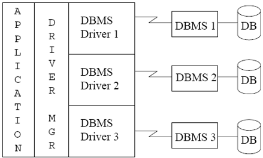

# Chapter 5 Advanced SQL

## Accessing SQL from a Programming Language

并非所有查询都可以用SQL来表示，因为
人机交互时使用图形界面、发送语音图像等，无法只通过SQL来实现

从通用编程语言中调用SQL主要有两种方式：
1. API（类似于库函数）
2. Embedded SQL
    + 将SQL语句嵌入到编程语言中，编译时会转换为函数调用
    + 在运行时，这些函数调用会通过API来执行SQL语句

### JDBC & ODBC
> 二者都是程序与数据库之间的API

+ ODBC(Open Database Connectivity): with C, C++, C#
+ JDBC(Java Database Connectivity): with Java
    
应用程序通过调用：

+ 和 Database server 连接
+ 将SQL指令发送给database server
+ 将结果元组one by one返回给应用程序

#### JDBC

+ JDBC支持元数据检索，可以获取数据库的schema相关信息
+ Model for communicating with databases:
    1. Open a connection to the database
    2. Create a **statement** object
    3. Execute SQL queries using the statement object to send queries and fetch results
    4. Exception mechanism to handle errors

??? eg "update"
    ```java
    try{
        stmt.executeUpdate("insert into instructor values ('10101', 'Srinivasan', 'Comp. Sci.', 65000)");
    } catch (SQLException e) {
        System.out.println("Insertion failed: " + e);
    }
    ```

??? eg "execute and fetch"
    ```java
    ResultSet rs = stmt.executeQuery("select * from instructor");
    while (rs.next()) {
        System.out.println(rs.getString("ID") + " " + rs.getString("name"));
    }
    ```

??? eg "Details"
    
    === "Getting result field"
        ```java
        rs.getString("ID") and rs.getString(1)
        ```
        二者等价，但是前者更易读

    === "Dealing with NULL"
        ```java
        int a = rs.getInt("salary");
        if (rs.wasNull()) {
            System.out.println("salary is NULL");
        }
        ```

##### Prepared Statements

SQL语句中某些参数可以在运行过程中再确定，这时候可以使用prepared statement

??? eg 
    ```java
    PreparedStatement pstmt = conn.prepareStatement("insert into instructor values (?, ?, ?, ?)");
    pstmt.setString(1, "10101"); // set first parameter to 10101
    pstmt.setString(2, "Srinivasan");
    pstmt.setString(3, "Comp. Sci.");
    pstmt.setInt(4, 65000);
    pstmt.executeUpdate();
    ```
    其中`?`是占位符，可以在运行时再确定

+ **Never use string concatenation** to build SQL queries

!!! warning "SQL Injection"
    ```java
    String name = "Srinivasan";
    stmt.executeUpdate("insert into instructor values ('10101', '" + name + "', 'Comp. Sci.', 65000)");
    ```
    如果`name`是用户输入的，那么用户可以通过输入`' or 1=1 --`来绕过验证，造成SQL注入

##### Metadata Features

将`ResultSetMetaData`对象放在`ResultSet`对象中，可以获取元数据信息

??? eg
    ```java
    ResultSet rs = stmt.executeQuery("select * from instructor");
    ResultSetMetaData rsmd = rs.getMetaData();
    for (int i = 1; i <= rsmd.getColumnCount(); i++) {
        System.out.println(rsmd.getColumnName(i));
        System.out.println(rsmd.getColumnTypeName(i));
    }
    ```

    ```java
    DatabaseMetaData dbmd = conn.getMetaData();
    ResultSet rs = dbmd.getTables(null, "univdb", "department", "%");
    while (rs.next()) {
        System.out.println(rs.getString("COLUMN_NAME"), rs.getString("TYPE_NAME"));
    }
    ```

##### Transaction Control in JDBC

+ 默认情况下，每个SQL语句都是一个transaction
+ `conn.setAutoCommit(false)`可以关闭自动提交，需要手动提交
+ `conn.commit()`提交
+ `conn.rollback()`回滚

##### SQLJ

SQLJ是Java的一个扩展，可以将SQL语句嵌入到Java程序中

```java
#sql iterator InstructorIterator {
    String ID;
    String name;
    String dept_name;
    int salary;
};
while (instructorIterator.next()) {
    String deptName = iterator.dept_name();
    int salary = iterator.salary();
    System.out.println(deptName + " " + salary);
}
iterator.close();
```

#### ODBC

每个支持ODBC的数据库都有一个"driver" library，与客户端程序连接

<center></center>

??? eg
    ```c
    int ODBCexample(){
        RETCODE rc;
        HENV henv; // environment handle
        HDBC hdbc; // connection handle
        HSTMT hstmt; // statement handle
        SQLAllocEnv(&henv); // allocate environment handle
        SQLAllocConnect(henv, &hdbc); // allocate connection handle
        SQLConnect(hdbc, "univdb", "user", SQL_NTS, // "password"); // connect to database
        {//do actual work}
        SQLDisconnect(hdbc); // disconnect from database
        SQLFreeConnect(hdbc); // free connection handle
        SQLFreeEnv(henv); // free environment handle
    }
    其中`SQL_NTS`表示字符串以null结尾
    ```

+ `SQLExecDirect` - 程序将SQL语句发送给数据库
+ `SQLFetch` - 从数据库中获取结果
+ `SQLBindCol` - 将结果绑定到变量上

??? eg "main body of program"
    ```c
    char deptName[80];
    float salary;
    int lenOut1, lenOut2;
    HSTMT hstmt;
    char *sqlquery = "select dept_name, sum(salary) from instructor group by dept_name";
    SQLAllocStmt(hdbc, &hstmt);
    err = SQLExecDirect(hstmt, sqlquery, SQL_NTS);
    if (err == SQL_SUCCESS){
        SQLBindCol(hstmt, 1, SQL_C_CHAR, deptName, 80, &lenOut1);
        SQLBindCol(hstmt, 2, SQL_C_FLOAT, &salary, 0, &lenOut2);
        while (SQLFetch(hstmt) != SQL_NO_DATA){
            printf("%s %f\n", deptName, salary);
        }
    }
    SQLFreeStmt(hstmt, SQL_DROP);
    ```

##### Prepared Statements

+ `SQLPrepare` - 准备SQL语句
+ `SQLBindParameter` - 绑定参数
+ `SQLExecute` - 执行

??? eg
    ```c
    char *sqlquery = "insert into instructor values (?, ?, ?, ?)";
    SQLPrepare(hstmt, sqlquery, SQL_NTS);
    SQLBindParameter(hstmt, 1, SQL_PARAM_INPUT, SQL_C_CHAR, SQL_CHAR, 0, 0, "10101", 0, NULL);
    SQLBindParameter(hstmt, 2, SQL_PARAM_INPUT, SQL_C_CHAR, SQL_CHAR, 0, 0, "Srinivasan", 0, NULL);
    SQLBindParameter(hstmt, 3, SQL_PARAM_INPUT, SQL_C_CHAR, SQL_CHAR, 0, 0, "Comp. Sci.", 0, NULL);
    SQLBindParameter(hstmt, 4, SQL_PARAM_INPUT, SQL_C_FLOAT, SQL_FLOAT, 0, 0, 65000, 0, NULL);
    SQLExecute(hstmt);
    ```

##### More on ODBC
+ 也支持元数据检索
+ Transaction control
    + 默认情况下，每个SQL语句都是一个transaction
    + SQLSetConnectOption(hdbc, SQL_AUTOCOMMIT, 0)关闭自动提交
    + SQLTransact(hdbc, SQL_COMMIT)提交
    + SQLTransact(hdbc, SQL_ROLLBACK)回滚

##### Embedded SQL

+ SQL嵌入的语言称为host language
+ 在C中，可以使用`EXEC SQL`来嵌入SQL语句

+ 嵌入时，主要有三个问题要考虑：
    1. 标记SQL语句的开始和结束：`EXEC SQL<SQL statement>END-EXEC`
    2. database 和 programming language 之间的通信：`SQLCA` 和 `SQLDA` 结构
    3. 数据类型的转换：例如 SQL中`Date`转换为C中的`char(12)` 

??? eg

    === "insert"
        ```c
        main(){
            EXEC SQL INCLUDE SQLCA; //声明段开始
                EXEC SQL BEGIN DECLARE SECTION;
                char account_no [11];    //host variables(宿主变量)声明
                char branch_name [16];
                int  balance;  
            EXEC SQL END DECLARE SECTION;//声明段结束
            EXEC SQL CONNECT  TO  bank_db  USER Adam Using Eve; 
            scanf (“%s  %s  %d”, account_no, branch_name, balance);
            EXEC SQL insert into account 
                            values (:account_no, :branch_name, :balance);
            If (SQLCA.sqlcode ! = 0)    printf ( “Error!\n”);
            else       printf (“Success!\n”);
            
        }
        ```
    
    === "delete"
        ```c
        main()
        {  EXEC SQL INCLUDE SQLCA; //声明段开始
            EXEC SQL BEGIN DECLARE SECTION;
              char account_no [11];    //host variables(宿主变量)声明
           EXEC SQL END DECLARE SECTION;//声明段结束
           EXEC SQL CONNECT  TO  bank_db  USER Adam Using Eve; 
           scanf (“%s”, account_no);
           EXEC SQL delete from account where
                              account_number=:account_no;
           If (SQLCA.sqlcode ! = 0)    printf ( “Error!\n”);
           else       printf (“Success!\n”);
        }
        ```

    === "update"
        ```c
        main( )
        {  EXEC SQL INCLUDE SQLCA; //声明段开始
            EXEC SQL BEGIN DECLARE SECTION;
              char account_no [11];    //host variables(宿主变量)声明
              int  balance;  
           EXEC SQL END DECLARE SECTION;//声明段结束
           EXEC SQL CONNECT  TO  bank_db  USER Adam Using Eve; 
           scanf (“%s  %d”, account_no, balance);
           EXEC SQL update account
                               set balance= balance+:balance
                               where account_number = :account_no;
           If (SQLCA sqlcode ! = 0)    printf ( “Error!\n”);
           else       printf (“Success!\n”);
        }
        ```

    === "select single record"
        ```c
        main( )
        {  EXEC SQL INCLUDE SQLCA; //声明段开始
            EXEC SQL BEGIN DECLARE SECTION;
              char account_no [11];    //host variables(宿主变量)声明
              int  balance; 
           EXEC SQL END DECLARE SECTION;//声明段结束
           EXEC SQL CONNECT  TO  bank_db  USER Adam Using Eve; 
           scanf (“%s ”, account_no);
           EXEC SQL  select balance into :balance
                                from account 
                                where account_number = :account_no;
           If (SQLCA sqlcode ! = 0)    printf ( “Error!\n”);
           else       printf (“balance= %d \n”, balance);
        }
        ```

    === "with cursor"
        ```c
         main( )
        {  EXEC SQL INCLUDE SQLCA; 
            EXEC SQL BEGIN DECLARE SECTION;
              char customer_name[21]; 
              char account_no [11]; 
              int  balance; 
           EXEC SQL END DECLARE SECTION;
           EXEC SQL CONNECT  TO  bank_db  USER Adam Using Eve; 
        
           EXEC SQL DECLARE account_cursor CURSOR for
                      select account_number, balance 
                      from depositor natural join account
                      where depositor.customer_name = : customer_name;
                       scanf (“%s”, customer_name);
                      EXEC SQL open account_cursor;
                      for (; ;) 
                      {   EXEC SQL fetch account_cursor into :account_no, :balance;
                            if (SQLCA.sqlcode!=0) 
                        break;
                            printf( “%s  %d \ n”, account_no, balance);
                        }

                        EXEC SQL close account_cursor;
            }
        ```     

    === "where current of"
        ```c
        main()
        {  EXEC SQL INCLUDE SQLCA; 
            EXEC SQL BEGIN DECLARE SECTION;
                char account_no [11]; 
                int  balance; 
            EXEC SQL END DECLARE SECTION;
            EXEC SQL CONNECT  TO  bank_db  USER Adam Using Eve; 
            scanf (“%s”, account_no);
            EXEC SQL  select balance into :balance
                                from account 
                                where account_number = :account_no;
            If (SQLCA sqlcode ! = 0)    printf ( “Error!\n”);
            else       printf (“balance= %d \n”, balance);
            EXEC SQL update account
                                set balance= balance+100
                                where current of account_cursor;
        }
        ```   

## Procedural Extension and Stored Procedures

+ SQL支持模块化的语言特性：
    + 允许使用if-then-else、while、loop等控制结构来定义procedure
+ Stored Procedure
    + 在数据库中存储procedures
    + 使用call语句调用从而执行
    + 允许外部应用操作数据库，而不需要知道内部细节

### Functions and Procedures

+ Function
    + 有返回值，返回值可以是一个标量值或者一个表
    + 可以用在SQL语句中

??? eg "function"
    === "返回一个值"
        ```sql
        create function dept_count(dept_name varchar(20)) 
        returns integer
        begin
            declare count integer;
            select count(*) into count 
            from instructor 
            where dept_name = dept_name;
            return count;
        end;
        ```

    === "返回一个表"
        ```sql
        create function instructor_of(dept_name varchar(20))
            returns table(
                ID char(5),
                name varchar(20),
                salary integer
            )
        return table(
            select ID, name, salary
            from instructor
            where dept_name = dept_name
        );
        -- usage
        select * from table(instructor_of('Comp. Sci.'));
        ```

    + `returns` - 返回值类型
    + `declare` - 声明变量
    + `select ... into` - 将查询结果赋值给变量
    首先进行语法检查和查询优化，然后转换为关系代数表达式，再生成目标代码，储存在数据库中

    具体的调用例子如：
    ```sql
    select dept_name, budget
    from department
    where dept_count(dept_name) > 2;
    ```

+ Procedure
    + 通常执行操作而不是返回结果
    + 有输入参数和输出参数(in, out)
    + 需要使用`call`语句来调用

??? eg "procedure"
    function中的例子可以改为procedure
    ```sql
    create procedure dept_count_proc(in dept_name varchar(20), out count integer)
    begin
        select count(*) into count 
        from instructor 
        where dept_name = dept_name;
    end;
    ```
    调用：
    ```sql
    declare count integer;
    call dept_count_proc('Comp. Sci.', count);
    ```

??? eg "procedure constructs"
    
    === "while & repeat"
        ```sql
        declare n integer default 0;
        while n < 10 do
            set n = n + 1;
        end while;
        ```
        也可以用repeat:
        ```sql
        repeat
            set n = n + 1;
        until n = 10
        end repeat;
        ```
    
    === "for-loop"
        ```sql
        declare n integer default 0;
        for r as 
            select budget from department
            where dept_name = 'Comp. Sci.'
        do
            set n = n + r.budget;
        end for;
        ```

    === "if-then-else"
        ```sql
        if boolean expression then
            statement;
        else
            statement;
        end if;
        ```
    
### External Language Functions/Procedures

允许在SQL中调用外部函数，例如C、Java等，例如：
```sql
create procedure dept_count_proc(in dept_name varchar(20), out count integer)
language C
external name '/usr/avi/bin/dept_count_proc';
return integer
language C
external name '/usr/avi/bin/dept_count';
```
外部代码加载到数据库的过程中可能会有意外破坏数据库结构、访问未授权数据等问题，需要用沙箱机制或者在独立的进程中运行

## Triggers

+ 触发器是一种在修改数据时自动执行的机制
+ ECA rule:
    + Event: insert, update, delete, etc.
    + Condition: when, where, etc.
    + Action: sql statement

??? eg "trigger"

    ```sql
    record the transaction in account_log if the balance changes by more than 1000
    create trigger account_trigger 
    after update of account on balance
    referencing new row as nrow
    referencing old row as orow
    for each row
    when nrow.balance - orow.balance > 1000 or 
         orow.balance - nrow.balance > 1000
    begin
        insert into account_log values (nrow.account_no, nrow.balance - orow.balance, current_time());
    end;
    ```

trigger 也可以用来检验数据的完整性，例如：

```sql
create trigger timeslot_check after insert on section
referencing new row as nrow
for each row
when(
    nrom.time_slot_id not in(
        select time_slot_id 
        from time_slot
    )
) 
begin 
    rollback;
end;
```

+ `referencing` - 引用新旧行
    + `referencing new row as nrow`: for delete, update
    + `referencing old row as orow`: for update, delete
+ `for each row` - 每次修改一行

### Statement-Level Triggers

+ `for each row` - 针对每一行受影响的数据触发
+ `for each statement` - 针对每一条SQL语句触发，即只触发一次
+ `referencing new table as ntab` - 引用新表