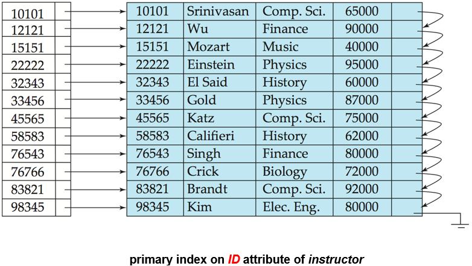
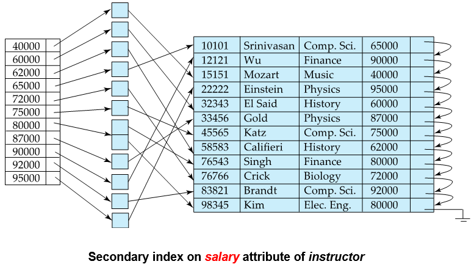
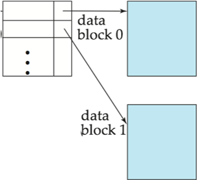
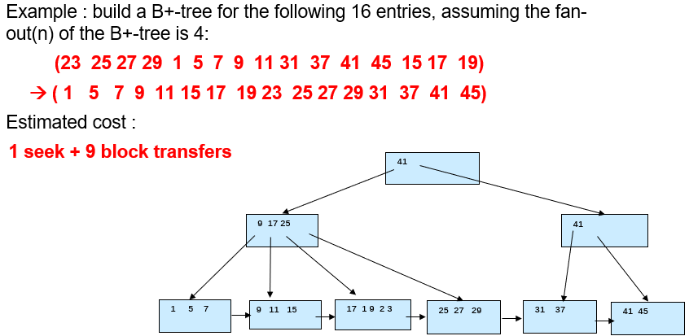
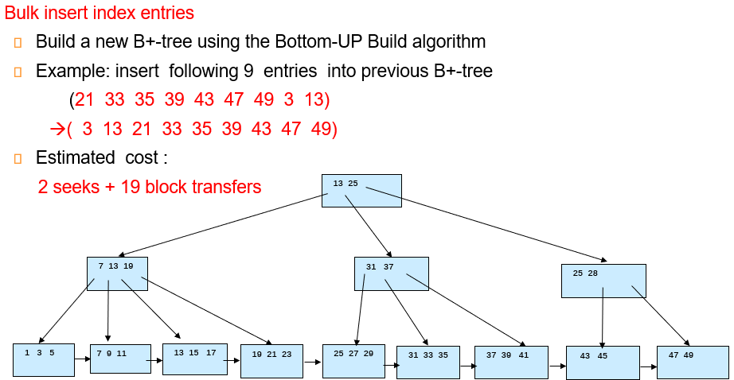
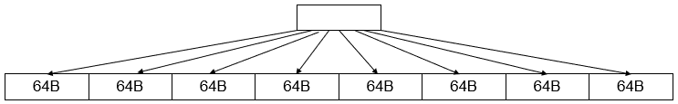
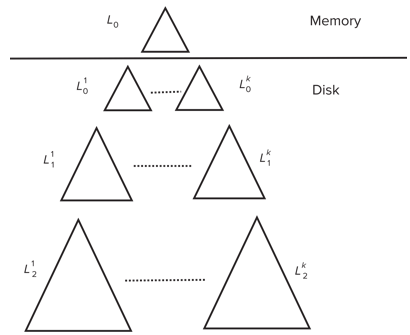

# Chapter 14 Indexing 

## Basic Concepts

+ 索引机制是用来加速访问的
+ Search Key: attribute/ set of attributes, 在file中查找records
+ index file: 由一系列 index entries 组成
    + index entries: 
    [search-key | pointer]
    

+ 索引有两种基本类型：
    + Ordered indices 
    + Hash indices 

+ 索引评估指标：
    + 支持的高效访问类型： Point / Range 
    + Access / Insertion / Deletion time 
    + Space overhead

## Ordered Indices

> index entries 按照 search-key 排序后存储在 index file 中

+ Primary Index: 指在一个顺序排列的文件中，其search-key 指定了该文件顺序的索引
    + aka clustered index(聚集索引)
    + 通常是，但不是必须由主键构成的
    + **Index-sequential file**: 数据文件顺序排列且有一个主索引

+ Secondary Index: 其search-key指定的顺序和文件的顺序不同的索引
    + aka non-clustered index(非聚集索引)

??? eg 
    + primary index:
    
    + secondary index:
    

> 主索引和数据文件顺序一致，点查和范围查都很快
> Secondary Index 可能出现一个search-key对应多个record的情况

+ Dense Index(稠密索引): 索引文件中包含所有的search-key值
+ Sparse Index(稀疏索引): 索引文件中只包含一部分search-key值

> Dense Index 空间开销和维护开销大，但定位快

> Sparse Index 空间开销和维护开销小，但定位慢

??? solution "tradeoff"
    + 对文件中每一个block建立一个index entry，如此构成sparse index
    <center>  </center>


+ Multi-level Index: 
    + 当primary index太大，不适用于内存时
    + 将primary index当作磁盘上的顺序文件对待，为其建立sparse index
        1. outer index: 为 primary index 构建的索引
        2. inner index: primary index file 
    + 同理可以建立多级索引
    + 注意维护时要同步更新

## B+ Tree Index 

??? note "B+ 树"
    + 根到叶所有路径等长
    + 内部节点（即非根非叶节点）有$[\lceil n/2 \rceil, n]$个子节点
    + 各个叶节点储存$[\lceil \frac{n-1}{2} \rceil, n-1]$个值
        + 特例：根非叶，则至少两个子节点；根是叶，则0到n-1个值
    + 叶节点之间有指针相连，形成一个有序链表
    + 叶节点存储数据，非叶节点存储索引

### Observations

+ 内部节点之间由指针连接，因此逻辑上相近的块不需要物理上相近
+ 非叶节点实际构成了一个稀疏索引
+ 对于一棵 n 阶的B+树，如果它包含K 个 search-key 值，则:
    + 高度至多为 $\lceil \log_{\lceil \frac{n}{2} \rceil} (\frac{K}{2}) \rceil + 1$    
    + 高度至少为 $\lceil \log_{n} K \rceil$
+ 实际应用中一个叶节点的大小通常和一个disk block大小相同，一般是4KB
    + 相应的阶数n在100附近

### height and size estimation

+ fan-out: $ n = \lceil \frac{block\_ size - pointer\_ size}{Search\_ key\_ size + pointer\_ size} \rceil + 1$

### B+ Tree File Organization

叶节点不存pointers而存records
+ record通常比pointer大，因此提高空间利用率比较重要
    + 一种优化是在插入、删除时放宽分裂和合并的条件，从而减少分裂或合并的次数：允许两个以上的兄弟节点共同承担
        + 例如重新分配时涉及2个兄弟节点（共3个节点参与），可使每个节点至少包含⌊2n/3⌋个entries

### Other issues

1. Record relocation and secondary indices
    + 如果一条record被移动到另一个block中，所有存放指向该record的指针的二级索引都需要更新，这导致split和merge操作的开销增加
    + 解决方法：在二级索引中存储主索引的Search Key，而非直接存储记录指针。
    ```less
    二级索引结构：
    [secondary index] → [primary key] → [primary index] → [record]
    ```   
        + record 位置变动时只更新主索引，二级索引不变，减少开销
        + 查询时需要额外遍历主索引
        + 如果主索引键不唯一，可以额外添加record id来唯一标识record

2. Variable-length strings as keys
    + 导致各节点fan-out不一致
    + Prefix compression: 适当保留前缀，只要能区分即可

3. Multiple-key Access
    1. 叶节点储存的指针不指向record，而是指向一个pointers block
    2. 添加另外的属性以保证唯一性，此时查找是在原有的基础上对新属性的范围查找
    3. 这样对于 首个属性的范围查找和第二个属性的点查这样的组合 并不友好

### Bulk Loading and Bottom-up Build
对于一次性向B+树里插入多个entries（多于一次IO操作）：
1. 先将所有entries排序（利用外部排序），然后插入
2. 先排序，然后从叶节点开始逐层向上构建B+树，构建好之后，用顺序IO将数据写入磁盘

??? eg
    <center>  </center>
    <center>  </center>
    merge时只需要拿第一个树的叶所在的block参与到整个排序中，因此13+6=19

更多时候的情况是需要将内存中的B+树和磁盘中的B+树合并，
这时需要引入新的结构：LSM tree（Log-Structured Merge Tree）

### Indexing in Main Memory

1. **内存随机访问的成本**：
   - 虽然比磁盘/闪存访问便宜得多，但相比缓存读取仍然昂贵
   - 在大B+树节点中进行二分查找会导致很多缓存未命中(cache misses)

2. **cache conscious设计**：
   - 优先选择能最好利用缓存的数据结构
   - 使用能放入缓存行(cache line)的小节点B+树可以减少缓存未命中

3. **核心思想**：
   - 使用大节点优化磁盘访问(减少I/O)
   - 但在节点内部使用小节点构成的树结构(而非searchKey-Pointer构成的数组)来优化缓存访问
   
   ??? eg 
       <center>  </center>
       
### Indexing in Flash

1. Flash 中：
   - 随机读写成本显著低于传统磁盘(20-100微秒)
   - 写入不是原地更新(in-place)，最终需要擦除(erase)操作

2. Page size optimize：
   - 最佳page size比传统磁盘小得多，因为erase操作的代价高
   - bulk-loading仍然有用，因为它能最小化页面擦除次数
   - 采用写优化树结构(如LSM-tree, Buffer Tree)来最小化flash的写入次数
   - 这些结构已被适配用于创建闪存优化的搜索树

#### Log Structured Merge Tree (LSM Tree)

+ 一开始插入的records都先放进memory的树中（L0 Tree）
    + 索引不一定是B+树，只要对内存友好即可，多用skip list
+ 当内存中的树满了，就将其顺序写到磁盘中，形成一个新的level（L1 Tree）
+ 此时内存中的树会被清空，继续插入新的records，满了再写入磁盘，和L1 merge 
+ L1达到一定规模后，继续合并到更大的L2 Tree中，依此类推

!!! note 
    + bottom-up build 的方式来构建树
    + $L_{i+1}$ 层的规模的阈值是 $L_i$ 层的k倍

+ Benefits:
    + inserts by sequential I/O operations
    + Leaves are full so that avoiding space waste

+ Drawbacks:
    + Searching is expensive, as it may need to search multiple levels

##### Stepped Merge Index

Disk 中的各层都有k个$L_i$ Tree:
<center>  </center>
+ 当前层的k个树都满了，才会merge到下一层
+ write cost 进一步减少，但query cost 进一步增加

对点查询的优化：
+ 为每一个树维护一个**Bloom filter**(存放在内存中)
    + 查询时先查Bloom filter，判断是否在该树中
    + 如果在，才去查该树，否则直接跳过


