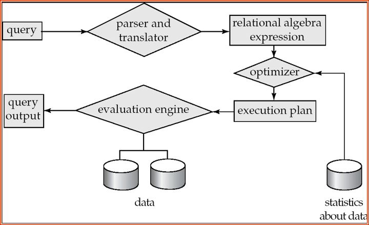
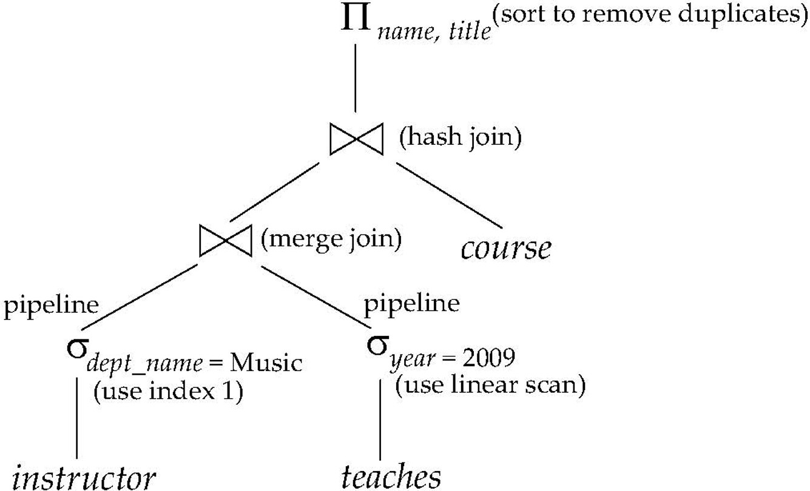
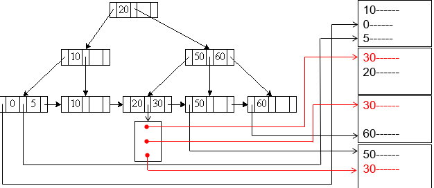
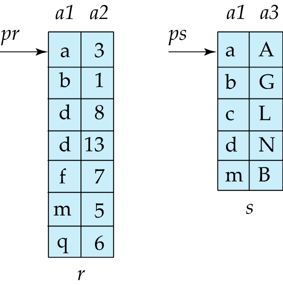
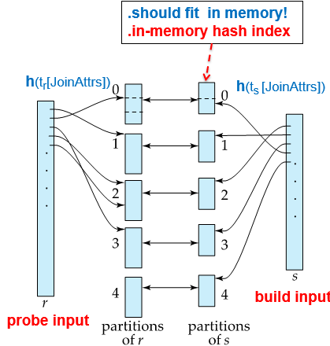
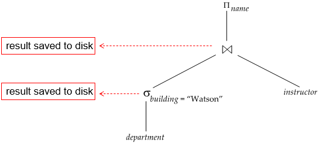

# Chapter 15 Query Processing 

## Basic Steps in Query Processing
<center>
{ width="400"}
</center>

+ Parsing and translation: 查询语句翻译、检查语法并转换为关系代数表达式

+ Optimization: 选择最优的查询执行计划
    + 一个简单的优化是：选择运算尽量先做，减少中间结果集的大小

+ Evaluation: 执行查询计划，返回结果
    + Evaluation plan: 对每个操作，定义其用于其实现的算法：
    <center>
    { width="400" }
    </center>

## Measures of Query Cost

一般来说就是从提交查询到返回结果的间隔时间，细分的话有disk accesses, CPU 以及网络通信时间等

+ 这里主要考虑的是磁盘访问时间：
    + number of seeks * average seek time
    + number of blocks read * average block read time
    + number of blocks written * average block write time

+ 简便起见，认为读写时间相同，统一为：
    + $t_T$: time to transfer a block of data 
    + $t_S$: time for one seek  
+ 忽略CPU时间以及中间结果写入磁盘的时间
+ 考虑worst case，即最小化可用内存。

### Selection Operation

#### File scan
A1: linear search

记$b_r$为包含关系r的记录的block数量，则：
+ worst case: $b_r * t_T + t_S$ 一次定位，读取所有block
+ average case: 如果是基于 key attribute 的selection，找到就可以停止 $b_r/2 * t_T + t_S$

### Index scan
> selection condition must be on search-key of index

#### A2

primary B+ tree index / clustering B+ tree index, equality on key 

记树高为$h_i$，则：
+ cost = $(h_i+1) * (t_S + t_T)$ 
从根向下二分查找，每层seek一次，搬一个block，加1是要将选出的record所在的block读入内存并seek到具体位置

#### A3
primary B+ tree index / clustering B+ tree index, equality on non-key 

不按search-key索引查找，查找结果可能不唯一（但文件中连续存储）

记树高为$h_i$，符合条件的records所在的block数量为$b_r$，则：

+ cost = $h_i * (t_S + t_T) + t_S + b_r * t_T$ 
    + 假设记录也按照search-key顺序存储在block中，则只需要一次seek就可以找到第一个符合条件的记录所在的block，之后顺序读取即可

#### A4
secondary B+ tree index, equality on key，对应record只有一条

+ cost = $(h_i+1) * (t_S + t_T)$

#### A4`
secondary B+ tree index, equality on non-key

<center>
{ width="300"}
</center>

查找到的是一个指向record的指针集合，可能有多个符合条件的记录。

记符合的record共有n条，n个指针所在的block数量为$m$

+ cost = $(h_i+m+n)*(t_S + t_T)$
    
### Selections involving comparisons
线性扫描/二分查找/索引都可以实现例如$\sigma_{A < v}(r)$ 或 $\sigma_{A > v}(r)$ 这样的selection

#### A5

primary B+ tree index / clustering B+ tree index, comparison(Relation is sorted on A)

+ 对于$\sigma_{A \geq v}(r)$，可以直接在索引上二分查找，找到第一个符合条件的记录所在的block，之后顺序读取即可:
    + cost = $h_i * (t_S + t_T) + t_S + b_r * t_T$

+ 对于$\sigma_{A \leq v}(r)$，从叶节点或者文件中的开头开始线性扫描，直到找到第一个不符合条件的记录为止
    
#### A6 

secondary B+ tree index, comparison

叶节点指向一个指针集合，可能有多个符合条件的记录，文件中不是按顺序存储的。因此定位后直接在叶子节点上顺序扫描即可。

### Complex selections

#### Conjuction

$\sigma_{\theta_1 \land \theta_2 \land \cdots \land \theta_n}(r)$

+ A7: 使用单个索引
    + 从前面6个算法中选出一个cost 最小的算法组合，选出符合其中某个条件的所有记录
    + 然后放入memory buffer中，检测其他条件

+ A8: 使用多个索引；例如 multiple-key

+ A9: intersection of identifiers 标识符的交集
    + 需要带有record pointer的索引
    + 对每个条件使用相应的索引，并获取所有指针集合的交集
    + 然后从文件中获取记录
    + 如果某些条件没有合适的索引，则在内存中进行测试

## Sorting 

我们可以为关系建立索引，然后利用该索引按排序顺序读取关系。这可能导致每个元组都需要一次磁盘块访问

+ 对于能够装入内存的关系：快速排序

+ 对于无法装入内存的关系，外部排序-归并

### External Sort-Merge

记M为内存页中的memory size 

1. Create sorted runs
```pseudo
for i = 1 to n do
    read M blocks of relation into memory
    sort the in-memory blocks
    write the sorted data to run Ri
```
读入再写出，总共需要2$b_r$次block transfer；
2$\lceil {b_r/M} \rceil$次seek


2. Merge the sorted runs (N-way merge)
    
    + 若归并段数N < 可用内存页M：只需要一轮merge
        1. 内存中为每个段分配一个作为buffer input 的 block；为buffer output 分配一个block
        2. 将每段的第一个block读入buffer page 
        3. 开始循环：
            + 选择buffer中最小的记录，输出到buffer output，如果buffer output满了，则将output写入磁盘
            + 从input buffer中删掉刚才的记录，如果buffer page 空了而且还有段没有读完，则从该段读入下一个block
            + 直到所有段都读完
        + 需要2$b_r$次block transfer；2$b_r$次seek

    + 若归并段数N >= 可用内存页M：需要多轮merge
        1. buffer output 需要单独开一个block，因此每一轮merge M-1段
        2. 每过一轮，段数减少为原来的$\lceil \frac{1}{M-1} \rceil$
        3. 直到merge成一个段为止
        + cost(simple): 每个段只分配一个block作为buffer input
            1. block transfer: 
                + total runs: $\lceil \frac{b_r}{M} \rceil$
                + total merge passes: $\lceil \log_{M-1} \frac{b_r}{M} \rceil$
                + 生成归并段时的block transfer: $2b_r$；每一轮merge的block transfer也是$2b_r$（忽略最后一轮，最后一轮可能不会写到disk中）
                + **总的block transfer**: $2b_r + 2b_r (\lceil \log_{M-1} \frac{b_r}{M} \rceil - 1)  = b_r (2\lceil \log_{M-1} \frac{b_r}{M} \rceil + 1)$
            2. seek: 
                + 生成归并段时：每一段需要一次读和一次写，总计$2\lceil \frac{b_r}{M} \rceil$次seek
                + merge时：每一轮需要$2b_r$次seek(一次读一次写，最后一次认为不需要写)
                + **总的seek**: $2\lceil \frac{b_r}{M} \rceil + 2b_r (\lceil \log_{M-1} \frac{b_r}{M} \rceil - 1) + b_r = 2\lceil \frac{b_r}{M} \rceil + b_r (2\lceil \log_{M-1} \frac{b_r}{M} \rceil + 1)$

        + cost(advanced): 每个段分配$b_b$个block作为buffer input
            + 相应的，每一轮merge的段数为$\lfloor \frac{N}{b_b} \rfloor - 1$，
            1. block transfer: 换个底数
                + $2b_r + 2b_r (\lceil \log_{\lfloor \frac{M}{b_b} \rfloor - 1} \frac{b_r}{M} \rceil - 1) = b_r (2\lceil \log_{\lfloor \frac{M}{b_b} \rfloor - 1} \frac{b_r}{M} \rceil + 1)$
            2. seek:
                + 生成归并段时：仍是$2\lceil \frac{b_r}{M} \rceil$次seek
                + merge时：一次进去$b_b$个block，每轮 $2\lceil \frac{b_r}{b_b} \rceil$次seek(最后一轮只读不写)
                + **总的seek**: 
                $2\lceil \frac{b_r}{M} \rceil + \lceil \frac{b_r}{b_b} \rceil(2\lceil \log_{\lfloor \frac{M}{b_b} \rfloor - 1} \frac{b_r}{M} \rceil - 1)$

## Join Operation

$r \bowtie_{\theta} s$

### Nested Loop Join

元组层级的两层for循环，泛用但是效率低下：
+ block transfer: $n_r * b_s + b_r$, 外层每个元组都要将内层的关系读入内存
+ seek: $n_r + b_r$ 

### Block Nested Loop Join

block层级的两层for循环，然后块内元组层级的两层for循环：
+ worst case: 
    + block transfer: $b_r * b_s + b_r$ 
    + seek: $2b_r$

假设内存中有$M$个block：其中一块要作为output buffer
+ 给外关系r分配$M-2$个block作为input buffer；内关系s分配1个block作为input buffer；则：
    + block transfer: $\lceil \frac{b_r}{M-2} \rceil * b_s + b_r$
    + seek: $2\lceil \frac{b_r}{M-2} \rceil$
    
+ best case: 内存足够大/表足够小 => 一次性读入
    + block transfer: $b_r + b_s$
    + seek: $2$ 

显然，小的关系作为外层更优

### Index Nested Loop Join

内关系有索引，则不用file scan 而可以用索引。
对外关系的每个元组，使用索引查找内关系中符合条件的元组

cost: $b_r(t_{seek} + t_{transfer}) + n_r * c$
    
+ 外关系每进一个block，其中每个元组都要在内关系上做索引查找，因此磁头位置一定会变，需要重新定位到外关系的下一个block
+ 内关系的索引查找和获取时间为c

### Merge Join

适用于已经在相关属性上排好序的两个关系
<center>

{ width="300"}

</center>

+ block transfer: $b_r + b_s$
+ seek: 需要定量分析最优解，即实际情况下要给两个关系定量分配合适大小的buffer page：

$X_r + X_s = M$, 要求$\lceil \frac{b_r}{X_r} \rceil + \lceil \frac{b_s}{X_s} \rceil$最小

显然当：
+ $X_r = \frac{\sqrt{b_r} * M}{\sqrt{b_r} + \sqrt{b_s}}$
+ $X_s = \frac{\sqrt{b_s} * M}{\sqrt{b_r} + \sqrt{b_s}}$
时，seek次数最小.

### Hash Join

用相关属性的哈希函数$h$将内外关系的元组分拆成$0, 1, \cdots, n$组

+ 最好能使得每个组的大小可以放到内存中，因此要求
    + $\lceil b_s / M \rceil \leq n$

<center>

{ width="300"}

</center>

分组后只要在相同哈希值的内外组上进行join即可

+ 对每一个Partition，都要有对应的buffer block
+ 内关系s称为build input，先将其读入内存并建立hash index
+ 外关系r称为probe input，加载内关系的分组后，外关系各元组在内存中进行hash index查找

#### Recursive partitioning

如果直接按 $n$ 分区，但 \( n > M \)，则buffer 不够用，需要递归分区，流程大致如下：
1. **第一次分区**：
   - 对关系 \( s \) 和 \( r \) 用哈希函数 \( h_1 \) 划分为 \( M-1 \) 个分区（\( s_0, s_1, \ldots, s_{M-2} \) 和 \( r_0, r_1, \ldots, r_{M-2} \)）。
2. **递归检查**：
   - 如果某个 \( s_i \) 仍然大于内存 \( M \)，则对其 **再用另一个哈希函数 \( h_2 \)** 划分为 \( M-1 \) 个子分区。
   - 重复此过程，直到所有 \( s_i \) 能完全装入内存。
3. **探测阶段**：
   - 对最终的分区对 \( (r_i, s_i) \) 执行常规 Hash Join（将 \( s_i \) 装入内存，扫描 \( r_i \) 匹配元组）。

如果满足以下条件，则 **无需递归分区**：

+ $M \geq \lceil \frac{b_s}{M} \rceil + 1$ => $M \geq \sqrt{b_s} 


## Other Operations

#### Duplication Elimination

+ sorting 之后扫描去重
+ 优化：在局部排序的过程中即可去重
+ 也可以hashing 

#### Projection

对每个元组都要进行投影操作然后去重

#### Aggregation

+ 按照分组的属性进行 sorting / hashing，然后对每组进行聚合

+ 也可以在排序时合并的过程中进行聚合：
    + 对于count, min/max, sum: 在过程中计数/记录局部最值/求和
    + 对于avg: 过程中记录sum 和 count，最后除以count 

## Evaluation of Expressions

对于整个expression tree:
+ Materialization: 操作中间结果生成一张表
<center>

{ width="300"}

</center>
    
+ Pipelining: 
    + demand driven: 上级需要时，下级执行
    + production driven: 下级执行完就向上推