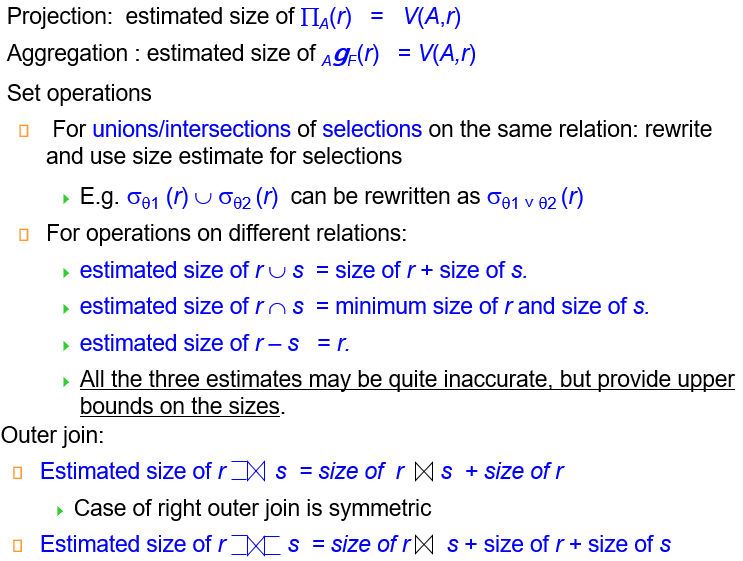

# Chapter 16 Query Optimization

## Generating Equivalent Expressions

+ Equivalent: 两个关系代数表达式对于所有数据库实例的相同元组集，产生的结果集相同
+ Equivalence rules: 用于生成等价表达式的规则

    1. Conjunctive selection 可以被分解为一系列单独的selection
        <center> 
        $\sigma_{\theta_1 \land \theta_2}(r) = \sigma_{\theta_1}(\sigma_{\theta_2}(r))$ 
        </center>

    2. Selection 操作是可交换的
        <center>
        $\sigma_{\theta_1}(\sigma_{\theta_2}(r)) = \sigma_{\theta_2}(\sigma_{\theta_1}(r))$
        </center>

    3. 投影操作只需要保留最外层的，内层可以忽略
        <center>
        $\pi_{A_1}(\pi_{A_2}(\cdots(\pi_{A_n}(r)))) = \pi_{A_1}(r)$
        </center>

    4. Selection 和 Cartesian product 可以合并为join 操作，从而减小中间结果集的大小 
        <center>
        $\sigma_{\theta}(r \times s) = r \bowtie_{\theta} s$

        $\sigma_{\theta_1}(r_1 \bowtie_{\theta_2} r_2) = r_1 \bowtie_{\theta_1 \land \theta_2} r_2$
        </center>

    5. Theta join / natural join 可交换

    6. natural join 可结合；Theta join 在如下的情况下可结合：
        <center>
        $(E_1 \bowtie_{\theta_1} E_2) \bowtie_{\theta_2 \land \theta_3} E_3 = E_1 \bowtie_{\theta_1 \land \theta_3}(E_2 \bowtie_{\theta_2} E_3)$, 
        where $\theta_2$ involves attributes from $E_2$ and $E_3$ only
        </center>
    7. selection 对于 theta join 可分配，亦即选择操作尽量先做
    8. projection 对于 theta join 可分配
    9. Union / intersection 可交换
    10. Union / intersection 可结合
    11. selection 对于 union / intersection / difference 可分配：
        + 对于intersection 和 difference，可以有：$\sigma_{\theta}(r \cap s) = \sigma_{\theta}(r) \cap s$
        但是**对于union 不成立**
    12. projection 对于 union 可分配

    其他懒得记了(

    {width=500}


## Statistics for Cost Estimation

+ $n_r$: number of **tuples** in a relation r.
+ $b_r$: number of **blocks** containing tuples of r.
+ $l_r$: **size of a tuple** of r.
+ $f_r$: blocking factor of r — i.e. **the number of tuples of r that fit into one block**.
+ $V(A, r)$: number of **distinct values** that appear in r for attribute A; same as the size of $\Pi_A(r)$.

如果r的元组都存在文件中，则：$b_r = \lceil \frac{n_r}{f_r} \rceil$

比较直观的是直方图：
<center>

{width=200}
</center>

### Selection Size Estimation

+ $\sigma_{A = v}(r)$: 
    + $\frac{n_r}{V(A, r)}$ 基于属性数量均匀分布的假设下，可以粗略估计出查询的结果集大小
    + 如果A 是key属性，则结果集大小就是1
+ $\sigma_{A \leq v}(r)$: ($\geq$的情况是对称的)
    + 记估算结果为c
        <center>
        {width=400}
        </center>

+ 组合条件：中选率（selectivity):
    + 记$s_i$为r中满足选择条件$\theta_i$的元组数目；
    则$\theta_i$的中选率为：$s_i / n_r$

假设下面的选择条件相互独立，则可以估计联合选择条件的中选率：

1. Conjuction: $\sigma_{\theta_1 \land \theta_2 \cdots \land \theta_n}(r)$：
    <center>
    $n_r \cdot \frac{s_1 \cdot s_2 \cdots s_n}{n_r^n}$
    </center>

2. Disjunction: $\sigma_{\theta_1 \lor \theta_2 \cdots \lor \theta_n}(r)$：
    <center>
    $n_r \cdot (1 - (1 - \frac{s_1}{n_r})(1 - \frac{s_2}{n_r}) \cdots (1 - \frac{s_n}{n_r}))$
    </center>

3. Negation: $\sigma_{\neg \theta}(r)$：
    <center>
    $n_r - size(\sigma_{\theta}(r))$
    </center>
            
### Join Size Estimation

+ Cartesian product r × s: $n_r \cdot n_s$ 个元组；每个元组占用 $s_r + s_s$ 个字节
+ 若r和s没有公共属性，则 $r \bowtie s$和笛卡尔积相同
+ 若r和s有公共属性，则$r \bowtie s$元组数量不超过$n_r$
    + 公共属性是s中引用r的外键，则$r \bowtie s$的元组数目等于$n_s$
    + 如果不是键，则可以这样估算: 记$A = R \cap S$,$R$中的每一个元组平均下来可以和$S$中$\frac{n_s}{V(A, s)}$个元组匹配，因此$r \bowtie s$的元组数目可以估算为：
        <center>
        $\frac{n_r \cdot n_s}{V(A, s)}$, or 
        $\frac{n_r \cdot n_s}{V(A, r)}$
        </center>                               
    

### Other operations size estimation

{width=500}

### Estimation of Number of Distinct Values

**选择操作：\(\sigma_\theta (r)\)，估算 \(V(A,\sigma_\theta (r))\)**

1. 如果条件 θ 强制属性 A 取某个特定值：  
   $V(A,\sigma_\theta (r)) = 1$ 
   例如：$A = 3$ 

2. 如果条件 θ 强制属性 A 取某个指定集合中的值之一：  
   $V(A,\sigma_\theta (r)) = \text{指定值的数量}$  
   例如：$A = 1 \lor A = 3 \lor A = 4$

3. 如果选择条件 θ 的形式是 $A \text{ op } v$（，则估算：  
   $V(A,\sigma_\theta (r)) = V(A,r) * s $
   其中 $s$ 是选择条件的中选率。  

4. 对于其他所有情况，使用近似估算：  
   $V(A,\sigma_\theta (r)) = \min(V(A,r), n_{\sigma_\theta (r)})$  

## Choice of Evaluation Plans

### Cost-Based Join-Order Optimization

+ Dynamic programming approach: 

+ left-deep join tree: 只允许左侧的关系参与连接，右侧的关系只能是单个关系

## Additional Optimization Techniques

### Nested Subqueries

+ SQL 将 where clause 中的子查询视为函数处理
    
+ correlation variable: 子查询中引用外部查询的变量

+ correlated evaluation: 子查询中引用外部查询的变量，导致子查询在每个外部查询元组上都需要重新计算

+ correlated evaluation 很低效，优化时会尽可能将其转换为join操作：

```sql
select name 
from instructor 
where exists (select * 
              from teaches
              where instructor.ID = teaches.ID and teaches.year = 2022);
```
可以转换为：

```sql
select name 
from instructor, teaches
where instructor.ID = teaches.ID and teaches.year = 2022;
```

但是这样转换后不能保证结果集中重复元组的数量和原查询一致，这是由于自然连接后，表中可能出现重复的元组。

可以使用`semijoin`来解决该问题：右表仅用于条件判断。如果左表中元组$r$出现n次，右表中只要有匹配的数据，最终结果就会有n次。
```sql
select name
from instructor 
where ID in (select teaches.ID
              from teaches
              where teaches.year = 2022);
```

一般而言，如下的SQL查询：
```sql
select A 
from r1, r2, ..., rn
where P1 and exists (
    select * 
    from s1, s2, ..., sm
    where P2^1 and P2^2
)
```

可以转换为$\Pi_A(r_1 \times r_2 \times \cdots \times r_n ) \bowtie_{P_2^2}\sigma_{P_2^1}(s_1 \times s_2 \times \cdots \times s_m)$

+ $P_2^1$不包含任何correlation variable
+ $P_2^2$包含correlation variable

+ 将嵌套查询转换为带有join/semijoin查询的过程称为**decorrelation** 

#### Decorrelation

去除相关对于标量、聚合子查询的一些情况会更复杂：

```sql
select name 
from instructor
where 1 < (
    select count(*)
    from teaches
    where instructor.ID = teaches.ID
    and teaches.year = 2022
)
```

可转换为：

$\Pi_{name}(instructor \ltimes_{instructor.ID = TID \cap 1 <_{cnt}}(_{ID as TID} \gamma_{count(*) as cnt}(\sigma_{teaches.year = 2022}(teaches))))$


### Materialized Views

视图通常没有实际空间与之对应。但是如果要经常用到，可以将view实际存储下来，即为 materialized view

#### Materialized View Maintenance

一旦改变底层数据，则需要更新materialized view，维护代价较大

+ incremental view maintenance增量维护：不需要重新计算所有数据，只对更新的部分进行局部修改

##### Join & select

{width=200} 

{width=200}

##### Projection

对于$\Pi_A(r)$，需要额外记录原始表中A出现的count：

+ insert：increment count
+ delete: decrement count / if 0 then delete the result of $\Pi_A(r)$

##### Aggregation Operations

1. count ：$v = _{A}\mathcal{G}_{count(B)}(r)$ 
   - Insert：  
     - 对于每个新插入的元组 `r`，检查其分组键 `A` 是否已存在于结果集 `v` 中：  
       - 若存在，则将该组的计数 `count` 加 1  
       - 若不存在，则在 `v` 中新增一个元组，并设置 `count = 1`。 
   - Delete：  
     - 对于每个待删除的元组 `t`，找到 `v` 中对应的分组 `t.A`，并将该组的计数 **减 1**。  
     - 如果计数减到 **0**，则从 `v` 中删除该分组。

2. sum: $v = _{A}\mathcal{G}_{sum(B)}(t)$   
    - 与 `count` 类似，但插入或删除时，加减的是 `B` 的具体value而不是count  
    - 额外维护计数：  
       - 需同时记录每组的 `count`，以便检测组内是否还有元组。  
       - **为什么不能直接判断 `sum = 0`？**  
         - 因为 `B` 的值可能正负抵消（如 `+5` 和 `-5` 的和为 0，但组内仍有数据），需依赖 `count = 0` 确认无数据。

3. avg
    + 分别维护每组的 `sum` 和 `count`，最终计算时用 `sum / count` 得到平均值。  
    + 避免重复计算，且能动态更新（如数据增减时调整 `sum` 和 `count`）。

4. min/max: 
    + insert：直接和当前最值比较即可
    + delete：可能要重新找出当前组中的最值

其余操作类似，总之尽可能维护较少的中间数据，尽量避免重新扫描