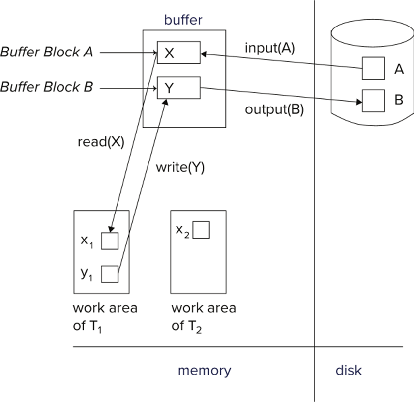
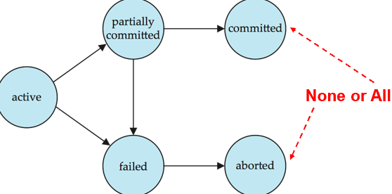
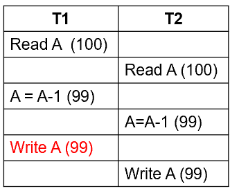
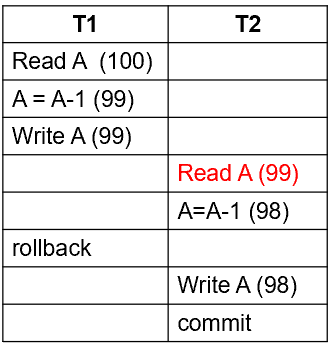
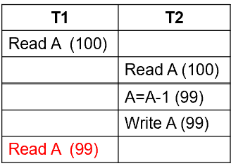
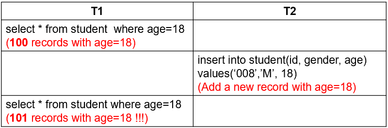
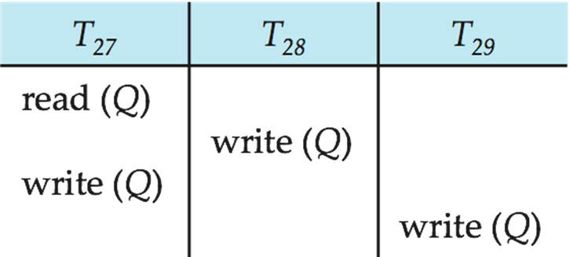

# Chapter 17 Transactions

## ACID

+ Atomicity: 事务是一个原子操作，要么全部执行成功，要么全部不执行。
+ Consistency: 事务执行前后，数据库要维持一致性。
    + 显式：定义primary key, foreign key 等
    + 隐式：例如某些数据必须非负，或者一些默认的等式关系
+ Isolation: 事务的执行不受其他事务的影响。
+ Durability: 一旦事务提交，其对数据库的修改是永久性的，即使系统崩溃也不会丢失。

## A simple model

<center>

{width=300}
</center>

访问数据的方式简化为两种：
+ read(X)
+ write(X)

## Transaction State

事务必须处在如下状态中的某个：{: align=right width=300}
+ active
+ Partially committed
+ Failed
+ Aborted
+ Committed

## Concurrent Executions
好处：
+ 提高CPU和disk利用率
+ 减少平均响应时间

潜在问题：
+ Lost Update:
{width=160}
+ Dirty Read:
{width=160}
+ Unrepeatable Read
{width=160}
+ Phantom Problem
{width=400}

## Schedules

Schedule是一组指令序列，指定了并发事务中各个操作的执行顺序。

+ Serial Schedule: 串行执行，一定满足ACID。
+ Serializable Schedule: 可串行化

### Serializability

+ 基本假设：每个事务都能保证数据库一致性
+ 因此一系列串行的事务一定能保持一致性
+ 如果一个调度能够等价于某个串行调度，则称为可串行化：
    + conflict serializability: 冲突可串行化
    + view serializability: 视图可串行化

#### Conflict Serializability

+ 对相同的数据，两个事务都进行读操作是没有冲突的，只要有写操作就有冲突。

+ conflict equivalent: 两个调度可以通过一系列 non-conflicting操作的交换互相转换，则称二者是conflict equivalent的
+ conflict serializable: 如果一个调度和一个串行调度是conflict equivalent的，则称该调度是conflict serializable的。

#### Testing for Serializability
+ precedence graph: 前驱图
    + 有向图，节点是事务，边是冲突的操作
    + $T_1$ 指向 $T_2$，如果 $T_1$ 的操作冲突于 $T_2$ 的操作，且 $T_1$ 的冲突操作在 $T_2$ 的冲突操作之前执行。 
    + 如果图中没有环，则该调度是conflict serializable的。

+ 对于无环图，可以通过拓扑排序得到一个串行调度。

#### Different forms of Serializability

+ Conflict serializability: 如前所述，只考虑冲突的操作对
+ View serializability: 
    + 相同的数据读取内容：每个事务的读操作必须读到与某个串行执行顺序中相同的数据值。
    + 相同的最终写入内容：所有事务执行完成后，数据项的最终值必须与某个串行执行顺序中的最终值相同。

明显后者要求更宽松：
+ 如果一个调度是conflict serializable的，则它也是view serializable的。
+ 但反之不成立: <center>
{width=300}
</center>

## Recoverability

### Recoverable Schedules

+ 避免脏读：如果$T_j$read了 $T_i$write的数据，则$T_j$必须在$T_i$commit之后才能commit。 
+ 避免cascading rollback：
    + 一连串的事务之间有依赖关系，如果一个事务回滚，所有依赖它的事务都必须回滚，虽然可恢复但是效率低。
    + cascadeless schedules：每一对事务之间都不允许脏读

### Weak Levels of Consistency

回顾四种潜在问题：Lost Update, Dirty Read, Unrepeatable Read, Phantom Problem

+ Serializable: 要求最高，严格串行
+ Repeatable Read: 允许Phantom Problem
+ Read Committed: 允许Unrepeatable Read和Phantom Problem
+ Read Uncommitted: 允许所有问题

隔离级别可以设置：

```sql 
set transaction isolation level serializable;
```

```java
connection.setTransactionIsolation(Connection.TRANSACTION_SERIALIZABLE);
```

