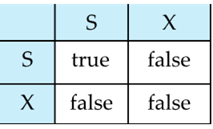
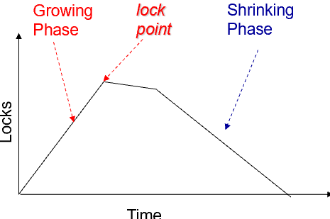
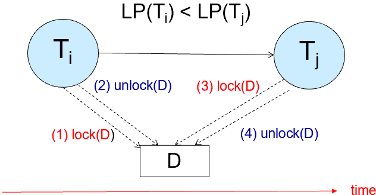
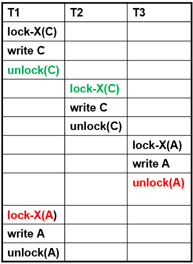
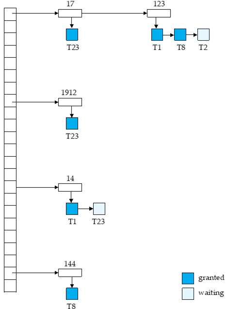
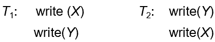
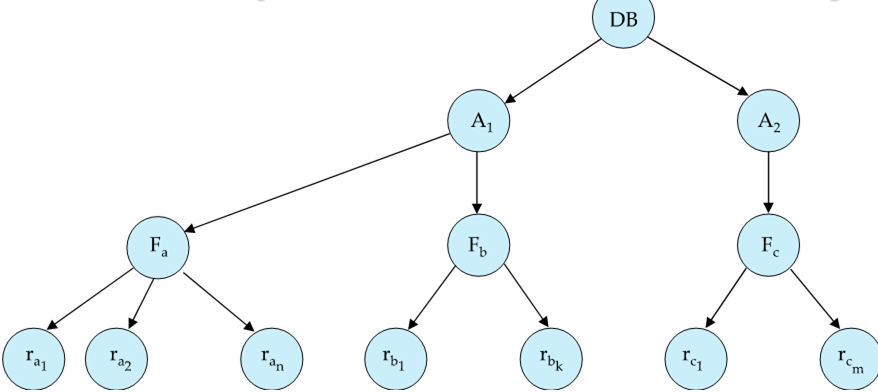
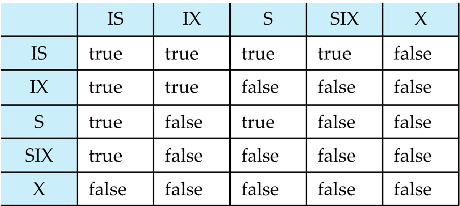
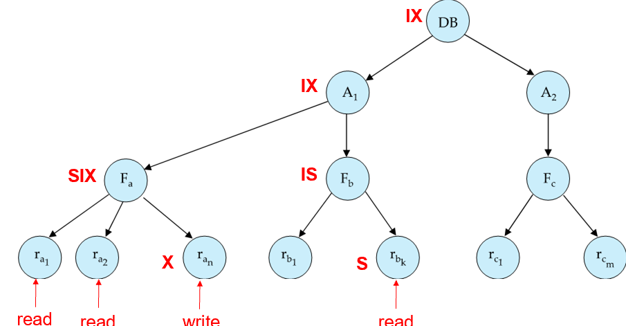

# Chapter 18 Concurrency Control 

## Lock-Based Protocols
+ 基本假定是：
    + 访问数据前都要先加锁，在合适时机需要释放锁。
    + 锁和锁之间可能有冲突，冲突时需要等待。

+ 锁的基本类型：
    1. Exclusive Lock (X-lock): 写数据时需要先获得X锁，其他事务不能读或写。
    2. Shared Lock (S-lock): 读数据时需要先获得S锁，其他事务可以继续读，但不能写。

{width = 400}

+ 这意味着对同一数据而言，可以有任意数量的事务同时持有S锁，但只有一个事务可以持有X锁。
+ 如果锁暂时不能被授予，则发出锁请求的事务会被阻塞，直到锁可用。

### Two-Phase Locking Protocol
> ensures conflict-serializability schedules

1. **Growing Phase**: 锁的获取阶段，事务可以申请任意数量的锁，但不能释放任何锁。
2. **Shrinking Phase**: 锁的释放阶段，事务可以释放任意数量的锁，但不能再申请新的锁。

{width=300}

+ lock point: 最后一次加锁的时刻。
+ 2PL 协议保证了冲突可串行化的调度，且串行顺序与到达lock point的顺序一致。

!!! prove 
    1. 证明事务构成的图无环：
        + 反证：如果$T_i$指向$T_j$，则$LP(T_i) < LP(T_j)$。若有环则存在$LP(T_i) < LP(T_j) < LP(T_k)< \cdots < LP(T_i)$，矛盾。

    2. 证明顺序一致性：
        + 考虑拓扑排序，首先执行的是入度为0的事务。
        + 入度为0的事务在图中没有前驱，因此它们的lock point是最早的。
        + 去除入度为0的事务后的图同样如此（因为始终无环）

        {width=300}
        

        
+ Strict 2PL：
    + 在2PL的基础上，要求事务在commit/abort之前不能释放它持有的**所有X锁**
    + 这样避免了cascading rollbacks，保证了可恢复性。
+ Rigorous 2PL：
    + 事务在commit/abort之前不能释放它持有的**所有锁**

+ **两阶段锁协议是conflict serializable的充分非必要条件**
    + 例如下面的调度是conflict serializable的，但T1不满足2PL：

    {width=200}
    

#### Lock Conversion

1. First Phase:
    + 可以获得S锁或X锁，但不能释放任何锁。
    + 可以将S锁转换为X锁(lock upgrade)
2. Second Phase:
    + 可以释放锁，但不能再申请新的锁。
    + 可以将X锁转换为S锁(lock downgrade)

#### Implementation of Locking 

+ Lock Manager: 可以理解为是一个独立的进程，负责管理锁的申请和释放。
+ Lock Table: 记录授予锁的记录和悬挂的锁请求
    + 通常实现是内存中的哈希表，索引是正在被锁定的数据项

{align=left width=270}

+ 记录授予的锁、锁的类型、等待的请求和请求锁的类型
 

+ 新的锁请求会添加到对应数据项的请求队列的末尾，如果所有更早的锁都能和新请求兼容，则授予锁，否则将请求挂起
 

+ 解锁请求会从锁表中删除对应的记录，并唤醒等待队列中的请求
 

+ 如果事务abort，则该事务所有等待的或是已授予的请求都会被删除
    + 可能需要针对每个事务维护一个lock list，记录该事务持有的所有锁

## Deadlock Handling

2PL协议不能避免死锁的发生：

{width=300}

+ Deadlock prevention:
    + 要求每个事务在执行开始前锁定其所有数据项（预先声明）
    + 对所有数据项施加一种偏序关系，并要求事务只能按照该偏序关系指定的顺序锁定数据项（只要有向无环图即可）
+ Timeout-Based Schemes:
    + 设定一个超时时间，如果事务在超时时间内没有获得锁，则放弃请求并回滚。

### More Deadlock Prevention Strategies

+ 每个事务都有一个timestamp，标记其开始时间
    + older transaction：开始较早
    + younger transaction：开始较晚

+ wait-die scheme —— 非抢占式：
    + older 事务可以等待 younger 事务释放锁，但 younger 事务若要等毋宁死（即 younger 事务会被强制回滚）
    + 容易产生starvation，即某些事务可能长时间无法获得锁

+ wound-wait scheme —— 抢占式：
    + older 不会等待 younger，而是强制 younger 回滚（ :( )
    + younger 事务可以等待 older 事务释放锁

两种机制下，回滚事务都会按其原始的timestamp重启，因此older transaction始终先于younger transaction执行，从而避免了starvation的发生

### Deadlock Detection

不进行事先预防，而是允许死锁发生，然后检测并解决。

维护一个wait-for graph G = (V, E)，其中：
+ V 是事务顶点集合
+ E 是有向边集合：
    + 如果$T_i \to T_j$，则表示$T_i$等待$T_j$释放锁

当事务$T_i$请求某个数据项的锁时：
+ 如果$T_j$当前持有该数据项的锁，则添加边$T_i \to T_j$
+ 当$T_j$释放锁时，删除边$T_i \to T_j$

deadlock state <=> 有向图中存在环
+ 可以使用深度优先搜索（DFS）检测图中的环
+ 一旦检测到死锁，可以选择回滚某个事务来打破环
    + 也可能发生starvation
    
## Graph-Based Protocols 

2PL疑似有些太严格了，图协议允许更灵活的锁定和释放策略。

+ 对数据项的集合$D = {d_1, d_2, \ldots, d_n}$，施加一个偏序关系，从而构建一个有向无环图$G$
    + 如果$d_i \to d_j$，则任何事务如果要访问$d_i$和$d_j$，必须先访问$d_i$，然后访问$d_j$

## Tree Protocol

+ 只允许X锁
+ 首个锁可以加在树的任意位置，但之后的锁必须按照树结构加在当前锁的子节点上
+ 任意时间都可以释放锁，但释放之后不能重新加锁

树协议保证了冲突可串行化的调度，同时也不会有死锁

+ Advantages:
    + 相对2PL协议，可能会更早释放锁；等待时间短，并发度更高
    + 不会有死锁
+ Disadvantages:
    + 不保证可恢复性或者级联回滚：需要引进commit dependency
    + 事务可能会对更多的数据项加锁，例如为了访问某个叶节点的数据项，需要额外锁定其路径上的祖先节点

最大的限制是需要先验地知道数据项的偏序关系，否则无法构建树结构；但对于某些偏序关系是自然存在的场景来说比较方便

## Multiple Granularity（多粒度锁协议）

加锁的数据项粒度不同，可以用树结构来表示：
+ fine granularity(细粒度)：高并发、锁开销大（可能会有很多锁）
+ coarse granularity(粗粒度)：低并发、锁开销小

{width=400}

+ database -> area -> file(table) -> record 

### Intention Lock Modes

多粒度下还需要检测不同粒度锁之间的冲突，为此需要引入X/S之外的锁类型：

+ intention-shared(IS) lock: 例如要对record加S锁，必须先对其父节点的file加IS锁
+ intention-exclusive(IX) lock: 例如要对record加X锁，必须先对其父节点的file加IX锁
+ shared and intention-exclusive(SIX) lock: 例如要对file加S锁，但在读的过程中可能需要对某个record加X锁，则需要先对file加SIX锁

相容矩阵：

{width=400}

### Multiple Granularity Locking Scheme

+ 规则如下： 
    1. 必须先对树的根节点加锁
    2. 节点$Q$可以被事务$T_i$加S/IS锁，only if $T_i$持有$Q$的所有父节点的IS/IX锁
    3. 节点$Q$可以被事务$T_i$加X/IX/SIX锁，only if $T_i$持有$Q$的所有父节点的IX/SIX锁
    4. 对同一事务而言，仍遵循2PL协议，即$T_i$能对一个节点加锁，only if $T_i$在此前没有释放过任何锁
    5. $T_i$可以释放节点$Q$的锁，only if $Q$的所有子节点当前都没有被$T_i$加锁

+ 注意到加锁顺序是root-to-leaf，而释放锁的顺序是leaf-to-root
+ 锁粒度升级：当某一层级锁数量过多，则将其上移到更高层级（更粗粒度）上的S/X锁

{width=400}

### Insert and Delete Operations

在应用2PL锁后，插入和删除可能导致phantom phenomenon，即一个事务在扫描关系读取元组信息时，另一个事务可能同时插入或删除元组。
+ 一个解决思路是给整个表加X锁，但这样会导致并发度降低
+ 更细的粒度是对相关数据项相关的谓词上加锁（例如`age=18`），但这需要对谓词进行解析和分析，复杂度较高
+ 另一种思路是**Index locking**，即对需要特定的B+树索引桶加锁，并发性相对高

#### Index Locking Protocol

- 索引锁定协议：
  - 每个关系必须至少有一个索引。
  - 事务只能通过关系上的一个或多个索引找到元组后才能访问它们
  - 执行查找的事务 \( T_i \) 必须用S-mode锁定它访问的所有索引叶节点
    * 即使叶节点不包含任何满足索引查找条件的元组（例如，对于范围查询，叶节点中没有元组落在该范围内）
- 在关系 \( r \) 中插入、更新或删除元组 \( t_i \) 的事务 \( T_i \)
    * 必须更新 \( r \) 的所有索引
    * 必须获取受插入/更新/删除操作影响的所有索引叶节点上的排他锁(X锁)
- 必须遵守两阶段锁定协议的规则

这保证了幻影现象不会发生，因为：
+ 查询时锁定了所有可能包含查询结果的索引范围（包括当前为空的区域）
+ 插入时必须获取对应索引位置的排他锁，这会与查询的共享锁冲突，因此新插入的记录无法出现在已查询的范围内

## Multiversion Schemes

+ 每次成功的写操作都会创建一个新的版本
+ 版本会包含一个时间戳，标记其创建的时间
+ 要执行读操作时，会根据当前事务的时间戳选择合适的版本
+ 只读事务不受阻碍，无需等待