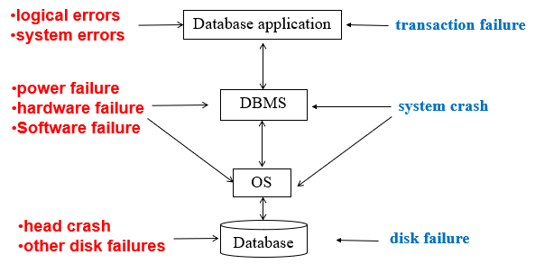
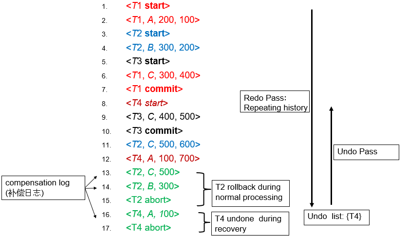
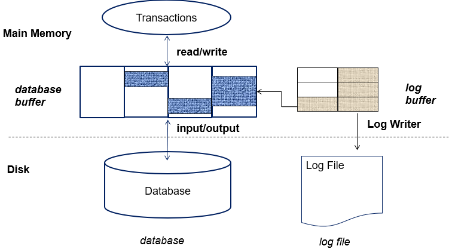
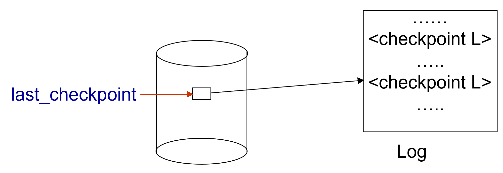
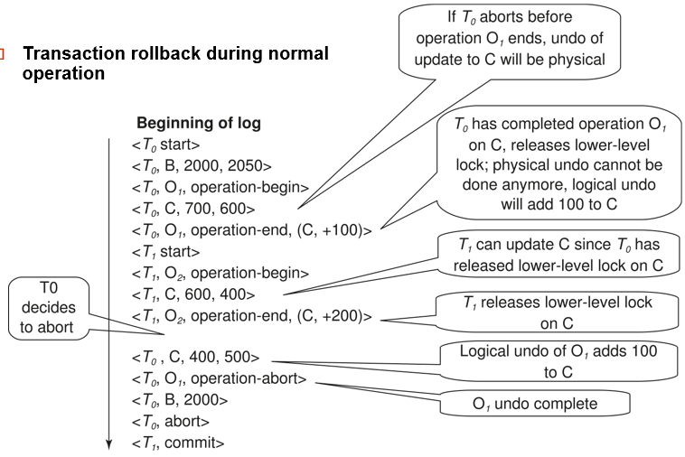
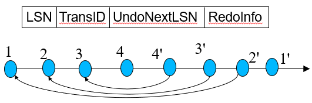
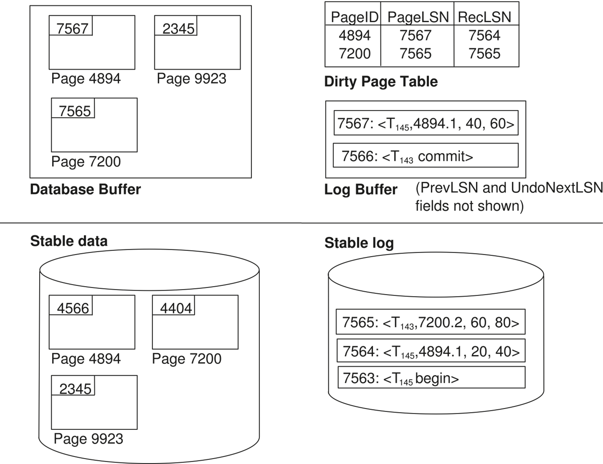
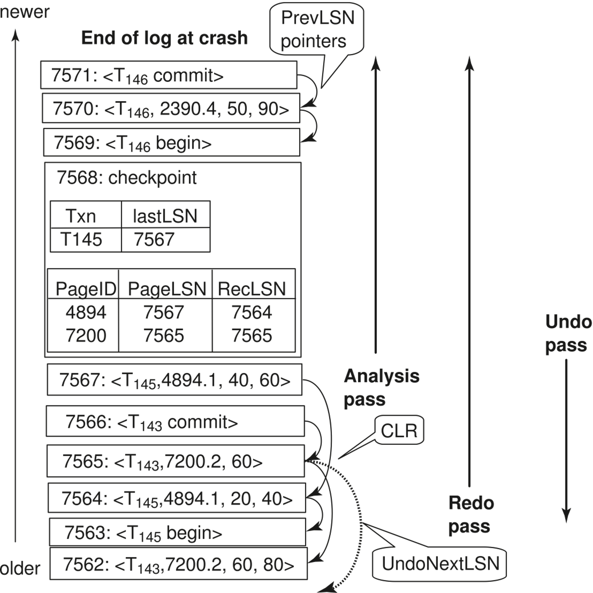

# Chapter 19 Recovery System

+ 特别与ACID中的Atomicity和Durability相关

## Failure Classification

{width=550}

## Storage Structures

+ Volatile Storage: main memory / cache，系统崩溃时数据丢失
+ Non-volatile Storage: disk / flash memory，系统崩溃时数据不丢失，但仍可能丢失数据
+ Stable Storage: 理想的非易失性存储，系统崩溃时数据不丢失且不会损坏，虽没有但可以近似实现，例如多重备份。

## Database Recovery

+ 保证数据库的一致性和事务的原子性和持久性

恢复算法需要保证两方面：

1. 在正常的事务执行中，需要足够的日志信息来支持恢复。
2. 在系统崩溃后，能够使用日志信息恢复，从而保证原子性、持久性和一致性。

**Idempotent(幂等性)**: An recovery algorithm is said to be idempotent if executing it several times gives the same result as executing it once. 

## Log-Based Recovery

!!! example "Log File"
    {width=600}

+ 恢复时，先Redo到最新的状态，再Undo（执行abort等操作）

+ 在主存中的数据写到磁盘之前，必须先将日志写到磁盘。
    + 只有在一个事务的 commit log record 被写入磁盘后，才可以认为该事务已经提交。（数据提交与否实际上无所谓，日志在的话最终一定可以提交）
    + 日志和数据都有buffer，提高吞吐量。

### Checkpoints

每次都从头开始恢复日志会很慢，因此引入检查点（checkpoint）来减少恢复时间，checkpoint相当于是恢复的起点：
+ 相当于一个快照
+ 需要记录一个活跃事务表，记录在checkpoint创建时开始但未提交/终止的事务

### Log Buffer & Database Buffer

{width=400}

+ Database Buffer: 用于缓存数据页，减少磁盘I/O
    + no-force policy: 数据页不需要立即写入磁盘，可以在后续的checkpoint或日志刷新时写入。
    + force policy: 更新的数据要在提交的时候立即写入磁盘。

+ steal policy: 允许将脏页（已修改但未写入磁盘的页）从数据库缓冲区中写回磁盘，即使事务尚未提交。
    + 这样不用undo但对并发控制等不友好

### Fuzzy Checkpointing 

checkpoint 是为了减少恢复时间，但每次写日志、写数据都需要I/O操作，可能会影响性能（可能会忽高忽低），因此引入模糊检查点（fuzzy checkpointing）：
1. 临时停止事务的更新
2. 日志记录中写入一条 <checkpoint L>，并将其写入磁盘
3. 记录M个被修改但未写入磁盘的数据buffer block列表
4. 全部记录完后，可以继续事务的更新
5. 后台线程将所有M个之前记录的脏数据页写入磁盘，在此期间：
    + 这些block不能被其他事务修改
    + 仍遵循WAL，即相关的日志必须先写入磁盘
6. 在磁盘的固定位置(last_checkpoint)存一个指向该checkpoint 记录的指针

{width=400}

这样当系统崩溃时，可以从last_checkpoint指向的checkpoint开始恢复

## Recovery with Early Lock Release and Logical Undo

+ 不用严格遵循2PL协议，可以在事务执行过程中释放锁，例如此前提到的树形锁协议（tree locking protocol），在子节点都加锁后，父节点可以释放锁。

+ 但是在放锁后可能会有其他事务来修改同一数据项，恢复时如果仍是物理回滚，则可能会直接覆盖掉其他事务的修改；因此需要Logical Undo，即记录需要的反向操作（例如插入->删除，+10->-10等），而不是直接覆盖。

记录的日志信息稍有不同：

{width=550}

## ARIES Recovery Algorithm

**ARIES is a state of the art recovery method**

1. 用LSN（Log Sequence Number）标记日志记录
2. Physiological redo
3. Dirty page table
4. Fuzzy checkpointing

### ARIES Data Structures

+ Log sequence number (LSN): 每条日志记录都有一个唯一的LSN，递增
+ Page LSN: 每个数据页都有一个Page LSN，指示对该页数据进行最新修改的日志
+ Log record
+ Dirty page table: 记录所有脏页
+ Active transaction table: 记录所有活跃事务以及这些事务的最新LSN

#### Log Record

+ 一般的日志记录有如下字段：

{width=400}

+ 特殊的redo-only日志记录（即compensation log record）:

{width=400}

#### Dirty Page Table

+ buffer中的脏页列表
+ 对每一个这样的页，记录：
    + Page LSN
    + RecLSN: 这个LSN之前的日志记录都已经被写入磁盘

{width=600}

#### Checkpoint Record

包含：
- 脏页表（DirtyPageTable）和活跃事务列表  
    - 对每个活跃事务，记录该事务最后一条日志记录的LSN  
    - 磁盘固定位置存最近一次完成的检查点日志记录的LSN

脏页不会在检查点时立即写盘，而是通过后台线程持续异步刷盘

### ARIES Recovery 

3个阶段：
1. Analysis
2. Redo
3. Undo

#### Analysis Phase

+ 从最近的检查点开始，分析日志记录，构建脏页表和活跃事务表。
+ 将RedoLSN(即redo的起点)设置为脏页表中每个页的RecLSN中的最小值（即所有脏页中最早的没有写入磁盘的日志记录）
+ undo-list设置为checkpoint记录中的活跃事务表
+ 从undo-list中读取每个事务的最后一条日志记录的LSN
+ 从checkpoint开始向前扫描
    + 如果日志记录不在undo-list中，则将其添加到undo-list中
    + 当找到一个update log record时:
        + 如果该页不在脏页表中，则将其添加到脏页表中，并设置RecLSN为该日志记录的LSN
    + 如果找到一个 transaction end log record，则将该事务从undo-list中删除
    + 始终记录undo-list中每个事务的最后一条日志记录的LSN

analysis阶段的结果是：
+ RedoLSN: 最早的脏页日志记录，作为Redo的起点
+ 脏页表中每个页的RecLSN
+ undo-list: 需要rollback

#### Redo Phase
> Repeats history

+ 从RedoLSN开始，向前扫描日志记录，一旦找到一个update log record:
    1. 如果该页不在脏页表中（这意味着该页数据已经写入磁盘或者未曾修改），或者日志记录的LSN比脏页表中page 的 RecLSN小（这意味着此日志已经写入磁盘），则跳过该日志记录
    2. 否则，从磁盘中取出该页。如果该页的Page LSN小于日志记录的LSN（这意味着该页数据未被更新），则redo该日志记录

#### Undo Phase

+ 当对更新日志记录执行Undo时：
    1. 生成一个包含所执行撤销动作的补偿日志记录
       - 图中将记录n对应的CLR标记为n'
    2. 将该CLR的UndoNextLSN设置为原更新日志记录的PrevLSN值
       - 图中箭头表示UndoNextLSN的值

+ ARIES支持部分回滚：例如用于处理死锁情况，只需回滚到足以释放所需锁的程度

{width=400}

+ 对undo-list 中的事务执行逆向日志扫描，具体优化如下：
    1. 初始定位：
        - 为每个待撤销事务设置起始LSN（即分析阶段确定的该事务最后一条日志记录LSN）
        - 每次选择所有待撤销事务中**最大的LSN**作为当前处理点，直接跳转到该位置执行撤销
    2. 撤销执行：
        - 对于普通日志记录，撤销后将该事务的下一个待撤销LSN更新为当前记录的PrevLSN
        - 对于补偿日志记录，则将下一个待撤销LSN更新为当前记录的       UndoNextLSN
    3. 跳跃优化：
        - 跳过所有中间日志记录（因其已被撤销）
    4. 撤销操作按此前说过的逻辑进行，直到undo-list为空或所有事务都已撤销

 
{width=500}

