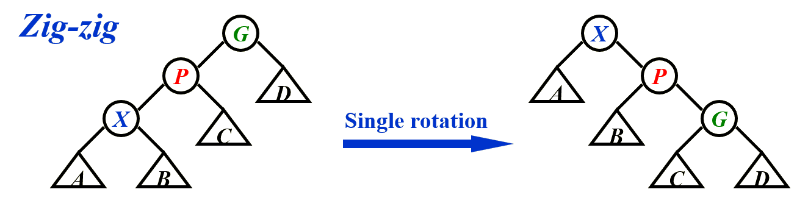
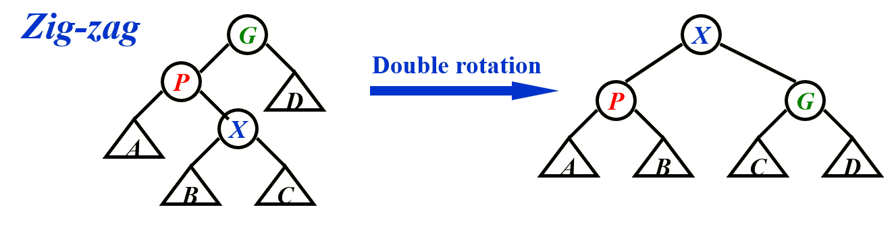

# AVL & Skew Tree
## AVL Tree
+ 为避免BST退化为链表，AVL树保持平衡，即左右子树高度差不超过1
    + 平衡因子BF = 左子树高度 - 右子树高度

+ AVL Tree的操作核心为旋转：
    + LL/RR: 单次旋转，只需要对最低的不平衡节点为根的树进行操作即可：
    ??? eg "单次旋转" 
        
    + LR/RL: 
        + LR: 先对左子树进行一次左旋，再对根节点进行一次右旋
        + RL: 先对右子树进行一次右旋，再对根节点进行一次左旋    
+ 插入：
    1. 插入节点
    2. 从插入节点向上回溯，更新高度和平衡因子
    3. 从插入节点向上回溯，检查平衡因子，若不平衡则旋转
    > 选取最低的不平衡节点为根进行旋转
!!! note "复杂度分析"
    定义$n_h$为高度为h的AVL树的最少节点数
    
    有：$n_h = n_{h-1} + n_{h-2} + 1$，
    
    事实上，$n_h = F_{h+2} - 1$，其中F为斐波那契数列
    
    则 $n_h \approx (\frac{1+\sqrt{5}}{2})^h$

    从而 $n \leq (\frac{1+\sqrt{5}}{2})^h$

    即 $h \geq \log_{\frac{1+\sqrt{5}}{2}}n \approx 1.44\log n$ 
    
    $T_{insert} = T_{search} + T_{rotation} = O(1) + O(\log n) = O(\log n)$

## Skew Tree
+ 不再维护平衡因子，只要进行一次访问（增删查改）就将访问节点通过若干次旋转“翻”到根节点
+ 核心操作依旧是旋转：
    + 单次旋转与AVL树相同
    + 双旋转：
        
        ??? eg "Zig-Zig"
            
        ??? eg "Zig-Zag"
            

**均摊意义下**从空树开始连续M次访问，总时间复杂度为O(MlogN)
