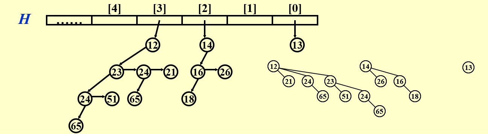

# 左式堆 & 斜堆 & 二项堆
## 左式堆
### 性质
!!! info "零路径长NPL"
    对任意结点$X$，定义$NPL(X)$为 $X$ 到一个没有两个儿子的结点的最短路径的长度。
    
    + $NPL(null) = -1$
    + $NPL(X) = max{NPL(X.left), NPL(X.right)} + 1$

+ 满足二叉堆堆序
+ 对于任意结点$X$，$NPL(X.left) \ge NPL(X.right)$
显然此结构是向左倾斜的，右路径上有$r$个结点的左式堆，总结点数至少为$2^r-1$
### 操作

核心操作是merge：

+ insert 相当于 merge(新结点, 原堆)
+ delete 相当于 delete root + merge(左子堆, 右子堆)

#### 合并

递归实现：

1. 至少一个堆为空时，返回另一个堆
2. 均非空，比较根节点大小，较小的作为$H_1$，较大的作为$H_2$。
3. 若$H_1$为单点（由定义，若无左儿子则一定是单点），则$H_1.left = H_2$，返回$H_1$     
4. 若$H_1$非单点，递归合并$H_1.right$和$H_2$
5. 若合并后的$H_1$的结构性质被破坏，交换$H_1.left$和$H_1.right$
6. 更新$NPL$并返回$H_1$

## 斜堆

不再维护$NPL$：

+ $H$若与$NULL$相连，则H右路径上除了最大结点外，都要交换左右儿子
+ 否则，若$H_1.root < H_2.root$，则交换$H_1.left$和$H_1.right$，递归合并$H_1.left$和$H_2$

## 二项堆
### 性质
+ 堆序默认为最小堆
+ 结构上：
    1. 是多棵二项树构成的森林
    2. 各二项树高度不同
    3. $B_k$通过将$B_{k-1}$接在另一棵$B_{k-1}$的根上得到
### 存储
+ 二项堆的根表是一个数组，数组的每个元素是一个指向二项树根结点的指针，数组索引即为二项树的阶数
+ $LeftChild-NextSibling$ 将树翻转:

??? eg
    

### 操作
1. FindMin: $O(\logn)$
2. Insert: $O(\logn)$, 但从空堆开始均摊时间为$O(1)$
3. Merge: $O(\logn)$:
    + 类似全加器，合并两个二项树，产生进位
    + `4*(!!carry) + 2*(!!b1) + 1*(!!b2)`用来转换为二进制数
    