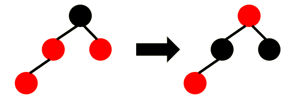
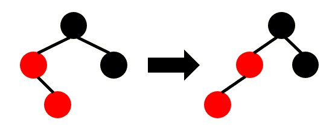
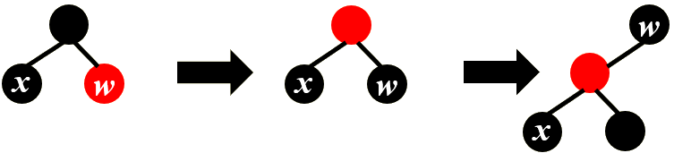
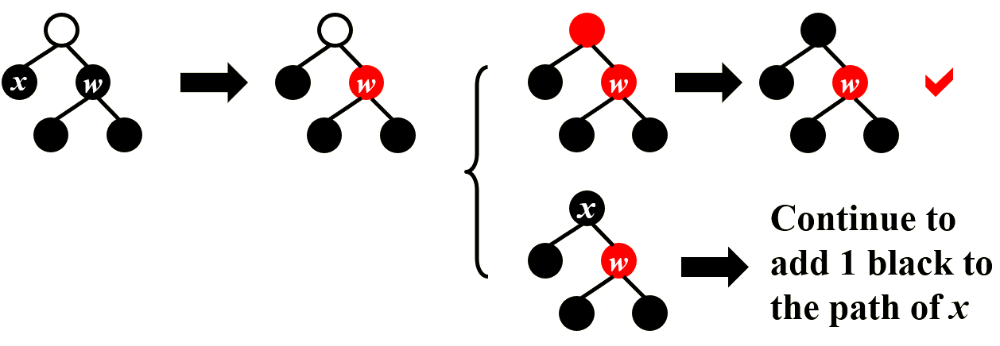
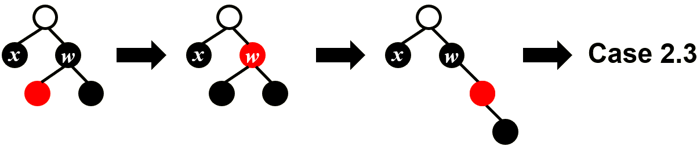
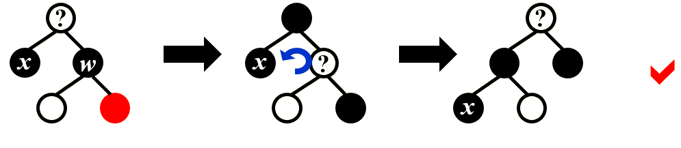
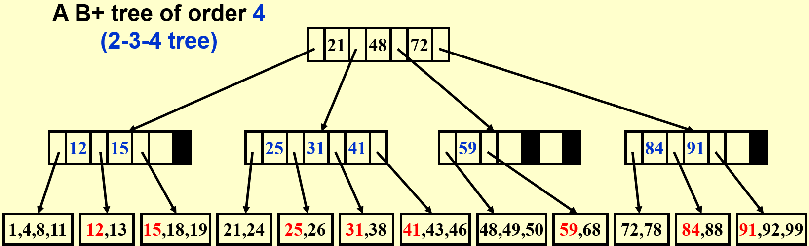

# 红黑树 & B+ 树

## 红黑树

### 性质：

红黑树是BST且：

1. 结点是红色或黑色
2. 根是黑色
3. 叶子是黑色（即NIL是黑色）
4. 红色结点的子结点都是黑色
5. 从任一结点到其每个叶子的所有路径都包含相同数目的黑色结点

!!! warning "注意"
    + 第5条性质描述的黑色结点数目定义为**黑高（bh）**，其**不包括自身但包括NIL结点**
!!! note "推论"
    + $h_T \leq 2bh_T$
    + 若内部结点数量为n，则整棵树可以达到的最大高度为$2\log(n+1)$

### 操作：
#### 插入：
1. 插入结点并标记为红色（保证bh）
2. 调整：
    + 若插入结点的父亲为黑色，不需要调整
    + 若插入结点的父亲为红色，则：
    ??? eg "case 1: 叔为红"
        + 父辈标黑，祖父标红，将调整结点上推
        

        此时若祖父为根，则将其标黑；若祖父父亲为黑，则调整结束；若祖父父亲为红，则继续调整
    ??? eg "case 2: 叔为黑"
        + zig-zig

             
        
        + zig-zag
            
            

#### 删除：
1. 当作BST，正常删除结点：
    + 若删除结点没有孩子，则直接删除
    + 若删除结点只有一个孩子，则删除后用孩子接替
    + 若删除结点有两个孩子，则将待删结点和其左子树的最大结点或右子树的最小结点交换值后删除。

2. 进行调整：
    + 如果删除的结点是红色，不会破坏性质，直接删除即可
    + 如果删除的结点是黑色，且接替结点为红色，则将接替结点标黑即可
    + 若删除的结点是黑色，且接替结点为黑色，则需要调整：
    首先为保证bh，将接替的黑色结点标为双黑，随后有如下几种情况（x为双黑结点）：

        ??? eg "case 1: 兄弟为红"
            
            此时并没有解决问题，但是可以转化为下面的几种情况

        ??? eg "case 2: 兄弟为黑"
            !!! eg "case 2.1: 两侄子均黑"
                
            
            !!! eg "case 2.2: 近侄子红，远侄子黑"
                

            !!! eg "case 2.3: 远侄子红，近侄子任意" 
                

## B+ 树
??? eg 
    

### 性质
1. 叶子均在同层，且只有叶子结点存储数据，数据按升序从左至右存储
2. 非叶子结点只存储索引，若存k个索引，则有k+1个孩子，且$e_i$为子树$T_{v_{i+1}}$所有叶节点中最小值，$e_i$ 大于 $T_{v_i}$ 所有叶节点的值
3. 对于 B 阶 B+ 树：
    + 内部结点孩子数目范围：$[\left \lceil B/2 \right \rceil , B]$
    + 叶子结点数据数目范围：$[2, B]$
    + 叶子存储的数据数目为 $[\left \lceil B/2 \right \rceil , B]$
        + 如果叶子同时是根，则数据数目为 $[1, B]$

!!! note 推论
    记所有叶子存的总数据数目为 n，（假设$n > B \leq 3 $）则：
    
    1. $\#leaf \leq \frac{n}{\left \lceil B/2 \right \rceil}$
    2. $\#node \leq \frac{2n}{\left \lceil B/2 \right \rceil}$
    3. $\#element_total \leq 2n$
    4. $height \leq \log_{\left \lceil B/2 \right \rceil}{\frac{n}{\left \lceil B/2 \right \rceil}} + 1 = O(\log_B n)$

### 操作
#### 插入
1. 二分查找找到插入位置
2. 插入数据
3. 若叶子结点数据数目超过上限，则递归向上分裂结点并更新索引
 
