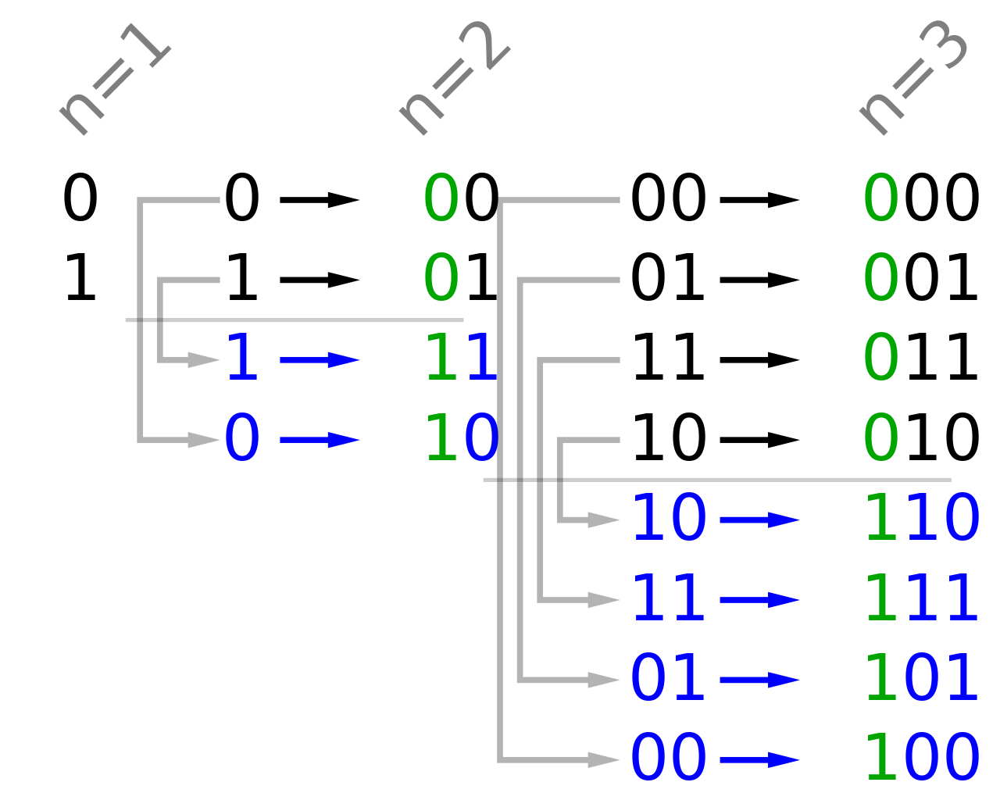

# Digital Systems and Information

??? Abstract
    1. 数字系统：数字信号，典型数字系统。    
    Digital Systems: Digital signal, typical digital systems
    2. 计算机内信息表示法    
    Information Representation
    3. 数制     
    Number systems   

        * 进位计数制的概念和十、二、十六、八制数的表示  
        Positive radix, positional number systems, decimal, binary, octal and hexadecimal  
        * 不同进位数制之间的转换  
        Conversion Between Bases
    4. 编码的概念及带符号二进制数的编码。  
    Representation for unsigned and signed binary numbers  
    
        * 真值、指定长度的机器数：原码、反码、补码。  
        Magnitude, Signed-Magnitude, Signed-1’s Complement, Signed-2’s Complement    
        * 十进制数的二进制编码：BCD 码  
        Binary coded decimal (BCD)  
        * 字符编码：ASCII  
        ASCII Character Codes
    5. 各种信息的编码  
    Non-numeric Binary Codes

## Digital Systems

### Types of Digital Systems   

  
  

??? question "何为“状态”？"
    董老师：“对于此前若干周期的输入数据的抽象”

    有状态后，系统输出必定与当前状态有关

+ no state present(无状态):
   **Combinational Logic System（组合逻辑系统）**：
    
    输入一旦确定，一定有唯一的输出且可预测 / 任意时刻的输出仅取决于该时刻的输入
   (output = Function(Input)).  

+ state present(存在状态): 
   **Sequential System （时序系统）**

    任意时刻的输出即取决于该时刻的输入，也取决于电路的当前状态

    又分两类：

    1. **synchronous** (同步，按特定周期更新):state update at discrete times

    2. **asynchronous** (异步，无特定周期) :state updated at any time

* State = Function(State, Input)  
* Output = Function(State) **or** Function(State, Input)  

    ??? Question "state 不能只和 input 有关吗?"
        —— 不能, 这样 state 的存在就没有必要了(每次的 state 只是作为了 input 到 output 的中间量.) 

!!! Example
    汽车上的里程表, 输入 count up 和 reset 信号. 如果 count up 就把里程加一. 输出就是可视化的显式里程. 状态就是里程表的值.  
    这是非同步的, 因为更新信号的时间不依赖统一时钟, 在任意时刻都可以发生.  

--------------------------------------------

### Embedded Systems(嵌入式系统)

  
  

**analog input(模拟输入)**:  

* **A-to-D**: 把模拟信号转化为数字信号(处理器不能处理模拟信号)  
* **D-to-A**: 处理后把数字信号转化为模拟信号
* 也有其他的数字输入输出(如按键)

**核心**: AD & DA, 嵌入式系统区别于日常计算机

??? Example "A to D"
    对空调, input 是温度传感器(电阻). 输入是一个电压值, 空调如何理解电压变化?  
    
  
  
    
    计算机有以下两个行为:

    + 周期性采样: 采样的周期是由输入信号的信号频率决定.(香农定理确定采样频率)  
    + 量化: 按 $2^n$ 等分数据，使数据离散化(存在误差),**n**决定采样精度 
    ??? extra "D to A"
        + DA转换
        + 滤波

??? extra
    香农定理：采样频率至少在原信号频率的两倍以上
## Information Representation

Binary values are represented abstractly by:  

* digits 0 and 1
* words (symbols) False (F) and True (T)
* words (symbols) Low (L) and High (H) 
* and words On and Off.

Binary values are represented by values or ranges of values of physical quantities

**信号的分类:**  

  
 

为什么选择二进制数值表示? ---更好**对抗数据传输中的干扰**  
连续信号在传输过程中难免衰减

  
  
噪声容限 0.3V(0.6-0.9 0.1-0.4之间可以继续保留信息的正确性)  

## Number Systems 

首先来看进制转换：

计算机中常见进制为 **二进制(binary)**，**八进制(octal)**，**十进制(decimal)**和**十六进制(hexadecimal)**

通常一个 $r$ 进制数可以表示如下:
$A_{n-1}A_{n-2}\cdots A_1A_0.A_{-1}A_{-2}\dots A_{-m}$

其对应的十进制数换算为：

$Number_r = (\sum\limits_{i=0}^{i=n-1}A_i\times r^i)+(\sum\limits_{j=-m}^{j=-1}A_j\times r^j)$

整数与小数分开转换 

!!! note "小数转换"
    十进制转化为$x$进制：小数部分乘$x$取整，余下小数部分重复此步骤至结束
        
    2转8/16进制: 小数点向两边每次取3/4位，不够则补零
    
    !!! warning "注意" 
        + 十进制小数转换难免除不尽，要根据要求精度保留。
        
        + 补零：
            - 整数部分补零在左侧（不补没影响）
            - 而小数部分补 0 是在**右侧(最后)**   
        $(11 111 101. 010 011 110)_2 \neq (375.233)_8$  最后要补 0, 应为 $(375.236)_8$

??? info
    * $2^{10} = 1024$ is Kilo, denoted "K".  
    * $2^{20}$ is Mega, denoted "M".  
    * $2^{30}$ is Giga, denoted "G".  
    * $2^{40}$ is Tera, denoted "T".  

### Binary Arithmetic （二进制运算）
**二进制加法:** 全加器

**二进制减法：**注意0-1=11；计算机中依靠补码实现

**二进制乘法:** 根据乘数对应位是 1 还是 0, 如果是 1 就移位并加起来.(和十进制乘法没区别)

## Binary Coding(二进制编码)

一个数值对应一个符号（例如交通信号灯）

主要有下面几种：

* Numeric  
    * 必须表达一定范围内的数字；
    + 支持简单且普遍的计算；
    + 和二进制数本身关联较大
* Non-numeric  
    * 相对灵活，亦即不需与普遍的运算法则相适配
        + 只要编码映射关系唯一就是合法编码
    * 与二进制数本身未必有关系

------------------------------------------

给定M个符号，求至少需要的二进制位数n:

 $2^n>=M>2^{n-1}$ so $n=\lceil{log_2{M}}\rceil$.  

--------------------------------------------
**"one-hot" code(独热编码):**M个符号，M个二进制位,有且仅有一位是1(对应**独冷**，只有一位是0)

(例如red_001;green_010;yellow_100)  
??? extra
    使用这种编码的好处是，决定或改变状态机目前的状态的成本相对较低，容易设计也容易检测非法行为等。

    但是相对应的，缺点是信息表示率较低，非法状态非常多而有效状态很少。

常见对十进制的十个数字进行编码:  

  
  

!!! warning 
    BCD码和进制转换不同

    13 = D = 1101(进制转化), 但在编码时会表示成 0001 0011(BCD码), 我们应该分别编码每个数字.   

### BCD Codes(Binary Code Decimal)

有权编码，每个码都有位权

可以计算，但要修正。（超过 9 要加 6）

!!! Example
    
  
  

!!! Info "为什么需要 BCD 编码"
    电子表中有时针秒, 我们如果用二进制保存时针秒, 那么 加到9以上得到 ABCD..., 当我们想要显示这些值时, 我们要先做进制转换, 再显示(如 A 转为 10) 这其中要做除法, 成本高.  
    但我们用两位 BCD 码表示, 就可以直接显示结果了.  
### Excess3(余三码)

8421 + 3 得到 Excess3 的值. 

编码成对出现, i 和 9 - i 各位互反. 在通信时很有用处.  

“3”来自于BCD码中加法修正时的$\frac{16-10}{2}$,从而很好地解决了BCD加法中的进位问题

### ASCII Codes

常用的 ASCII Code:  

* **`0`** <-> $30_{16}$  
* **`A`** <-> $41_{16}$ to $5A_{16}$ 
* **`a`** <-> $61_{16}$ to $7A_{16}$ 
* Delete (DEL) is all bits set.  

### Parity Bit Error-Detection Codes(奇偶校验位)

信号传输过程中可能由于各种原因出现信号抖动，为保证数据可信度，需要一个错误检测机制。

一种常见方法是 **冗余**，即加入一些额外的信息用来校验

一种做法是引入 **奇偶校验位（Parity Bit）**.
它分为：

+ 偶校验：A code word has **even parity** if the number of 1’s in the code word is even.  
+ 奇校验：A code word has **odd parity** if the number of 1’s in the code word is odd.

添加一位，表示编码的奇偶性。

对偶校验来说，当`1`的个数为偶数时校验位为`0`.(如`0101`添加一位`0`成为`01010`)

对奇校验来说，当`1`的个数为奇数时校验位为`1`(如`1101`添加一位`1`成为`11011`)

此时若传输过程中出现问题，`1`的数量很可能变成奇数，从而得知此信息不对。

### Gray Codes

  
 

!!! Example "应用: 光学传感器"   
    编码器盘包含不透明区域和透明区域。  
    Opaque表示0 ,clear表示1。光通过编码器的每一个环，与编码的一个位相对应，照射在传感器上，产生一个0或1  
    
  
  

    角编码器, 测量转轴转向的角度.  
    三个传感器不会在同一条直线(安装误差), 存在中间状况.  
    但格雷编码盘, 相邻编码只差一位, 对结果不会带来影响.  

    例如二进制编码 011 转换到 100 ，还有可能出现中间状态 000, 001, 010, 110, 101, 111; 但格雷编码只会是011或100。

??? extra 
    格雷码的一种简单粗暴的写法，是通过「镜像」的技巧来倍增已知的格雷编码。

    具体来说，如果现在有0 - 3的格雷码，分别是 00，01，11，10，那么我们可以将其增添一位前导 0，然后镜面对称地书写出带有前导 1 的4 - 7的格雷码。

    最终我们得到的0 - 7的格雷码是：000，001，011，010，110，111，101，100

    
    

#### Unicode

Unicode extends ASCII to 65536(ASCII 最多只有 7 个二进制位, 后扩展为 8 个)

* 2 bytes(16 bits) code words  
* 可以用来编码中文/韩文...等字符(ASCII 只能处理英文字母)