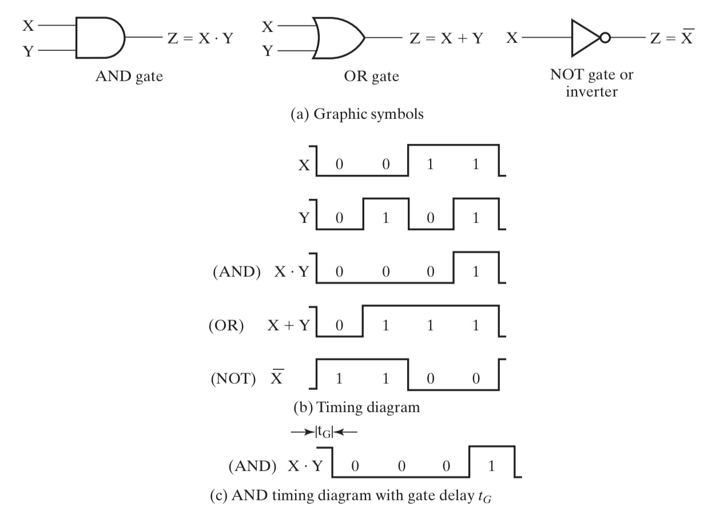
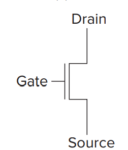
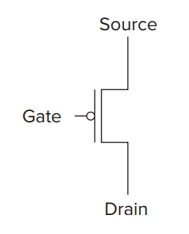
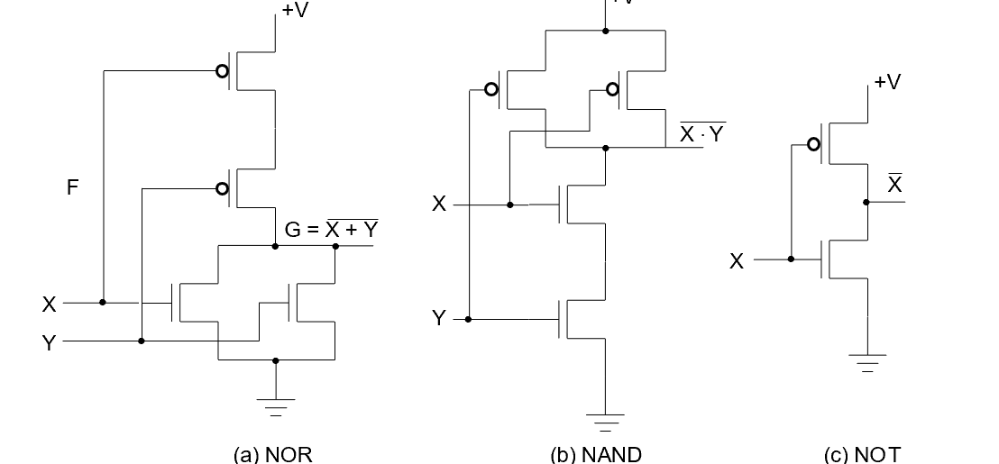

# **Combinational Logic Circuits**

??? Abstract  
    1. 布尔代数(Boolean)的概念  
    Boolean Algebra   

        * 变量与真值的关系  
        Binary Variables  
        * 二值逻辑和门  
        Binary Logic and Gates
        * 三种基本运算  
        Three basic logic operations
    2. 基本运算法则与电路符号  
    Operation Definitions and Logic Gate Symbols
    3. 基本运算公式、规则、反演，对偶规则  
    basic identities, DeMorgan’s Theorem, Dual Theorem
    4. 基本逻辑电路与其逻辑特性。与，或的开、关门特点，异或的同相、反相性质    
    Logic Gates and implementation, AND, OR gates used to control gate open or close, 
    XOR gates used as a controllable invertor
    5. 逻辑函数的化简  
    Simplification

        * 化简的标准、公式化化简、最小项，最大项及其相互关系、卡诺图化简、质蕴涵项、必要质蕴涵项，门输入成本  
        Boolean Algebraic Proof, Boolean Function Optimization, Canonical Forms, 
        Minterms, Maxterms and their relationship, K-map simplification, Prime 
        Implicants, Gate input Cotes
        * 含任意项函数化简  
        Don't Cares in K-Maps
    6. 不同函数形式的变换及与最小项的关系    
    SOM form, POM form, Standard forms, SOP form, POS form, Conversion between 
    forms
    7. 函数的五种表示形式：真值表、逻辑解析式、波形图、卡诺图、逻辑电路图  
    Truth Table, Boolean Equations, Wave form, K-map, Logic Diagram
    8. 高阻输出(三态门)  
    Hi-Impedance Outputs, Three state buffer

## **Gate Circuits and Boolen Equations**

### **Binary Logic and Gates**

#### Binary Logic

逻辑运算的对象是布尔变量 
如True/False, On/Off, Yes/No, 1/0, 高电压/低电压

主要运算如下： 
 
+ **`A AND B`** denoted by $A\cdot B$或者$AB$  
+ **`A OR B`** denoted by $A + B$
+ **`NOT A`** denoted by $\overline{A}$ or $ \sim{A}$  
+ **`A NOR B`** denoted by $\overline{A+B}$
+ **`A NAND B`** denoted by $\overline{A\cdot B}$

逻辑函数的具体实现:   

  
  

#### **Logical Gates（逻辑门）**
>硬件层面上实现布尔代数的逻辑单元。其操作对象为高低电平

> (a)是三种常用逻辑门的符号，(b)为三者在 **时序图 (timing diagram)**中的状态，(c)为在延时效应下的时序图

??? extra "gate delay"
    
    由于物理层面的实现，每个门电路在改变输入后，输出的改变都会有一定的延迟 
    很多时候我们会使用更昂贵的器材来获得更小的 delay.  

>另：非门更多被称为 inverter 而不是 NOT

**MOS管** 

+ N-type  

等效于常开开关

+ P-type  

  

等效于常闭开关

下面是或非门、与非门和非门：

  
  

**通用门(Universal Gate):**功能完全的，能够表示其他所有门的逻辑门。只有**NAND**和**NOR**是通用门   

!!! Question
    + 能不能把两个逻辑门的输出接在一起?(如 NAND 和 NOT 的输出)?   
    -> 可能一个输出是 1, 一个输出是 0. 短路, 芯片烧掉, 冒烟.  
    + 能不能把 NOT 门中变为 X 和 Y 两个输入分别对应 CMOS 和 NMOS?  
    ->不能. 当 X,Y=1,0 时上下都接通, 短路. 当 X,Y=0,1 时输出角处于 HZ(高阻态).   
    三态门允许器件输出这样的结果.  

### Boolen Algebra

#### 基础运算律

(左右公式是对偶的)

**注意到公式15似乎有些反直觉，但实际上这只是（为了少写一些括号）人为规定的运算优先级问题，本质仍是And 对 Or 的分配律**

**precedence**: （） > NOT > AND > OR   

AND 和 OR 地位上是对等的，但是优先级不同

#### 推广

实际上前三个和后三个互为对偶

#### 对偶函数(dual function)和反函数(complement of function)

!!! warning "注意"
    区分“对偶函数”和“反函数”

    对偶函数是指将原函数中的 AND 和 OR 互换。

    反函数是指将原函数中的 AND 和 OR 互换，同时将所有的常数和变量取反。（也可看做是在对偶基础上进一步取反）

    注意为保证运算顺序，有时需要加括号。
    !!! eg "example"
        - 原函数：$F=\overline{A}B+C\overline{B}$；
        - 其对偶函数：$F=(\overline{A}+B)(C+\overline{B})$；
        - 其反函数：$F=(A+\overline{B})(\overline{C}+B)$。
#### 一致性定理（Consensus Theorem）

$$
XY+\overline{X}Z+YZ=XY+\overline{X}Z
$$

主要思想是为了合并而裂项：
$XY+\overline{X}Z+YZ=XY+\overline{X}Z+(X+\overline{X})YZ=XY+\overline{X}Z$

#### 课上的例子
??? Example "Boolean Algebraic Proofs 1"
    AB + A'C + BC = AB + A'C (Consensus Theorem)  
    Justification 1: 			1 . X = X  
    Justification 2: 			 
    X + X’ = 1  
    原式 = AB + A’C + ABC + A’BC 	X(Y + Z) = XY + XZ (Distributive Law)   
    = AB + ABC + A’C + A’BC  	X + Y = Y + X (Commutative Law)  
    = AB . 1 + ABC + A’C . 1 + A’C . B X . 1 = X, X . Y = Y  . X (Commutative Law)  
    = AB (1 + C) + A’C (1 + B)  X(Y + Z) = XY +XZ (Distributive Law)  
    = AB . 1 + A’C . 1 = AB + A’C	X . 1 = X      
    最好将每一步用的公式写出来    

??? Example "Boolean Algebraic Proofs 2"
    (X+Y)'Z + XY' = Y'(X+Z)
    原式 = X’ Y’ Z + X Y’ (A + B)’ = A’ . B’ (DeMorgan’s Law)  
    = Y’ X’ Z + Y’ X A . B = B . A (Commutative Law)  
    = Y’ (X’ Z + X)  A(B + C) = AB + AC (Distributive Law)  
    = Y’ (X’ + X)(Z + X) A + BC = (A + B)(A + C) (Distributive Law)  
    = Y’ . 1 . (Z + X)        A + A’ = 1
    = Y’ (X + Z)		1 . A = A, A + B = B + A (Commutative Law)  
    <u>**留意定理 15**</u>

??? Example "Boolean Algebraic Proofs 3"
       
   

### **Standard Forms & Canonical Forms**

真值表相同的布尔函数写法多而杂，我们希望能找到一种标准的写法。

由此引入了两种标准的写法：

+ **标准形式（Standard Forms）**: 包括**SOP**和**POS**

+ **规范形式（Canonical Forms）**: **SOM**和**POM**。

二者可以互相转化。

初学的时候或许结合一个真值表来理解会更好一点。

考虑一个由三个命题变量构成的复合命题，它的真值表如下：

|    Index|X|Y|Z|Output|
|:-------:|:-:|:-:|:-:|:-:|
|0 / `000`|`0`|`0`|`0`|`0`|
|1 / `001`|`0`|`0`|`1`|`0`|
|2 / `010`|`0`|`1`|`0`|`1`|
|3 / `011`|`0`|`1`|`1`|`0`|
|4 / `100`|`1`|`0`|`0`|`1`|
|5 / `101`|`1`|`0`|`1`|`1`|
|6 / `110`|`1`|`1`|`0`|`0`|
|7 / `111`|`1`|`1`|`1`|`1`|

>注意到index的二进制写法各位数字对应的正是X、Y、Z的取值，**0表示取反，1表示原命题**，实际上正是用$m_{index}$来表示最小项，$M_{index}$来表示最大项。

#### 最小项之和（SOM）& 最大项之积（POM）

+ **最小项Minterms**    
>Minterms are ***AND*** terms with each variable present in either true or complemented form. 

即：所有变量的取值组合中，使得函数值为1的取值。

对应上表中所有Output为1的行：$m_2=\overline{X}Y\overline{Z}$、$m_4=X\overline{Y}\overline{Z}$、$m_5=X\overline{Y}Z$、$m_7=XYZ$。

+ **最大项Maxterms**  
>Maxterms are ***OR*** terms with each variable present in either true or complemented form.
  
 即：所有变量的取值组合中，使得函数值为0的取值。

 对应上表中所有Output为0的行：$M_0=X+Y+Z$、$M_1=X+Y+\overline{Z}$、$M_3=X+\overline{Y}+\overline{Z}$、$M_6=\overline{X}+\overline{Y}+Z$。     

!!! warning "区分"
    最小项中XYZ的是否取反与index二进制各位数字**相对应**，

    最大项中XYZ的是否取反与index二进制各位数字**相反**
+ **最小项之和（SOM）**：   
    将所有结果为 1 的 minterm 取或，得到的就是原函数的表达式。
    
+ **最大项之积（POM）**：
    将所有结果为 0 的 maxterm 取与，得到的也是原函数的表达式

两种写法等价，且不重不漏。（即一旦确定其中一个，另一个也可得出）

#### **标准形式（SOP & POS）**  

* **Standard Sum-of-Products (SOP) form:** 积式的和（析取范式）
* **Standard Product-of-Sums (POS) form:** 和式的积（合取范式）
    
!!! Info
    Standard Forms 用来做**电路实现**, 一般会进行 SOM POM 化简, 但会省略一些东西. 依然按照 Standard Order, 但每一项中不一定需要所有变量.  
    SOP POS 也被称为**两极函数**.  
    如 **SOP**: $ABD+\overline A \overline B C +B$, **POS**: $(A+B)\cdot  (A+\overline B+\overline C)\cdot  C$ 他们路径上最多只需要经过两个电路门, 这称为二级电路.  
    反观 $(AB+C)(A+C), AB\overline C+AC(A+B)$ 最多就需要经过三个电路门.
    
    * 为什么需要降低电路门的级数?   
    电路门有延迟, 经过的电路门越多延迟越大, 意味着最后电路做出来的计算机不易提高功率.  

## **电路实现和优化（Circuit Optimization）**

>在实际情况中，若直接通过标准形式实现电路，有时会导致成本过高以及电路冗余。因此引入“卡诺图（Karnaugh map）”来优化逻辑电路。

在正式引入前，还需要定义一些定量衡量电路成本的量，亦即**成本标准（cost criteria）**

主要有以下三种：

+ **L(Literal cost) **：按照**字面量**计算
!!! note
    就是单纯的字面量，重复出现也要计算
    !!! eg
        + $F=BD+A\overline BC+ A\overline C\overline D$  L=8  

        + $F=BD+A\overline BC+ A\overline B\overline D + AB\overline C$  L=11  

+ **G(Gate input cost) **：按照**门输入**计算且**不算非门**

+ **GN(Gate input cost with NOTs)**：按照**门输入**计且**计算非门**

!!! note 
    所谓按照门输入，亦即按照**逻辑门输入的引脚**个数计算。单个字面量的引脚已经计算在了L中，这里G只需要在L的基础上再加上**字面量运算后所得结果作为输入传入下一逻辑门的引脚**个数
    
    在计算非门时，重复出现的只记一次
    !!! eg 
        + $F=BD +A\overline BC+A\overline C\overline D$  G=8(L)+3=11, GN=11+3=14.

        + $F=BD+A\overline BC+A\overline B\overline D+AB\overline C$ G=11+4=15, GN=15+3(only BCD)=18.  

  
    
***e.g.***   

!!! Example "Cost Criteria"
    
  
  
    
  
  

When do we stop trying to reduce the cost?    
Do we know when we have a minimum cost?  

### **Map Manipulation**

**Karnaugh maps(K-map)**   

* A **K-map** is a collection of squares
Each square represents a minterm
* The collection of squares is a graphical representation of a Boolean function
* <u>**Adjacent squares differ in the value of one variable**</u>
* Alternative algebraic expressions for the same function are derived by recognizing patterns of squares

The **K-map** can be viewed as

* A reorganized version of the truth table
* A topologically-warped Venn diagram as used to visualize sets in algebra of sets

#### **Two-Variable Maps**

  
  

!!! Example
    |F=x+y|y=0|y=1|
    |:-|-|-|
    |x=0|0|1|
    |x=1|1|1|

    For function F(x,y), the two adjacent cells containing 1’s can be combined using the Minimization Theorem:  
    $F(x,y)=(x \ \overline y + x\ y ) + (x\ y + \overline x \ y) = x + y$

#### **Three-Variable Maps**

  
  

!!! Note
    注意列, <u>**要按照Gray codes的顺序排列, 即相邻两列只相差一位.**</u>  因此列标号为  00 01 11 10.  
    相邻两个小方格都只有一个变量不同.  
    可以卷起来, 即最左边一列和最右边一列

**Alternatie Map Labeling**   

  
  

!!! Example  
    
  
  

    * 注意到 3 2 格都是 1, 因此 $\bar xy\bar z + \bar x y z = \bar xy$, 没有变化的变量可以保留, 变化了的变量可以消掉. 同理 4 5 格可化为 $x \bar y$   
    * 3 7 格: $yz$; 6 7格: $x y$; 4 6 格$: x\bar z$

**Combining Squares**

可以画 $2^n$ 大小的方形格(即一次要包括 $2^n$ 个小方格)  
For 3-variable **K-Map**:  

* One square represents a minterm with three variables  
* Two adjacent squares represent a product term with two variables  
* Four “adjacent” terms represent a product term with one variable  
* Eight “adjacent” terms is the function of all ones (no variables) = 1.  

!!! Example
    
  
  

!!! Warning

    * 格雷码!  
    * 两侧可以卷起来  
    
  

<u>**化简思路: 用最大的最少的圈把所有的 1 圈完.(圈与圈之间可以有交叉)**</u>  
一定是 SOP

!!! Example
    
  
  
    

#### **Four Variable Maps** 

  
  

!!! Note
    注意四个角也可以卷(0 2 8 10 -> $\overline X \ \overline Z$)

!!! Example
    
  
 
    F = XZ + X'Z'  
    化简结果不唯一

#### **Don't Cares(无关项) in K-Maps**

By placing “don't cares” (an “x” entry) in the function table or map, the cost of the logic circuit may be lowered.  
如我们把 BCD 码作为输入, 有效数字 0 - 9, 如果那么 9 以上的输入组合我们不在乎输出结果, 称为无关项, 在卡诺图上画 x.    

!!! Example "BCD 5 or More"
      
    X 可圈可不圈!  

!!! Example
    Find the optimum POS solution: $F(A,B,C,D)=\sum\limits_m(3,9,11,12,13,14,15)+\sum d(1,4,6)$  
    Hint: Use $\overline F$ and complement it to get the result.  
    ans:
    F' = B' D' + A' B   (求 F' 时在卡诺图中圈空格，而不是 1)
    F = (B + D)(A + B')  

#### Systematic Simplification

* A **Prime Implicant**(质蕴含项) is a product term obtained by combining the maximum possible number of adjacent squares in the map into a rectangle with the number of squares a power of 2.  
* A prime implicant is called an **Essential Prime Implicant**(必要质蕴涵项) if it is the only prime implicant that covers (includes) one or more minterms.  

质蕴涵项是对某个 "1" 而言包括它的最大方形。对某个 "1" 而言如果它的质蕴涵项只有一个，那么它是必要的。

1. Find All Prime Implicants
2. Find Essential ones
3. 处理剩下的 1 

!!! Example
    
  
   
    哪些 1 只被一个质蕴含圈包围，那么他一定是必要质蕴涵项 

!!! Example
    Find all prime implicants for:  
    $G(A,B,C,D)=\sum\limits_m(0,2,3,4,7,12,13,14,15)$  
    Hint: There are *seven* prime implicants!  
    
    Prime Implicants are AB, B C' D', A' C' D', A' B' D', A' B' C, A' C D, B C D. ony AB Essential.   

### Multi-Level Circuit Optimization

两级门的延迟低，但 cost 高。

!!! Example "Transformation Examples"
    
  
    

#### **Integrated Circuits**

集成电路

* **Integrated circuit** (informally, a **“chip”**) is a semiconductor crystal (most often silicon) containing the electronic components for the digital gates and storage elements which are interconnected on the chip.   
* **Terminology** - Levels of chip integration

    * *SSI (small-scale integrated)* - fewer than 10 gates
    * *MSI (medium-scale integrated)* - 10 to 100 gates
    * *LSI (large-scale  integrated)* - 100 to  thousands of gates
    * *VLSI (very large-scale integrated)* - thousands to 100s of millions of gates

* **Technology Parameters**

    * **Fan-in 扇入系数** – the number of inputs available on a gate  
    一个门的输入端的上限  
    理想情况一个门的输入可以接无数个门的输入，但实际上因为每一个门的输入端都会花费一些电流，而门输出的电流是有限的，从集成电路本身会要求一个门的输出最多能拉多少门的输入。
    * **Fan-out 扇出系数** – the number of standard loads driven by a gate output  
        一个门的输出带了很多门的输入？（像火车头带了很多车厢）  
        一个门的输出不能接到太多门的输入上去，一般会用 buffer 做缓冲  
        
        * ***e.g.*** 1 standard load equals the load contributed by the input of 1 inverter.  
        * **Transition time** - the time required for the gate output to change from H to L, $t_{HL}$, or from L to H, $t_{LH}$  
        带的门越多，上升时间就越多。
        我们会限制过渡时间，设置 maximum fan-out 
    * **Logic Levels** – the signal value ranges for 1 and 0 on the inputs and 1 and 0 on the outputs (see Figure 1-1)
    * **Noise Margin** – the maximum external noise voltage superimposed on a normal input value that will not cause an undesirable change in the circuit output
    * **Cost for a gate** - a measure of the contribution by the gate to the cost of the integrated circuit  
    Ignoring the wiring area, the gate area is roughly proportional to the gate input count.  
    * **Propagation Delay** – The time required for a change in the value of a signal to propagate from an input to an output
    * **Power Dissipation** – the amount of power drawn from the power supply and consumed by the gate

#### **Propagation Delay**  

Delay is usually measured at the 50% point with respect to the H and L output voltage levels.  
High-to-low ($t_{PHL}$) and low-to-high ($t_{PLH}$) output signal changes may have different propagation delays.  
注意 HL/PL 指的是**输出端**的时间变化。

  

!!! Info
    如果这里有 n 个非门串联
    
  
    

    计算 $t_{PHL}$ 需要 $t_{3PHL} + t_{2PLH} + t_{1PHL}$  
    从结果倒推  
    如果只求 $t_{pd}$ 只需要把每级的 $t_{pd}$ 相加即可。

* **Delay Mode**  

    * **Transport delay** - a change in the output in response to a change on the inputs occurs after a fixed specified delay  
    输出整体往后移
    * **Inertial delay** - similar to transport delay, except that if the input changes such that the output is to change twice in a time interval less than the **rejection time**, the output changes do not occur. Models typical electronic circuit behavior, namely, rejects narrow “pulses” on the outputs
    除了输出往后移，在惯性延迟下，很窄的脉冲（小于 rejection time）会被消除掉。    

        !!! Example
            
  
   
            蓝线表明 propagation time, 黑线表明 rejection time.  
            因此 ab de 这个脉冲被吃掉

* **Circuit Delay**

    !!! Example
        
  
   

        * 最开始 S 由 0->1 后 0.9s Y 从 0->1 
        * S 从 1->0 后下方的与门 0.4s 后会从 1->0, 但上方的与门 0.6s 后才会从 0->1. 但 0.9s 后 Y 才会 1->0, 此后再过 0.2s(共 1.1s) 后 Y 从 0-> 1.  
        这里 Y 出现了一个小尖峰，我们称之为电路产生的**冒险**。  
        S 的两条路径我们发现延迟不同，这种我们称之为电路中的**竞争**。

* Fan-out and Delay  
The fan-out loading a gate’s output affects the gate’s propagation delay。  
**SL**(Standard Load): 以非门为标准。带一个非门需要...的负载

    !!! Example
        One realistic equation for tpd  for a NAND gate with 4 inputs is: $t_{pd} = 0.07 + 0.021 SL$ ns
        SL is the number of standard loads the gate is driving, **i. e.**, its fan-out in standard loads
        For SL = 4.5, tpd = 0.165 ns  
        由工艺程度+负载情况决定  

* Cost/Performance Tradeoffs  

    !!! Example
        NAND gate G with 20 standard loads on its output has a delay of 0.45 ns and has a normalized cost of 2.0.  
        A buffer H has a normalized cost of 1.5. The NAND gate driving the buffer with 20 standard loads gives a total delay of 0.33 ns  
        1. The cost of this portion of the circuit cannot be more than 2.5
        2. The delay of this portion of the circuit cannot be more than 0.40 ns
        3. The delay of this portion of the circuit must be less than 0.40 ns and the cost less than 3.0

        ans:
        1. No buffer  
        2. Use buffer  
        3. Irrelevant - buffer needed to satisfy delay constraint, but cannot satisfy cost constraint.

## Additional Gates and Circuits

### Other Gate Types

Why?

* Implementation feasibility and low cost
* Power in implementing Boolean functions
* Convenient conceptual representation

Gate classifications

* **Primitive gate** - a gate that can be described using a single primitive operation type (AND or OR) plus an optional inversion(s).
* **Complex gate** - a gate that requires more than one primitive operation type for its description

### **Primitive gate**

#### Buffer  

  

没有逻辑功能，但有很强的带负载的能力，能够拉高电平，降低传输延迟。

#### NAND

  
   

与非也可以认为是*先非后或* $F=\overline{X} + \overline{Y} + \overline{Z}$  
A NAND gate with one input degenerates to an inverter.  
**Universal gate** - a gate type that can implement any Boolean function. 
最高效

我们一般不使用与非门做逻辑运算，因为他不满足交换、结合律。一般在最后把与或非转为用与非实现。

#### NOR

  
   

也可以利用 De Morgan 变为 先非后与，其他同与非。

### **Complex gate**

#### Exclusive OR/ Exclusive NOR

eXclusive OR(XOR) and XNORs gate  

* **Definitions**:  

    * $X\oplus Y = X\ \overline Y +\overline X \ Y$  
    * $\overline{X\oplus Y} = X\  Y +\overline X \ \overline Y$  
* the XNOR function also known as the **equivalence function**, denoted by the operator '$\equiv$'.  
* 重要公式（要记）

 (第一行 & 最后一行很重要)
 

* 严格来说，只有两变量的异或。对于多于两个输入的，我们用奇函数/偶函数代替。  
对于三变量的异或 $X\oplus Y\oplus Z = \overline X \ \overline Y \ Z + \overline X \ Y \overline Z + X \ \overline Y \ \overline Z + X\ Y\ Z$
卡诺图无法再化简

    ||1||1|
    |:-|-|-|-|
    |1||1||

    我们称它为奇函数，因为 minterm 里 1 的个数($=\sum m(1(001),2(010),4(100),7(111))$)为奇数。其反函数为偶函数。

* Symbol  
注意 bubble 泡泡(表示 inverter)  

  
   

* Implementation  

  
  
下面的实现需要 $4\times 4=16$ 个晶体管。但实际中最简单只需要 10 个晶体管，就可以构造出 XOR 门。

#### Odd and Even Functions

* The 1s of an **odd function** correspond to minterms having an index with an odd number of 1s.  
* The 1s of an **even function** correspond to minterms having an index with an even number of 1s.  

!!! Example
    xor 都是奇函数.  
    如 $F=(X\oplus Y)\oplus Z \\ F=(W\oplus X)\oplus (Y\oplus Z)$  

* Parity Generators and Checkers
奇偶校验：传输若干个数据位，增加一个数据位，用来表示数据位的奇偶性。输入和输出端的奇偶位应该相同。  

    !!! Example
        
  
  

#### Hi-Impedance Outputs  

高阻输出  

**Three-state** logic adds a third logic value, Hi-Impedance (Hi-Z), giving three states: **0, 1, and Hi-Z** on the outputs.   
有条件情况下允许门的输出接在一起。  

* 3-State Buffer

  
 

* Resolving 3-State Values on a  Connection  
把两个三态门的输出接在一起：  
*Resolution Table*  

|B1|B0|OUT|
|:-|-|-|
|0|Hi-Z|0|
|1|Hi-Z|1|
|Hi-Z|0|0|
|Hi-Z|1|1|
|Hi-Z|Hi-Z|Hi-Z|

!!! Info
    不允许同时两个门同时输出有效输出！否则可能产生大电流损坏电路。  
    因此对于 n 个三态门，共 2n+1 种有效组合。

* 3-State Logic Circuit   

 此时，两个三态门不会同时输出有效输出。
  

#### More Complex Gates 

The remaining complex gates are SOP or POS structures with and without an output inverter.  

* A - AND
* O - OR
* I  - Inverter
Numbers of inputs on first-level “gates” or directly to second-level “gates”  

***e.g.*** AOI(AND-OR-Invert), 2-2-1 AO means 2-input ANDS driving an OR with one additional OR input.  