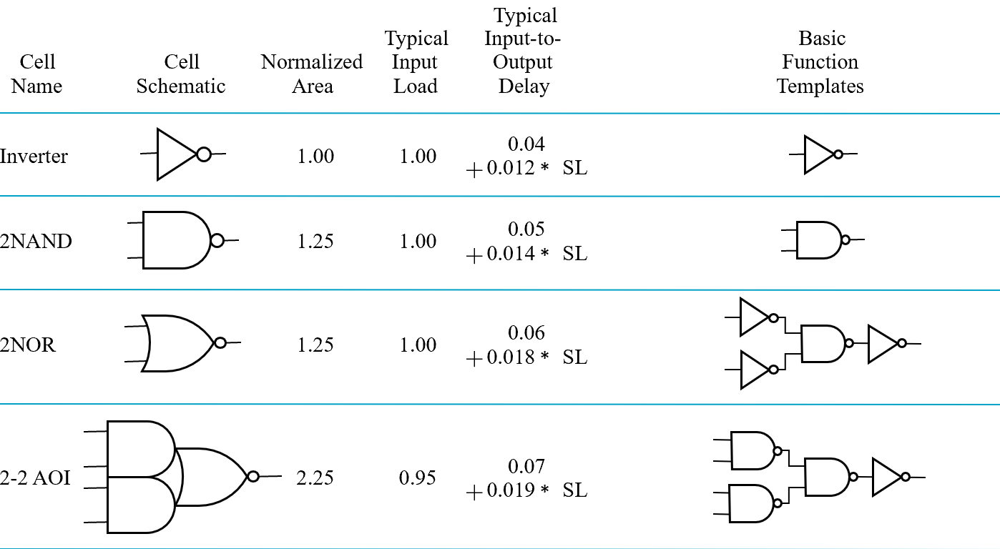
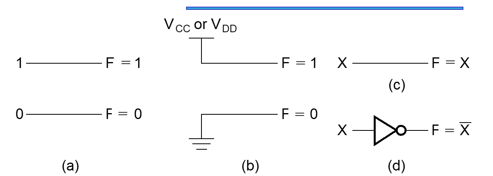
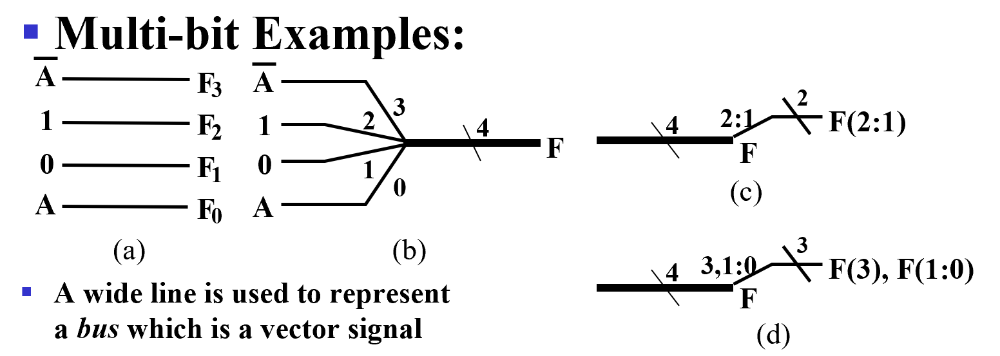
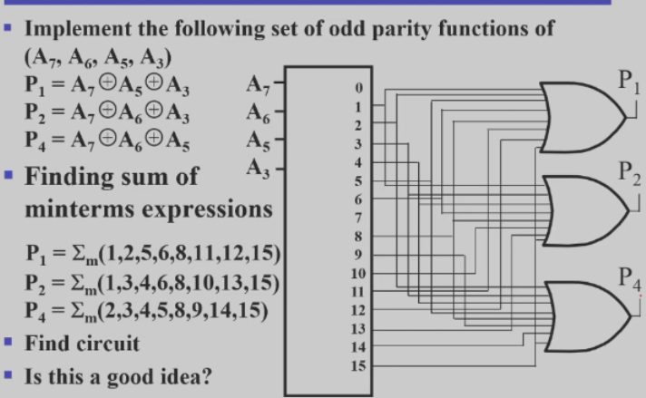
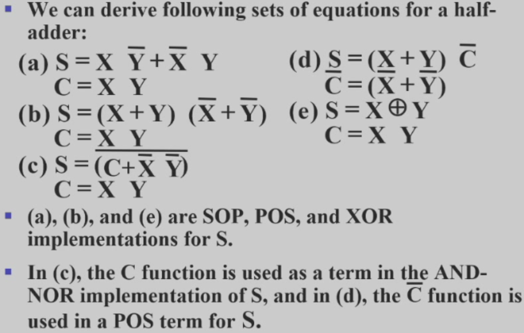
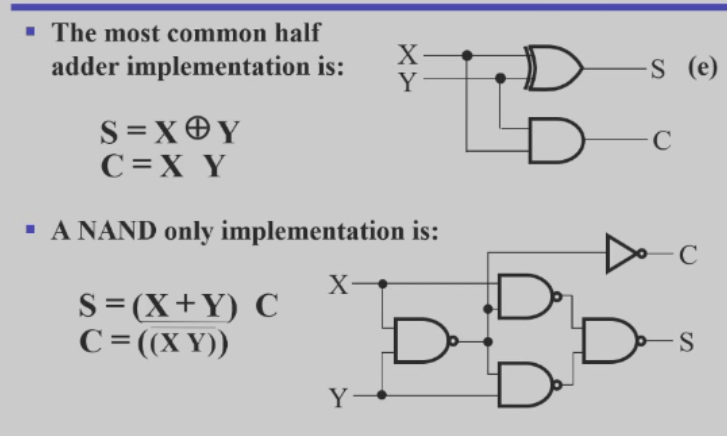

# Combinational Logic Design

??? Abstract
    1. 组合电路定义（逻辑电路的两大类型：组合逻辑电路、时序逻辑电路）  
    Definition of Combinational Circuits  
    2. 模块与层次设计  
    Hierarchical Design  
    3. 逻辑事件的描述方法*  
    Description of logic events  
    4. 逻辑门的主要参数  
    Technology Parameters  
    扇入（Fan-in）、扇出（Fan-out）、噪音容限（Noise Margin）、门的成本（Cost for a gate）、传输延迟（Propagation Delay）  
    5. 器件状态值或状态表与正逻辑，负逻辑的概念  
    Positive and Negative Logic  
    6. 三态门使用原则与总线（BUS）  
    BUS  
    7. 信号系统延时、延时模型、上升和下降时间、时钟上升和下降沿概念。  
    Delay Models, Positive and Negative Edge  
    8. 组合逻辑电路分析方法  
    Analysis of Combinational Circuits  
    9. 组合逻辑电路的设计方法  
    Design of Combinational Circuits  
    10. 函数与函数模块，基本逻辑功能  
    Functions and functional blocks  
    11. 计算机中的常用组合逻辑电路（功能芯片）  
    Frequently used Combinational Circuit in Computer Design  
    译码器、编码器、数据选择器（多路复用选择器）、数据分配器。  
    12. 组合函数的实现技术  
    Implementing Combinational Functions Using:  
    译码器和或门  
    Decoders and OR gates  
    多路复用器（加反相器）  
    Multiplexers (and inverter)  
    13. 使能信号（EN，OE）的作用    
    Function of Enable Signal  
    14. 组合电路的迭代结构  
    Iterative combinational circuits  
    15. 算术函数：了解加、减、乘、除、增量函数及运算  
    Arithmetic function: Add, subtraction, multiplication, division, increment  
    16. 补码运算  
    2’s complement  
    17. 半加器及全加器函数及电路设计  
    Equations and Circuit implementation of 1 bit Half Adder and Full Adder  
    18. 多位全加器、全减器及设计  
    Design of multiple-bit Full Adder/ Subtracter  
    19. 超前进位：进位传递与延迟，进位函数：generate, Gi、propagate, Pi  
    Carry Lookahead: carry propagation and delay  

## Design Procedure （标准设计步骤）

!!! Section "回顾：组合逻辑电路"
    + 输入由输出唯一确定，与历史输入无关
    + 若有m个输入，n个输出，则有n个布尔函数，每个函数都是m个输入的函数

!!! note "主要设计过程"
    1. **Specification**  
    写出电路的功能要求，真值表，或者逻辑函数
    2. **Formulation**  
    用**真值表**或者**逻辑函数**描述电路的功能
    3. **Optimization**  
    优化逻辑函数，化简逻辑函数（比如卡诺图），进行**两级优化**或者**多级优化**
    4. **Technology Mapping**  
    选择合适的技术映射，选择合适的门（通常是与非和或非门）（工艺映射）

    ??? question "为什么需要这步"  
     
        很多时候需要用预先定义好的与非门，或者其他基本模块（如 XOR）直接套入电路中去，可以降低电路的成本和延迟。

    5. **Verification**  
    验证电路的正确性，仿真

### Hierarchical Design（层次化设计）
与写代码一样，设计电路也要模块化。

+ 将逻辑函数划分为足够小的*blocks*
+ 不可再划分的称之为*primitive block*(如与非门、异或门等)
    - **Reusable Functions:**   
        把常用的操作抽象成模块，并提前定义好延迟等等特性。当需要使用时，我们把电路引脚接入即可。
+ 所有包括被划分模块的集合称为*hierarchy*（层？）

!!! eg
    + 顶层（Top Level）:定义9个输入和1个输出
    + 第二层（2nd Level）：四个3位
    
  
  

!!! Info "实例化模块和函数调用的区别"
    电路上实例化模块：复制一块并嵌入到电路中。且同时实例的模块是同时在运行，如上图中四个实例化的奇函数模块。（实际上硬件里做串行是非常麻烦的，需要状态机来约束行为逻辑）

    但 C 语言函数体只有一份代码，只是 PC 跳到函数部分。  

  

**Top-Down（自顶向下） versus Bottom-Up（自底向上）**

+ 自顶向下划分模块、分解功能设计
+ 自底向上从基本模块开始构建复杂逻辑电路

### **Design Procedure**

??? eg "BCD to Excess-3 code converter"
    1. **Specification**  

        * Transforms BCD code  for the decimal digits to Excess-3 code for the decimal digits
        * BCD code words for digits 0 through 9: 4-bit patterns 0000 to 1001, respectively  
        其他输入认为是无关项。  
        * Excess-3 code words for digits 0 through 9: 4-bit patterns consisting of 3 (binary 0011) added to each BCD code word
        * Implementation:
            * multiple-level circuit.
            * NAND gates(including inverters)

    2. **Formulation**  
    
  
  

    3. **Optimization**
        * two-level  
        W X Y Z 输出也需要四个逻辑函数。  
        单独 ABCD 四输入 对应一个输出 W, 用卡诺图化简。
        
  
  

        得到 $W=A+BC+BD, X=\overline B C+\overline B D+B \overline C\overline D, Y=CD+\overline C\overline D, Z=\overline D$
        
        * multiple-level  
        $G=7+10+6+0=23$.  
        优化后: $T_1=C+D, W=A+BT_1$, 
        
        $X=\overline BT_1 + B \overline C\overline D,$ 
        
        $Y=CD+\overline C\overline D, Z=\overline D$  
        
        $G=2+4+7+6+0=19$, 最多是三级电路。

        再次优化：
        
        $\overline C \cdot \overline D=\overline{C+D}=\overline{T_1}$
        
        $T_1=C+D, W=A+BT_1, X=\overlineB T_1 + B \overline C \cdot \overline D$ 
        
        $Y=CD+\overline C\overline D, Z=\overline D$    
        
        $G = 2 +1 + 4 + 6 + 4 + 0 = 17$，最多是四级电路。

        ??? question "为什么要算 T1 非"
            ABCD 是外部输入的引脚，一般同时有原变量和反变量。但 T1 是内部产生的信号，对这个信号的非要自己计算得到。

    4. **Technology Mapping**  
    Mapping with a library containing  inverters and 2-input NAND, 2-input NOR, and 2-2 AOI(与或非) gates    
    
  
   

    5. **Verification**

### **Chip Design Styles**

* Full custom: 全部自己定制化，不用先定义好的模型。（因为库会考虑通用性，完整，带来成本开销比较高，延迟也相对大）  
这种实现方式，研发成本高，但生产成本最低。 
用于高性能，或者生产量非常大的时候。
Justifiable only for dense, fast chips with high sales volume.  
* Standard cell: 使用预先规定好的标准库(如几输入的与门)
* Gate array: 研发成本低。买现成的芯片，写进代码即可执行。成本最低（不用流片）

Cell Libraries(单元库)
>类似于C的标准库。但是C中多次调用某一函数时，编译过后该函数体只出现一次；而Verilog中实例化某一模块n次则该模块就会出现n次。

* **Cell** - a pre-designed primitive block
* **Cell library** - a collection of cells available for design using a particular implementation technology
* **Cell characterization** - a detailed specification of a cell for use by a designer - often based on actual cell design and fabrication and measured values  
包括原理图，芯片面积，输入负载，延迟，工艺映射的模板库，硬件描述语言如何实现。

### **Mapping to NAND gates**  
 
+ 假设：不考虑 gate loading 和 delay. 可以有任意输入的与非/或非门。
The mapping is accomplished by:

+ Replace :
    + 与 $\rightarrow$ 与非加非
    + 或 $\rightarrow$ 非加与非

  
  

+ Pushing inverters through circuit fan-out points 
>这是为了找到成对的非门，从而消去

  
  

+ Canceling inverter pairs

??? Example
    
  
  

    b -> c 就是把 5 推出散出点，随后和其他非门相消。

    + 也可通过逻辑函数化简来进行工艺映射：如

    $$AB + CD = \overline{\overline {AB + CD}}
             = \overline{\overline {AB} \cdot \overline{CD}}
             = ((A|B)|(C|D)) $$
NONR 与 NAND 基本相同，除了 replace 这步。

### **Verification**  
验证方法：真值表/仿真/逻辑函数

小细节：仿真输出中有小脉冲，因为延迟产生。如果没有惯性延迟，我们要考虑把它吸收掉。  
Behaviour Simulation 看不到，因为他不考虑传输延迟。多考虑使用有延迟的仿真

## Combinational Logic(组合逻辑)

functional block: 偏高层逻辑应用，如译码器，选择器。

### 基本逻辑函数
+ **常量函数(Value-Fixing)**：$F = 0$ or $F = 1$ 
+ **传输函数(Transferring)**：$F = X$
+ **逆变函数(Inverting)**：$F = \overline X$
+ **使能函数(Enabling)**：$F = X \cdot E_n$ or $F = X + \overline {E_n}$ 
    + 通过使能控制输出是否可变，分为两种，比如在与的形式中，只有 En 为 1 时，F 表现为X 的值；反之输出必定为 0（注意:和三态门不同）；

    !!! eg
        
  
  
        (a) when disabled, output 0  
        (b) when disabled, output 1. 其中也可以写 $\overline {EN}$ 然后直接接或门，不用标 inverter.  

b 中表示接地和接电源。

#### 多位基本函数  

 

+ 粗线为总线（bus）
+ b 中 4 表示位宽，4 位信号。

* Sets of bits can be split from the bus as shown in (c) for bits 2 and 1 of F. 
* The sets of bits need not be continuous as shown in (d) for bits 3, 1, and 0 of F.

### 译码器（Decoder）
> 输入位小于等于输出位

**变量译码器：**输入n位，输出$2^n$位
> 实际上，变量译码器**每一个输出位对应一个最小项**

如：3-8 译码器

  
  
其真值表：

  
  

!!! Example "常见变量译码器"
    
  
  
    1-to-2-Line Decoder and 2-to-4-Line Decoder

    可以将一个2-4译码器拆分为两个1-2译码器以及4个与门

译码器常用于内存，接在地址总线用于寻址。 

但 对于 $32-2^{32}$ 译码. 成本 $32\times 2^{32}$ 很高  

如何减少实现成本？

#### 行列译码
+ 对于3-8 译码器，可以将输入分成两部分，A 用 1-2 译码器, B C 用 2-4 译码器  

  

**行列译码**：对于 $n - 2^n$ 译码器，可以分行列设计两个译码器，一个 $\dfrac{n}{2}$ 输入 $2^{\frac{n}{2}}$ 的行译码器，一个 $\dfrac{n}{2}$ 输入 $2^{\frac{n}{2}}$ 输出的列译码器。  

这样再把行列的输出（下图中的交叉点）用两输入与门连接，我们只需要 $2^{\frac{n}{2}}\times 2^{\frac{n}{2}}=2^n$ 个 AND 门, 中间与门的成本是 $2^n\times 2 =2^{n+1}$.   

  
  
译码延迟加大（多一级与门的延迟），但降低成本。  

#### 带有使能的译码器

功能表：

  
 

+ 角度一：EN为使能端，控制A1\A0
+ 角度二：A为使能端，控制EN信号在哪个引脚输出。因而也叫做**demultiplexer(分配器)**.

  
   

#### 通过最小项得到任意逻辑函数

把译码器输出（最小项）或起来，得到任意的逻辑函数

??? eg "全加器"
    
  
   

??? eg "前向纠错编码"

    

    + 输出为1、2、4，输入为3、5、6、7
    + 七位数中任意一位错了则可通过后续电路设计检测到

!!! Example "七段数码管"
    
  
   
    七段数码管里，亮不同的段即可表示不同的数字
    
  
   
    上为共阳极（输出 0 才能亮，阴极相反）下为共阴极  
    输入不同的数字，亮对应的数码管，使其可以显示在数码管上  
    
### 编码器
一个编码器 有 $2^n$ 输入，n 个输出。常用于中断信号，计算机响应，告诉 CPU 哪一号的中断发生了（这里就要进行编码），有多个任务时会产生优先级

??? eg "十进制-BCD"
    * **Inputs**: 0~9
    * **Outputs**: 输入数据对应的4位BCD码（$A_3A_2A_1A_0$）  
    A3 = D8 + D9;  
    A2 = D4 + D5 + D6 + D7;  
    A1 = D2 + D3 + D6 + D7;  
    A0 = D1 + D3 + D5 + D7 + D9
    如果输入的 10 根线里，有两个输入都为 1, 可能会得到没有意义的输出，需要优先级。

####  优先编码器
>多用于电脑的中断程序应用中

!!! Example
    
  
  
    V 用于判断是否有有效信号进入

    $A2 = D4$    
    $A1 = \overline{D4} D3 + \overline{D4} D2 =       \overline{D4}F1, F1 = (D3 + D2)$  
    $A0 = \overline{D4} D3 + \overline{D4}\overline{D3}\overline{D2}  D1 = \overline{D4} (D3 + \overline{D2} D1)$  
    $V  = D4 + F1 + D1 + D0$

### 选择器(multiplexers)

执行选择操作的电路具有：

* m个信息输入(DBUS)
* 单个输出
* n个控制线(CBUS)，用于进行选择
+ 其中 $m \le 2^n $ 

  
 

!!! eg "2选1选择器/多路复用器"
    
  
 
     
    S = 0 时选择 $I_0$;  S = 1 时选择 $I_1$.   
    Equation: $Y=\overline S I_0+SI_1$
    画电路图时，要分成两块：第一部分 1-2 译码器，后一部分是 2-2 与或结构。1-2译码器控制由与门构成的使能逻辑，将数据选择并通过或门输出。（结构复杂后，其实就是将这两部分扩展）

总之，一个 $2^n-to-1$ 的选择器应该具备： 
+ n-to-$2^n$-line 译码器，得到最小项
+ $2^n \times 2$ 的与或结构 

!!! eg "4-to-1"
    
  
   
    
    任何时刻译码器只有一个输出是 1, 相当于只有一个与门被 enable, 其余都 disable. 这样就能选择出 enable 的信号。

    
  
 

    多位的数据选择需要进行**位扩展**。这里有四组信号，每组信号都是四个输入的一位，但选择逻辑对于四组信号是一样的，因此最后选出来的都是同一组信号。即最后输出的四位信号都来自同一根总线，
    

我们也可以不用与或结构，使用**三态门实现 mux**.  

!!! Info "三态门改进 Mux"
    
  
 

    (利用三态门可以将输出并在一起，同时最多只有一个三态门有有效输出。我们这里译码器只会有一个输出为 1, 保证了电路安全；这样还可以降低成本)  
    我们还可以将译码器也使用三态门：
    
  
 

    这里进行了两层选择，S0 = 0 时先选出 I0(00) 和 I2(10), S1 再进行第二层的选择。

#### 多路复用器构建任意逻辑函数

对于一个 n 变量的逻辑函数，我们可以把它抽象为 n 个输入对应一个输出。我们可以用 Mux 对应真值表中的 $2^n$ 行的结果，用 n 输入作为基准来**查表**。

!!! eg "Gray to Binary Code"
    
  
 

    相当于利用 ABC 查表
    
    + 注意到 x 始终等于 C
    + 只要看AB 和 y、z 关系即可
    + 设计两个8-to-1多路复用器即可

    **注意引脚顺序！**
    ABC与S2\S1\S0是按照真值表高到低位顺序编排的
    
进一步，使用 $2^n-to-1$ 多路复用器实现 $n+1$ 变量逻辑函数

对于 $F(A,B,C)$ 当**AB固定**时，最后可能输出只可能为 $1,0,C,\overline C$  
利用这点我们可以改造真值表，

  
 

  
 

一般都是将AB接在控制总线上，将C接在数据总线上
理论上还可以放更多变量到另一边

## Arithmetic Functions(算术逻辑函数)

>考虑到所有位的计算方法相同，可以先按位设计好单元模块（Cell）
再将这些cell串成阵列

### 加法器
对于二进制加法来说：

+ Input包括**加数X**、**被加数Y**以及可能会有的**上一位的进位Z**； 
+ Output包括**当前位S**和**进位C**

* **半加器（Half-Adder）**, XY-CS，不考虑进位Z
* **全加器(Full-Adder)**, XYZ-CS，考虑进位Z

上述两种只能做一位的加法，需要设计电路来计算多位，有下面两种：

+ **行波进位（Ripple Carry Adder）**, an iterative array to perform binary addition.  
+ **超前进位（Carry-Look-Ahead Adder**, a hierarchical structure to improve performance. 

#### 半加器 Half-Adder
只考虑两个输入的加法，不考虑低位对高位的进位。

真值表如下：

S和C分别对应：$S=X\oplus Y, C=XY$.

还有以下几种不同的写法：

进行多路电路设计时，可以根据不同电路的性能和成本，选择不同的设计。

最常见的是下面两种：

>第二种下半部分的四个与非门实际上构成了一个异或结构,而C则通过对X|Y取非得到，节省成本。

#### 全加器  Full Adder
考虑进位，故有三个输入：X是加数，Y是被加数，Z是**上一位对运算位的进位**。

  
  

从卡诺图可以看出S可以表示为奇函数（异或）

$S=X\overline Y\overline Z+\overline X Y \overline Z + \overline X\overline YZ+XYZ=X\oplus Y\oplus Z$

$C=XY+XZ+YZ=XY+(X+Y)Z$

!!! warning "注意"
    $X+Y$ 和 $X \oplus Y $ 仅在X=Y=1时结果不同，但因为XY的存在，对$C=XY+(X+Y)Z$整体结果没有影响

因此可以改写为：

$C=XY+XZ+YZ=XY+(X\oplus Y)Z$

称 XY 为 **进位产生函数（carry generate）**($XY=1$ 时一定会有进位)，记为G；

称 $X\oplus Y$ 为 **进位传递函数（carry propagate）**($X\oplus Y=1$ 时，XY=0，会把进位Z传下去，即 $C=Z$)，记为P

电路实现：

  
  

!!! key-point "注意"
    $C_0 = G + P \cdot C_i$ 是进位逻辑函数

    直白地理解就是：
    
    要么G = 1，P = 0 产生进位赋给$C_0$；
    
    要么P = 1 ，G = 0 传递进位赋给$C_0$

#### 行波进位
模拟竖式加法，从低位开始逐位计算，将进位给到下一位作为输入

如下图中，最长的路径是从 A0 或 B0 到 S3.  

  
  
存在一个问题：随着加法器位数的增加，延迟会越来越大，而主要的延迟来自进位传递，以此为切入点可以进行优化

#### 超前进位
>不再逐位传递进位，而是直接由一开始的进位得到
降低了延迟，但是电路复杂度大大提升

对于状态 i, 我们称 $G_i$ 为 进位产生, $P_i$ 为 进位传递.    

* $G_i$, $P_i$, and $S_i$ are local to each cell of the adder
* $C_i$ is also local each cell

全加器的更新可以定义为  

$$  
\begin{align*}
    P_i & =A_i\oplus B_i, \ G_i    = A_iB_i\\
    S_i & =P_i\oplus C_i,\ C_{i+1} = G_i+P_iC_i
\end{align*}  
$$  

这样 $C_{i+1}$ 可以从 cells 中去掉，同时我们可以推导得到一组跨越多个单元的进位方程：

  
  

于是我们可以得到下面的 **Carry Look-ahead Adder**:

  
  

这样的超前进位全加器，避免了因为位过多而造成延迟过大。高位的结果直接由低位的结果得到。

The concept is extended another level by considering group **generate($G_{0-3}$)** and **group propagate($P_{0-3}$)** functions:

  
  

这样我们就得到了 16-bits adder

  
  

Exactly the same structure. So CLA could be used to generate **Group Carry**.   
类似思路可得到 64 位的加法器。

!!! Example
    
  
  

### Unsigned Subtraction

* Subtract the subtrahend(减数) N from the minuend(被减数) M
* If no end borrow occurs, then $M\geq N$, and the result is a non-negative number and correct.
* If *an end borrow occurs*, the $N > M$ and the difference $M - N + 2^n$ is subtracted from $2^n$, and a minus sign is appended to the result.

To do both unsigned addition and unsigned subtraction requires:

  
  

复杂，成本高

#### Complements

* Diminished Radix Complement of N 反码    
defined as $r^n-1-N$($r^n-1$ 是 bits[n-1:0] 全为 1 的二进制数，用它减去 N 即可得到 N 按位取反的结果，即反码)  
The 1's complement is obtained by complementing each individual bit (bitwise NOT).  
* 2’s complement 补码 
defined as $r^n-N$
    * 反码按位取反再加一
    * 也可以这样求补码：从右往左第一个 1 之前不变，此后其他位全部求反

Subtraction is done by adding the complement of the subtrahend.  

* Subtraction with 2’s Complement
    * Add the 2's complement of the subtrahend N  to the minuend M: $M + (2^n -N) = M - N + 2^n$
    * if $M\geq N$, the sum produces end carry $r^n$ which is discarded; from above, $M - N$ remains.  
    * If $M < N$, the sum does not produce an end carry and, from above, is equal to $2^n - ( N - M )$, the 2's complement of $( N - M )$.    
    To obtain the result $(N – M)$, take the 2's complement of the sum and place a $-$ to its left.

!!! Example
    * 
  
  
    进位是 1 表明结果为正，不需对结果修正
    * 
  
  
    进位是 0 表明结果为负，需对结果修正

### Signed Integers

* **Signed Integer Representations**: 第 n-1 位表示正负，后面 bits[n-2:0] 表示绝对值大小
* **Signed-Complement**
    * **Signed 1's Complement**
    * **Signed 2's Complement**

详见 ICS notes

#### Signed-Magnitude Arithmetic

* 检查三个符号位的奇偶性（两个操作数的符号位和加减法的符号位，我们一般认为加法是 0, 减法是 1）用于判断溢出  
可能溢出的情况：正加正(000), 正减负(011), 负减正(101), 负加负(110)
* If the parity of the three signs is 0:(overflow may happen)
    * Add the magnitudes.
    * Check for overflow (a carry out of the MSB) 
    * The sign of the result is the same as the sign of the first operand.
* If the parity of the three signs is 1:
    * Subtract the second magnitude from the first.
    * If a borrow occurs:  
    take the two’s complement of result
    and make the result sign the complement of the sign of the first operand.
    * Overflow will never occur.

#### Signed-Complement Arithmetic

* Addition:  
    * Add the numbers including the sign bits,  discarding a carry out of the sign bits (2's Complement), or using an end-around carry (1's Complement).
    * If the sign bits were the same for both numbers and the sign of the result is different, an overflow has occurred.
    * The sign of the result is computed in step 1.
* Subtraction:     
Form the complement of the number you are subtracting and follow the rules for addition.

!!! Example "Signed 2’s Complement Examples"
    * 1101 + 0011  
    Result is  0000. The carry out of the MSB is discarded.
    * 1101 - 0011  
    Complement 0011 to 1101 and add. Result is 1010. The carry out of the MSB is discarded.
* 2’s Complement Adder/Subtractor  

  
  

利用异或门，当 S=0 时异或门相当于保持另一个信号，当 S=1 时异或门相当于对另一个信号取反。

* **Overflow Detection**   
**Overflow** occurs if n + 1 bits are required to contain the result from an n-bit addition or subtraction  

!!! Example
    
  
  

Simplest way to implement overflow $V = C_n \oplus C_{n - 1}$
$C_n$ 是溢出去的位，$C_{n-1}$ 是运算后的符号位。 截断

### Arithmetic Logic Unit (ALU)

Decompose the arithmetic circuit into:  

* An n-bit parallel adder
* A block of logic that selects four choices for the B input to the adder 

!!! Example
    
  
 
    
  
 

    其中 $Y_i=B_iS_0+\overline B_iS_1$  
    S0 S1 的变化可以给加法器提供不同的输入，包括 -1(二进制每一位都是 1) 0 $B$ $\overline B$ 