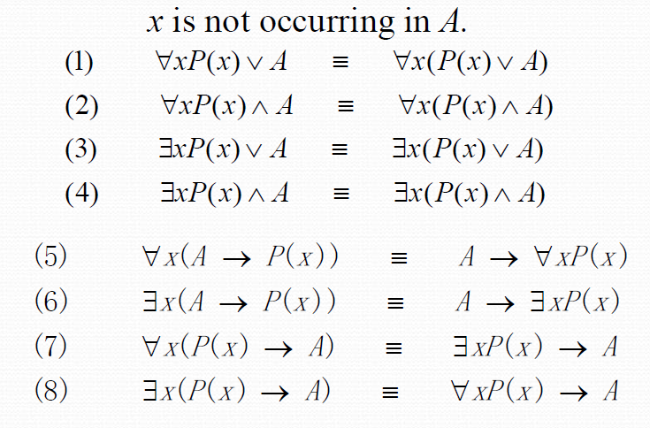
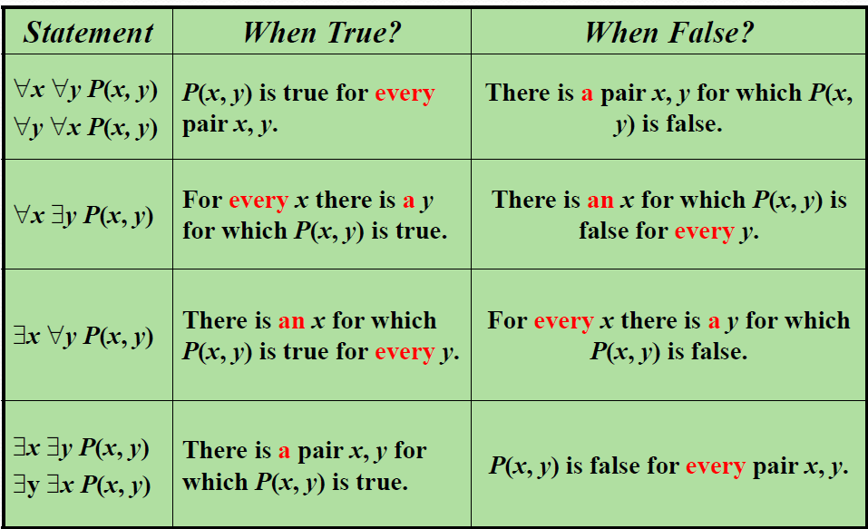
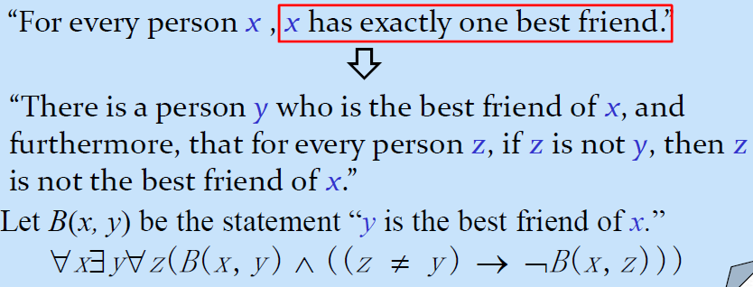

# Chapter 1 The Foundations:Logic and Proofs
## Part 1 Propositional Logic(命题逻辑)
### The language of propositional logic(命题逻辑的语言)
#### Constructing a Propositions
> Proposition(命题): A declarative sentence that is either true or false, but not both.

Compound Propositions(复合命题): Propositions that are formed by combining simpler propositions using logical connectives.

+ Propositional variables（命题变量）: p, q, r...
+ Logical connectives（逻辑连接词）: 
    - Negation ¬ （NOT）
    - Conjunction ∧ （AND）
    - Disjunction ∨ （OR）（可以二者兼具）
    - Exclusive or operator ⊕ （XOR）（只能二选其一）
    - Implication → （IF-THEN)
    - Biconditional ↔ （ IF AND ONLY IF / IFF）
    - NOR operator ↓ 
    - NAND operator | 
!!! note "more details about connectives"
    ??? info "implication"
        for p → q, p is called the **hypothesis/premise** and q is called the **conclusion/consequence**.
        
        p → q is false only when p is true and q is false.

        different ways to express p → q:

        - if p, then q
        - p only if q
        - p is sufficient for q
        - q is necessary for p

        converse(逆命题): q → p 
        
        inverse(否命题): ¬p → ¬q 
        
        contrapositive(逆否命题): ¬q → ¬p

    ??? info "biconditional"
        p ↔ q is true if p and q have the same truth value.

        different ways to express p ↔ q:

        - p if and only if q
        - p is necessary and sufficient for q
        - p iff q
    
    ??? info "NOR and NAND"
        NOR: ¬(p ∨ q)
        > also called Peirce's arrow

        NAND: ¬(p ∧ q)
        > also called Sheffer stroke

        NOR and NAND are called **universal gates** because any other logic gate can be constructed using **only** NOR or NAND gates.

        !!! eg
            p↓p = ¬(p ∨ p) = ¬p;
            p|p = ¬(p ∧ p) = ¬p;
            (p↓q)↓(p↓q) = p ∨ q;
    
    ??? info "Precedence(优先级)"
        1. ¬
        2. ∧, ∨, ⊕, ↓, | (注意这里按理来说没有优先级之分，但是为了少写点括号所以人为规定了优先级，此行从左到右优先级递减)
        3. →, ↔
        that means p ∨ q ∧ r actually is p ∨ (q ∧ r)

### Applications（应用）
+ Translating English Sentences
+ Consistent System Specification:为每个命题变量分配真值使所有命题都为真即可，否则系统不一致。
+ Boolean Search
+ Logic Puzzles

### Logical Equivalences(逻辑等价式)
+ Tautologies(永真式) 如 p ∨ ¬p always true
+ Contradictions(矛盾式) 如 p ∧ ¬p always false
+ Contingencies(可能式) 如 p ∨ q 

#### Show Logical Equivalences
1. using truth tables:万能但费事
2. using already-proved equivalences
??? note "some equivalences"

    + Commutative Laws(交换律)
        - p ∨ q ≡ q ∨ p
        - p ∧ q ≡ q ∧ p
    + Associative Laws(结合律)
        - (p ∨ q) ∨ r ≡ p ∨ (q ∨ r)
        - (p ∧ q) ∧ r ≡ p ∧ (q ∧ r)
    + Distributive Laws(分配律)
        - p ∨ (q ∧ r) ≡ (p ∨ q) ∧ (p ∨ r)
        - p ∧ (q ∨ r) ≡ (p ∧ q) ∨ (p ∧ r)
    + Idempotent Laws(幂等律)
        - p ∨ p ≡ p
        - p ∧ p ≡ p
    + Domination Laws(支配律)
        - p ∨ T ≡ T
        - p ∧ F ≡ F
    + Identity Laws(恒等律) 
        - p ∨ F ≡ p
        - p ∧ T ≡ p
    + De Morgan's Laws(德摩根定律)
        - ¬(p ∨ q) ≡ ¬p ∧ ¬q
        - ¬(p ∧ q) ≡ ¬p ∨ ¬q
    + Absorption Laws(吸收律)
        - p ∨ (p ∧ q) ≡ p
        - p ∧ (p ∨ q) ≡ p

    ??? extra "some more"
        
        
        

#### Dual(对偶)
+ The dual of a compound proposition is obtained by interchanging ∨  ∧ and ¬, and interchanging T and F.

+ Theorem: For any compound proposition P and Q, $P \Leftrightarrow Q$ if and only if $P^* \Leftrightarrow Q^*$.

#### Propositional Satisfiability(命题可满足性)
+ A compound proposition is satisfiable if **there is an assignment of truth values to its variables that makes it true**.
+ A compound proposition is unsatisfiable iff it is a **contradiction** or **its negation is a tautology**

### Propositional Normal Forms(命题范式)
+ Conjunctive Normal Form(CNF): a conjunction of disjunctions(合取范式)
+ Disjunctive Normal Form(DNF): a disjunction of conjunctions(析取范式)
!!! warning "注"
    + $\neg (p \wedge q) \vee r $ is not a normal form, but $(\neg p \vee \neg q) \vee r$ is.

    单个命题或字句也是 CNF 或 DNF

    如 $p$ 是 CNF 和 DNF，$p \vee q$ 也是 CNF 和 DNF
+ minterm and maxterm : 在计逻中有进一步学习和应用，遂不在这里记录
## Part 2 Predicate Logic(谓词逻辑)
### Predicates and Quantifiers(谓词和量词)

+ Predicate(谓词): A sentence that contains a finite number of variables and becomes a proposition when specific values are substituted for the variables.

形式上，谓词是一个函数，接受一个或多个参数，返回一个命题：
    + Variables:x,y,z...
    + Predicates:P(x), Q(x,y)...

+ Quantifiers(量词): 
    - Universal quantifier ∀(for all): $\forall x P(x)$
    - Existential quantifier ∃(there exists): $\exists x P(x)$ 
    - Unique quantifier ∃! (there exists unique): $\exists! x P(x)$

    给定domain,$ \forall $ 可以看作谓词逻辑函数的合取，$ \exists $ 可以看作谓词逻辑函数的析取。

    + precedence: $\forall, \exists$ higher than all the logical operators
    > but we often write $ \forall x P(x) \wedge Q(x) $ as $ \forall x (P(x) \wedge Q(x)) $ 

    + De Morgan's Laws for quantifiers
        - $ \neg \forall x P(x) \equiv \exists x \neg P(x) $
        - $ \neg \exists x P(x) \equiv \forall x \neg P(x) $
+ free variables(自由变量) and bound variables(约束变量)
> 量词的作用是约束变量，使得命题成立，而自由变量则是命题的参数，可以取任意值

+ valid and satisfiable
For an assertion involving predicates and quantifiers:
    + it is valid if 
        +it is true **for all domains**
        + every propositional function substitued for the predicates in the assertion
    + it is satisfiable if
        + it is true for **some domain**
        + some propositional functions that can be substituted for the predicates in the assertion to make it true.
        
### Nested Quantifiers(嵌套量词)
+ 可以看作嵌套的`for loop`
+ 顺序很重要，$ \forall x \exists y P(x,y) $ 和 $ \exists y \forall x P(x,y) $ 可能不同 
+ 否定依然满足De Morgan's Laws,逐层否定即可

+ translate 时注意 `exactly one`的翻译

## Part 3 Methods of Proof(证明方法) 
### Rules of Inference(推理规则)
#### Rules of Inference for Propositional Logic(命题逻辑的推理规则)
>感觉太理论化了？或者是我没有体会到其中的玄妙？

+ Modus Ponens（假言推理）: $(p \to q) \land p \to q$
+ Modus Tollens（取拒式）: $(p \to q) \land \neg q \to \neg p$
+ Hypothetical Syllogism（假言三段论）: $(p \to q) \land (q \to r) \to (p \to r)$
+ Disjunctive Syllogism（析取三段论）: $(p \lor q) \land \neg p \to q$
+ Addition（附加率）: $p \to (p \lor q)$
+ Simplification（化简率）: $(p \land q) \to q$
+ Resolution （消解率）: $((\neg p \lor r) \land (p \lor q)) \to (q \lor r)$

#### Rules of Inference for Quantified Statements(谓词逻辑的推理规则)
+ Universal instantiation（全称实例）: $\forall x P(x) \to P(c)$
+ Universal generalization（全称推广）: $P(c)  \to \forall x P(x)$
+ Existential instantiation（存在实例）: $\exists x P(x) \to P(c) $
+ Existential generalization（存在推广: $P(c) \to \exists x P(x)$
### Proof Methods and Strategy(证明方法)
> 作为初学算是学了点英文，这点东西并不足以让我的证明过程更严谨流畅符合逻辑，不过似乎也不必过分要求？

> 以及，可以看看lhjgg发的关于证明的[文章](img/proof.pdf)，似乎更有帮助一点

??? note "一些术语"
    theorem (定理)
    lemma (引理)
    corollary (推论)
    conjecture (猜想)

    Trivial Proof 平凡证明：we know q is true, so p → q is true

    Vacuous Proof 空证明：we know p is false, so p → q is true

    Direct Proof 直接证明 Proof by Contraposition 逆否证明 Proof by Contradiction 反证 Proof by Cases 分类讨论 

??? note "另一些术语"
    without loss of generality (WLOG) 不失一般性
    Existence Proof 存在性证明
    Constructive Proof 构造性证明
    Nonconstructive Proof 非构造性证明
    Uniqueness Proof 唯一性证明
    Counterexample 反例
    Inductive Proof 归纳证明

