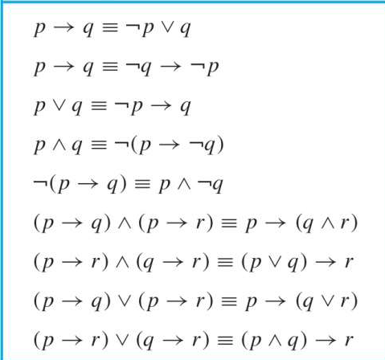
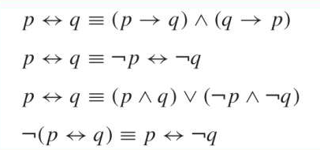

# Chapter 1 The Foundations:Logic and Proofs
## Part 1 Propositional Logic(命题逻辑)
### The language of propositional logic(命题逻辑的语言)
#### Constructing a Propositions
> Proposition(命题): A declarative sentence that is either true or false, but not both.

Compound Propositions(复合命题): Propositions that are formed by combining simpler propositions using logical connectives.

+ Propositional variables（命题变量）: p, q, r...
+ Logical connectives（逻辑连接词）: 
    - Negation ¬ （NOT）
    - Conjunction ∧ （AND）
    - Disjunction ∨ （OR）（可以二者兼具）
    - Exclusive or operator ⊕ （XOR）（只能二选其一）
    - Implication → （IF-THEN)
    - Biconditional ↔ （ IF AND ONLY IF / IFF）
    - NOR operator ↓ 
    - NAND operator | 
!!! note "more details about connectives"
    ??? info "implication"
        for p → q, p is called the **hypothesis/premise** and q is called the **conclusion/consequence**.
        
        p → q is false only when p is true and q is false.

        different ways to express p → q:

        - if p, then q
        - p only if q
        - p is sufficient for q
        - q is necessary for p

        converse(逆命题): q → p 
        
        inverse(否命题): ¬p → ¬q 
        
        contrapositive(逆否命题): ¬q → ¬p

    ??? info "biconditional"
        p ↔ q is true if p and q have the same truth value.

        different ways to express p ↔ q:

        - p if and only if q
        - p is necessary and sufficient for q
        - p iff q
    
    ??? info "NOR and NAND"
        NOR: ¬(p ∨ q)

        NAND: ¬(p ∧ q)

        NOR and NAND are called **universal gates** because any other logic gate can be constructed using **only** NOR or NAND gates.

        !!! eg
            p↓p = ¬(p ∨ p) = ¬p;
            p|p = ¬(p ∧ p) = ¬p
    
    ??? info "Precedence(优先级)"
        1. ¬
        2. ∧, ∨, ⊕, ↓, | (注意这里按理来说没有优先级之分，但是为了少写点括号所以人为规定了优先级，此行从左到右优先级递减)
        3. →, ↔
        that means p ∨ q ∧ r actually is p ∨ (q ∧ r)

### Applications（应用）
+ Translating English Sentences
+ Consistent System Specification:为每个命题变量分配真值使所有命题都为真即可，否则系统不一致。
+ Boolean Search
+ Logic Puzzles

### Logical Equivalences(逻辑等价式)
+ Tautologies(永真式) 如 p ∨ ¬p always true
+ Contradictions(矛盾式) 如 p ∧ ¬p always false
+ Contingencies(可能式) 如 p ∨ q 

#### Show Logical Equivalences
1. using truth tables:万能但费事
2. using already-proved equivalences
??? note "some equivalences"

    + Commutative Laws(交换律)
        - p ∨ q ≡ q ∨ p
        - p ∧ q ≡ q ∧ p
    + Associative Laws(结合律)
        - (p ∨ q) ∨ r ≡ p ∨ (q ∨ r)
        - (p ∧ q) ∧ r ≡ p ∧ (q ∧ r)
    + Distributive Laws(分配律)
        - p ∨ (q ∧ r) ≡ (p ∨ q) ∧ (p ∨ r)
        - p ∧ (q ∨ r) ≡ (p ∧ q) ∨ (p ∧ r)
    + Idempotent Laws(幂等律)
        - p ∨ p ≡ p
        - p ∧ p ≡ p
    + Domination Laws(支配律)
        - p ∨ T ≡ T
        - p ∧ F ≡ F
    + Identity Laws(恒等律) 
        - p ∨ F ≡ p
        - p ∧ T ≡ p
    + De Morgan's Laws(德摩根定律)
        - ¬(p ∨ q) ≡ ¬p ∧ ¬q
        - ¬(p ∧ q) ≡ ¬p ∨ ¬q
    + Absorption Laws(吸收律)
        - p ∨ (p ∧ q) ≡ p
        - p ∧ (p ∨ q) ≡ p

    ??? extra "some more"
        
        
        

## Part 2 Predicate Logic(谓词逻辑)
### Predicates and Quantifiers(谓词和量词)
### Logical Equivalences(逻辑等价式)
### Nested Quantifiers(嵌套量词)
## Part 3 Methods of Proof(证明方法) 
### Rules of Inference(推理规则)
### Proof Methods (证明方法)
### Proof Strategies(证明策略)