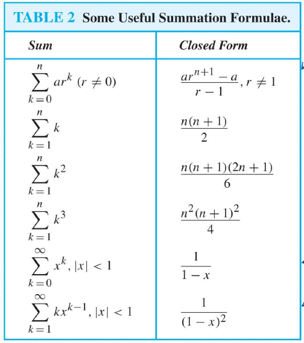
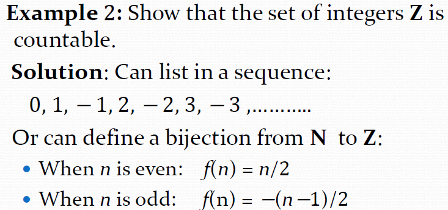
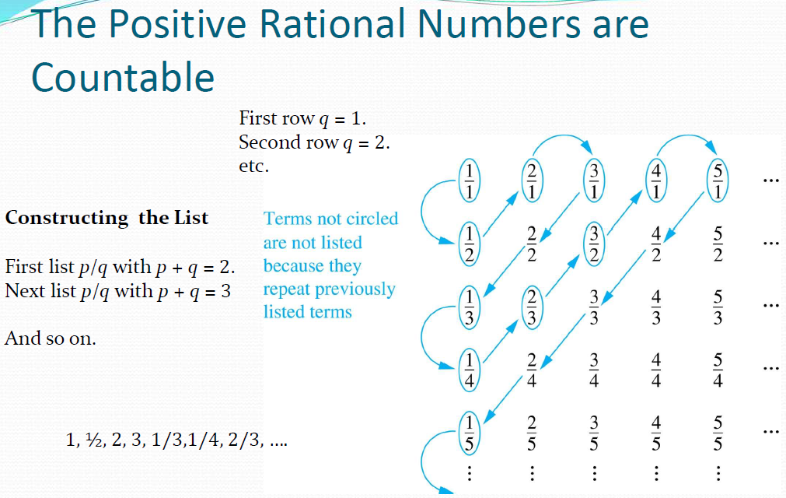
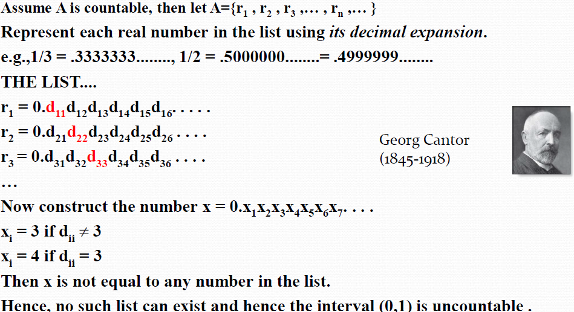
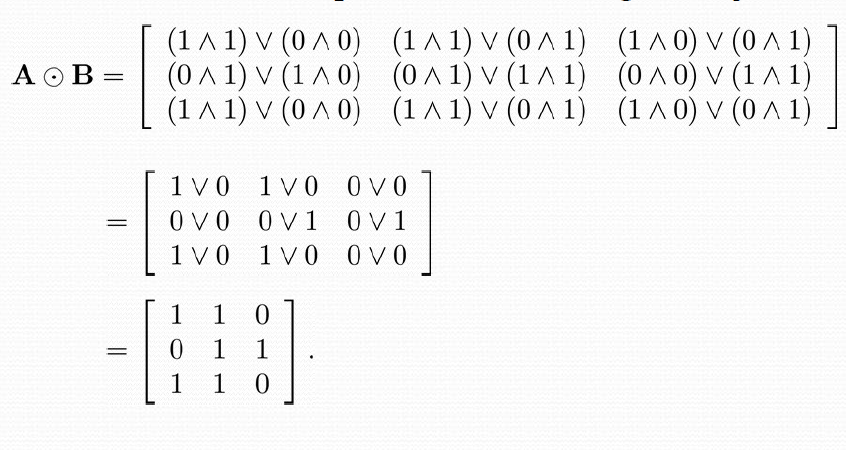

# Basic Structures: Sets, Functions, Sequences, Sums, and Matrices(基本结构：集合、函数、序列、求和、矩阵)

## Sets(集合)
### some fundamentals
+ a Set is an **unordered** collection of objects, the objects are called the elements or members of the set.

??? Section "some sets in mathematics" 
    $\mathbb{N}$: natural numbers 
    
    $\mathbb{Z}$: integers 
    
    $\mathbb{Z^+}$: positive integers 
    
    $\mathbb{Q}$: rational numbers 
    
    $\mathbb{R}$: real numbers 
    
    $\mathbb{C}$: complex numbers 

+ Two sets are equal if and only if they have the same elements.(regardless of the order)

+ Showing that A is a subset of B($A \subseteq B$):
    + For every element x in A, x is also in B.
    + $A \subseteq B \Leftrightarrow (\forall x)(x \in A \rightarrow x \in B)$

### Set Cardinality(集合的基数) and Power Set(幂集)
+ Cardinality is the number of elements in the set A, denoted by $|A|$.For example, $| \phi | = 0$.
+ Power Set of A, denoted by $\mathcal{P}(A)$, is the set of all subsets of A.
+ If $|A| = n$, then $|\mathcal{P}(A)| = 2^n$.

### Cartesian Product(笛卡尔积)
+ The Cartesian product of sets A and B, denoted by $A \times B$, is the set of all ordered pairs $(a, b)$, where $a \in A$ and $b \in B$.
    + A subset of $A \times B$ is called a **relation** from A to B.

### Set Operations(集合运算)
+ Union(并集): $A \cup B = \{ x | x \in A \text{ or } x \in B \}$
+ Intersection(交集): $A \cap B = \{ x | x \in A \text{ and } x \in B \}$
+ Difference(差集): $A - B = \{ x | x \in A \text{ and } x \notin B \}$
+ Complement(补集): $A^c = \{ x | x \notin A \}$
+ Symmetric Difference(对称差): $A \oplus B = (A - B) \cup (B - A)$
## Functions(函数)
### Definition of a Function 

+ A function from A to B is an assignment of exactly one element of B to each element of A.
+ A is called the **domain（定义域）** of the function, and B is called the **codomain（陪域）**
+ B is not equal to the **range(值域)** of the function sometimes.
+ when the domain of definition of f is equal to A, we say that f is a **total function**

### Injective, Surjective, and Bijective Functions(单射、满射和双射)
Injections:

+ A function f from A to B is called **injective(单射)** if for every $a_1, a_2 \in A$, if $f(a_1) = f(a_2)$, then $a_1 = a_2$.

Surjections:

+ A function f from A to B is called **surjective(满射)** or **onto** if for every $b \in B$, there exists an $a \in A$ such that $f(a) = b$.

Bijective:

+ A function f from A to B is called **bijective(双射)** if it is both injective and surjective.

### Inverse Functions(反函数)
+ **If f is a bijective function from A to B**, then there exists a unique function $f^{-1}$ from B to A such that $f^{-1}(f(a)) = a$ for every $a \in A$ and $f(f^{-1}(b)) = b$ for every $b \in B.
### Composition of Functions(函数的复合)
+ The composition of functions f and g, denoted by $f \circ g$, is the function from A to C defined by $(f \circ g)(x) = f(g(x))$ for every $x \in A$.

### Some Important Functions
+ the **floor function**, denoted by $ f(x) = \lfloor x \rfloor$, is the largest integer less than or equal to x.（向下取整）)
+ the **ceiling function**, denoted by $ f(x) = \lceil x \rceil$, is the smallest integer greater than or equal to x.（向上取整）

## Sequences(序列) and Sums(求和)
没什么新的，不赘述

## Cardinality of Sets(集合的基数)
+ $|A| = |B|$ iff there exists a bijection from A to B.
+ $|A| \leq |B|$ iff there exists an injection from A to B but no bijection from A to B.
+ **Countable/denumerable:** if it is finite or its elements can be put into one-to-one correspondence with the natural numbers.
+ When an infinite set is countable, its cardinality is $\aleph_0$, called **aleph-null**.
+ to show that a set is countable, we can list its elements in a sequence and construct a bijection between the set and the natural numbers.
??? eg
    
    

!!! property 
    + No infinite set has a smaller cardinality than a countable set.(无限集合的基数不会小于可数集合的基数，可用在证明中)
    + The union of a countable number of countable sets is countable.(可数个可数集合的并是可数的)

+ Cantor Diagonalization(康托对角线法)
    + The set of real numbers between 0 and 1 is uncountable.
    
    + The set of real numbers has the same cardinality as the interval (0, 1).(即实数集的基数与区间(0, 1)的基数相同，通过正切函数即可映射)

+ Schroder-Bernstein Theorem(施罗德-伯恩斯坦定理)
    + If there exist injections from A to B and from B to A, then there exists a bijection from A to B.
## Matrices(矩阵)
+ A square matrix A is called **symmetric(对称)** if $A^T = A$.
+ **Zero-One Matrices**: each element is either 0 or 1.
the boolean arithmetic for two zero-one matrices (say,$b_1,b_2$)is defined as follows:

$b_{1} \wedge b_{2}=\left\{\begin{array}{ll}
1 & \text { if } b_{1}=b_{2}=1 \\
0 & \text { otherwise }
\end{array} \quad b_{1} \vee b_{2}=\left\{\begin{array}{ll}
1 & \text { if } b_{1}=1 \text { or } b_{2}=1 \\
0 & \text { otherwise }
\end{array}\right.\right.$

+ **Boolean Product**: denoted by $A \odot B$.
Replace the usual product of two numbers by the $\land$, and the usual sum by the $\lor$.

??? eg
    for A = $\begin{bmatrix} 1 & 0 \\ 0 & 1 \\ 1 & 0 \end{bmatrix}$, B = $\begin{bmatrix} 1 & 1 & 0 \\ 0 & 1 & 1\end{bmatrix}$

    then 
    