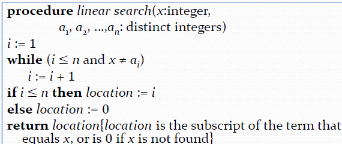
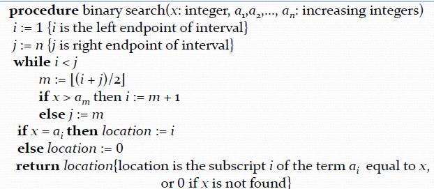

# Chapter 3 Algorithms (算法)

## Algorithm 
+ Def: A **finite** set of **precise** instructions for performing a computation or for solving a problem.(有限的、精确的指令集合，用于执行计算或解决问题)
+ Properties:
    - **Input**: Zero or more inputs.
    - **Output**: At least one output.
    - **Correctness**: The algorithm must produce the correct output for each input.
    - **Finiteness**: The algorithm must terminate after a finite number of steps.
    - **Effectiveness**: Each instruction must be basic enough to be carried out exactly and in a finite amount of time.
    - **Generality**: The algorithm must be applicable to a range of problems.

### Searching Algorithms
+ Linear Search:
 
+ Binary Search: Sort first

### Sorting Algorithms
+ Bubble Sort: Compare adjacent elements and swap them if they are in the wrong order.

+ Insertion Sort: Insert an element from the unsorted part into its correct position in the sorted part.

### Greedy Algorithms
+ Optimization problems(最优化问题): Find the best solution from a set of feasible solutions.
+ Greedy choice property: A global optimal solution can be reached by selecting the locally optimal choice.（某些情况下局部最优解可以导致整体最优解）

### Halting Problem(停机问题)
Q : Can we develop a procedure that takes as
input a computer program along with its input and
determines whether the program will eventually halt
with that input?
(即，是否存在一个进程，以某个计算机程序及其输入作为输入，并判断该程序在该输入下是否最终能停止)
??? info "Proof"
    + Assume that there is such a procedure and call it
    H(P,I). The procedure H(P,I) takes as input a program
    P and the input I to P.
    
        + H outputs “halt” if it is the case that P will stop when
        run with input I.
        + Otherwise, H outputs “loops forever.”
    + Since a program is a string of characters, we can call H(P,P). Construct a procedure K(P), which works as follows.

        + If H(P,P) outputs “loops forever” then K(P) halts
        
        + If H(P,P) outputs “halt” then K(P) goes into an infinite loop printing “ha” on each iteration.

    + Now we call K with K as input, i.e. K(K).
        + If the output of H(K,K) is “loops forever” then K(K) halts. A Contradiction.
        + If the output of H(K,K) is “halts” then K(K) loops forever. A Contradiction.
    + Therefore, there can not be a procedure that can
    decide whether or not an arbitrary program halts. The halting problem is unsolvable.

## Algorithm Analysis
+ Big-O: The upper bound of the growth rate of a function.
+ Big-Omega: The lower bound of the growth rate of a function.
+ Big-Theta: The tight bound of the growth rate of a function.

