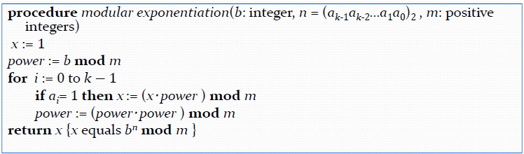

# Chapter 4 Number Theory and Cryptography （数论和密码学）
>只是概念的简单堆叠
## Part 1 Divisibility and Modular Arithmetic （整除性和模算术）

### Divisibility （整除性）
#### Division
+ **Definition**: Let a and b be integers with a ≠ 0. We say that a **divides** b, written as a | b, if there exists an integer c such that b = ac. If a | b, we also say that a is a **factor** or **divisor** of b and that b is a **multiple** of a. If a does not divide b, we write a ∤ b.

+ Theorem and Corollary: Let a, b, and c be integers,where$a \neq 0$:
    - If a | b and a | c, then a | (b + c)
    - If a | b and b | c, then a | c
    - If a | b and a | c, then a | (mb + nc) for any integers m and n 
    - If a | b, then a | bc for all integers c
#### Division Algorithm

+ Division Algorithm: Let a and d be integers with $d > 0$. Then there exist unique integers q and r such that $a = dq + r$ and $0 \leq r < d$

> d is called *divisor(除数)* 

> a is called *dividend(被除数)*

> q is called *quotient(商)*

> r is called *remainder(余数)*

符号表示：q = a **div** d , r = a **mod** d 

### Modular Arithmetic (模算术)
#### Congruence Relation (同余关系)
+ **Definition**: Let a, b, and n be integers with $n > 0$. We say that a is **congruent to b modulo n**,  if n divides $a - b$.

>written as $a \equiv b \pmod{n}$, If $a \equiv b \pmod{n}$, we also say that a and b are **congruent modulo n**.

??? info "theorem"
    1. if a and b are integers and m is a positive integer, then a is congruent to b modulo m if and only if m divides a - b.
    2. let m be a positive integer. The integers a and b are congruent modulo m if and only if there is an integer k such that a = b + km.
    3. $a \equiv b \pmod{m}$ if and only if $a \mod m = b \mod m$
    4. if $a \equiv b \pmod{m}$ and $c \equiv d \pmod{m}$, then $a + c \equiv b + d \pmod{m}$ and $ac \equiv bd \pmod{m}$

    ??? extra "Corollary"
        Let m be a positive integer and let a and b be integers. Then :
        
        + (a + b) (mod m) = (a mod m + b mod m) mod m  
        
        + (ab) (mod m) = (a mod m * b mod m) mod m

#### Arithmetic Modulo m (模 m 算术)
+ **Definition**: Let $Z_m$ be the set of nonegative integers less than m.
    - $+_m$ is defined by $a +_m b = (a + b) \mod m$
    - $\cdot_m$ is defined by $a \cdot_m b = (a \cdot b) \mod m$

+ Properties of modulo arithmetic
    - Closure : 对定义的两种运算封闭
    - Associative : 结合律
    - Commutative : 交换律
    - Distributive : 左右分配律都满足
    - Identity : 存在加法单位元 0 和乘法单位元 1
    - Additive Inverse : 只有加法逆元。

事实上，$<Z_m : +_m>$是一个交换群，$<Z_m : +_m, \cdot_m>$是一个交换环

## Part 2 Integer Representations and Algorithms （整数表示和算法）

### Integer Representations（整数表示）
+ *base b expansion of n(n的b进制展开式)*：

$n = a_kb^k + a_{k-1}b^{k-1} + \cdots + a_1b + a_0 $

you can also denote it as $n = (a_ka_{k-1} \cdots a_1a_0)_b$
### Base Conversion Algorithm（进制转换算法）
+ Convert an integer n from base 10 to base b:
    1. $n = bq_0 + a_0$ 
    2. $q_0 = bq_1 + a_1$
    3. until $q_k = 0$ ,then $n = (a_ka_{k-1} \cdots a_1a_0)_b$
+ Binary to Octal and Hexadecimal
    - Binary to Octal: 3 binary digits correspond to 1 octal digit
    - Binary to Hexadecimal: 4 binary digits correspond to 1 hexadecimal digit 
### Algorithms for Integer Operations（整数运算算法）
+ 加法：逐位加，进位
+ 乘法：二进制可以看作左移后相加
+ div 和 mod
+ modular exponentiation(模指数运算): 类似快速幂
