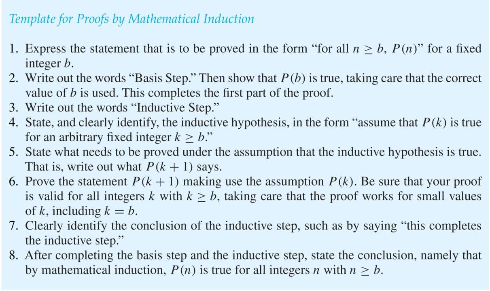
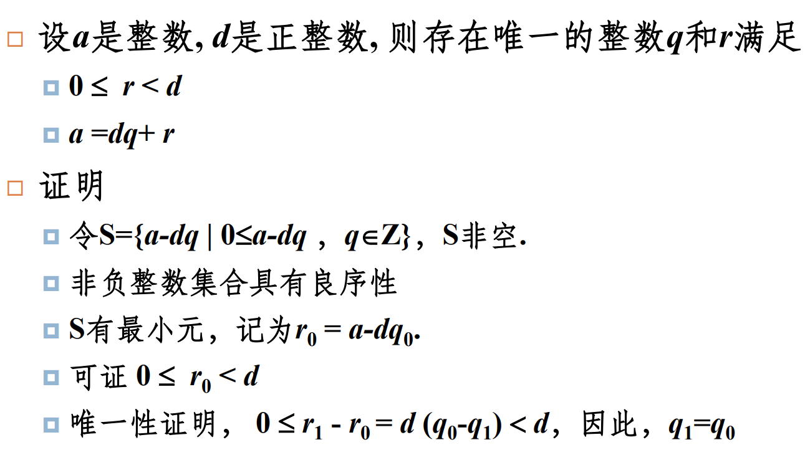

# Chapter 5 Induction and Recursion （归纳和递归）
---------------------------------
## Mathematical Induction （数学归纳）

### Mathematical Induction Principle （数学归纳原理）

To prove that a statement P(n) is true for all positive integers n, we follow these steps:

+ **Basis Step**: Verify that the statement is true for n = 1.
+ **Inductive Step**: Assume that P(k) is true for an arbitrary positive integer k, called the **induction hypothesis(归纳假设)**. Then show that P(k + 1) is true.

It can be expressed as the rule of inference:

$P(1) \land (\forall k , P(k) \rightarrow P(k + 1)) \longrightarrow (\forall n , P(n))$

Proofs by mathematical induction do not always start at n = 1.

### Guidelines for Proofs by Induction

## Strong Induction （强归纳）
+ Strong Induction Principle: To prove that a statement P(n) is true for all positive integers n, we follow these steps:
    + **Basis Step**: Verify that the statement is true for n = 1.
    + **Inductive Step**: Assume that P(1), P(2), ..., P(k) are true for an arbitrary positive integer k, called the **induction hypothesis**. Then show that P(k + 1) is true.
+ Strong Induction is sometimes called the second principle of mathematical induction or complete induction.

??? question "which one should I use"
    + We can always use strong induction instead of mathematical induction.
    + In fact, the two forms of induction are equivalent.
    + Sometimes it is clear how to proceed using one of the forms of induction but not the other.
## Well-Ordering （良序）
+ Well-ordering property: Every nonempty set of nonnegative integers has a least element.

!!! warning "note"
    + The validities of both mathematical induction and strong induction depend on the well-ordering property
    + Those three principles are equivalent.

??? eg
    
## Recursive Definitions and Structural Induction （递归定义和结构归纳）
+ Lame's Theorem: Let a and b be positive integers with a ≥ b. Then the number of divisions used by the Euclidian algorithm to find gcd(a,b) is less than or equal to five times the number of decimal digits in b.
+ Recursive Definition: consists of two parts:
    + **Basis Step**
    + **Recursive Step**
+ Structural Induction: A proof technique that is used to prove that a statement is true for all elements of a recursively defined set:
    - **Basis Step**: Prove that the statement is true for the basis elements.
    - **Inductive Step**:Show that if the statement is true for
    each of the elements used to construct new elements in
    the recursive step of the definition, the result holds for
    these new elements.(针对新元素产生规则，若相关元素满足命题则新元素满足命题)

+ Generalized Induction(广义数归): prove results about sets other than the integers