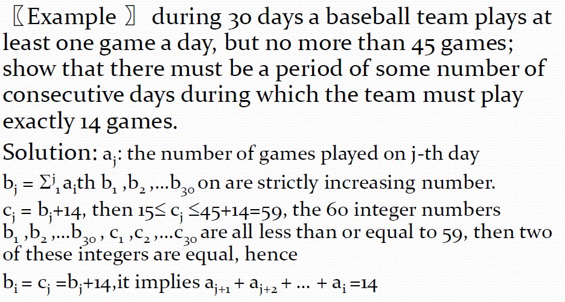
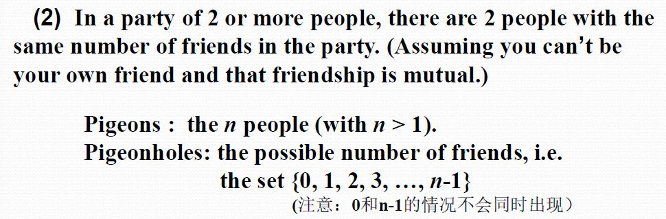

# Chapter 6 Counting(计数)
> 小学奥数？

## The Basics of Counting(计数基础)

+ **Product Rule(乘法原理)**: If there are $n_1$ ways to do the first task and $n_2$ ways to do the second task, then there are $n_1 \times n_2$ ways to do both tasks.

+ **Sum Rule(加法原理)**: If there are $n_1$ ways to do the first task and $n_2$ ways to do the second task, and the tasks cannot be done at the same time, then there are $n_1 + n_2$ ways to do one of the tasks.

+ **The Sum Rule for Counting(求和法则)**: If a set $S$ is the union of $k$ disjoint subsets $S_1, S_2, \cdots, S_k$, then $|S| = |S_1| + |S_2| + \cdots + |S_k|$.

+ **Subtraction Rule(减法原理)**: If there are $n_1$ ways to do a task and $n_2$ other ways to do the task, then there are $n_1 + n_2$ **minus** the number of ways that are duplicated.
(实则就是容斥原理)

+ **Division Rule(除法原则)**: There are n/d ways to do a task if it can be done using a procedure that can be carried out in n ways, and for every way w, exactly d of the n ways correspond to way w.
## The Pigeonhole Principle(鸽巢原理)
> 即抽屉原理

+ The Pigeonhole Principle(鸽巢原理): If $k$ is a positive integer and **$k+1$ or more objects are placed into $k$ boxes, then there is at least one box containing two or more of the objects**.

+ Generalized Pigeonhole Principle(广义鸽巢原理): **If $N$ objects are placed into $k$ boxes, then there is at least one box containing at least $\lceil N/k \rceil$ objects.**
    + proof: by contraposition, if all boxes contain less than $\lceil N/k \rceil$ objects, then the total number of objects is less than $k \times \lceil N/k \rceil = N$, which is a contradiction.
??? eg
    

在用鸽巢原理证明时，最关键的是要找到一个合适的“盒子”和“鸽子”的对应关系。例如下面的例子：

## Permutations and Combinations(排列与组合)
+ **Permutation(排列)**: An arrangement of $r$ objects from a set of $n$ objects is called a permutation of $n$ objects taken $r$ at a time. The number of permutations of $n$ objects taken $r$ at a time is denoted by $P(n, r)$

$$P(n, r) = n \times (n-1) \times \cdots \times (n-r+1) = \frac{n!}{(n-r)!}$$

+ **Combination(组合)**: An arrangement of $r$ objects from a set of $n$ objects, where the order of the objects does not matter, is called a combination of $n$ objects taken $r$ at a time. The number of combinations of $n$ objects taken $r$ at a time is denoted by $C(n, r)$.

$$C(n, r) = \frac{P(n, r)}{r!} = \frac{n!}{r!(n-r)!}$$

+ $C(n, r) = C(n, n-r)$
+ $C(n, r) = C(n-1, r) + C(n-1, r-1)$

剩下的希望能请神请到高三的自己

## Binomial Coefficients(二项式系数)
+ **Binomial Theorem(二项式定理)**: For any positive integer $n$ and any real numbers $x$ and $y$, $(x+y)^n = \sum_{k=0}^{n} C(n, k) \times x^{n-k} \times y^k$
+ **Binomial Coefficients(二项式系数)**: **$C(n, k)$** is the coefficient of $x^{n-k} \times y^k$ in the expansion of $(x+y)^n$,**also denoted by $\binom{n}{k}$**.
+ Corollary(推论1): $\sum_{k=0}^{n} C(n, k) = 2^n$
+ Corollary(推论2): $\sum_{k=0}^{n} (-1)^k \times C(n, k) = 0$
    + proof: $(1-1)^n = \sum_{k=0}^{n} C(n, k) \times 1^{n-k} \times (-1)^k = \sum_{k=0}^{n} (-1)^k \times C(n, k)$
+ Corollary(推论3): $\sum_{k=0}^{n} 2^k \times C(n, k) = 3^n$
    + proof: $(1+2)^n = \sum_{k=0}^{n} C(n, k) \times 1^{n-k} \times 2^k = \sum_{k=0}^{n} 2^k \times C(n, k)$

+ **Pascal's Identity(帕斯卡恒等式)**: $C(n, k) = C(n-1, k) + C(n-1, k-1)$
    + proof: $(x+y)^n = \sum_{k=0}^{n} C(n, k) \times x^{n-k}  y^k = \sum_{k=0}^{n} C(n-1, k) \times x^{n-k}  y^k + \sum_{k=0}^{n} C(n-1, k-1) \times x^{n-k}  y^k$

> 其实就是杨辉三角。

+ **Vandermonde's Identity(范德蒙恒等式)**: $C(m+n, r) = \sum_{k=0}^{r} C(m, r-k) \times C(n, k)$
    + proof: $(x+y)^{m+n} = (x+y)^m \times (x+y)^n = \sum_{k=0}^{m} C(m, k) \times x^{m-k} \times y^k \times \sum_{j=0}^{n} C(n, j) \times x^{n-j} \times y^j = \sum_{r=0}^{m+n} \sum_{k=0}^{r} C(m, k) \times C(n, r-k) \times x^{m+n-r} \times y^r$
+ Corollary(推论): $C(2n, n) = \sum_{k=0}^{n} C(n, k)^2$
    + proof: $C(2n, n) = \sum_{k=0}^{n} C(n, k) \times C(n, n-k) = \sum_{k=0}^{n} C(n, k)^2$
+ Corollary(推论): $C(n+1, k+1) = \sum_{j=0}^{n} C(j, k)$
    + proof: $C(n+1, k+1) = C(n, k) + C(n, k+1) = C(n, k) + C(n-1, k) + C(n-1, k+1) = \cdots = \sum_{j=0}^{n} C(j, k)$

<table><tr><td bgcolor=PowderBlue>开摆！</td></tr></table>