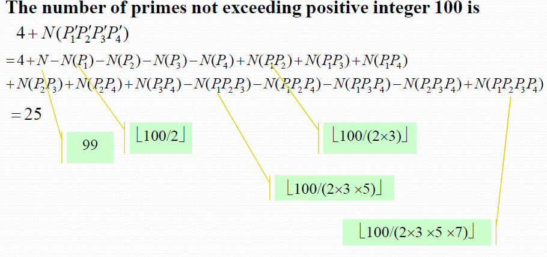

# Chapter 8 Advanced Counting Techniques(高级计数技术)

## Application of Recurrence Relations(递归关系的应用)
+ Definition: A **recurrence relation** for the sequence $a_0, a_1, a_2, \cdots$ is an equation that expresses $a_n$ in terms of one or more of the previous terms of the sequence, namely, $a_0, a_1, \cdots, a_{n-1}$, for all integers $n$ with $n \geq n_0$, where $n_0$ is a nonnegative integer.

+ A sequence that satisfies a recurrence relation is called a **solution** of the recurrence relation.

+ The **initial conditions** for a recurrence relation specify the values of the terms $a_0, a_1, \cdots, a_{n_0-1}$.

+ The **Degree** of a recurrence relation is the largest integer $k$ such that $a_n$ is defined in terms of $a_{n-1}, a_{n-2}, \cdots, a_{n-k}$; e.g. $a_n = a_{n-1} + a_{n-8}$ has degree 8.

??? eg 
    + The Fibonacci sequence $F_0, F_1, F_2, \cdots$ is defined by the recurrence relation $F_n = F_{n-1} + F_{n-2}$ for $n \geq 2$ and the initial conditions $F_0 = 0$ and $F_1 = 1$.

    + The Hanoi sequence $H_0, H_1, H_2, \cdots$ is defined by the recurrence relation $H_n = 2H_{n-1} + 1$ for $n \geq 1$ and the initial condition $H_0 = 0$.

    + Catalan numbers $C_0, C_1, C_2, \cdots$ are defined by the recurrence relation $C_n = \sum_{i=0}^{n-1} C_iC_{n-1-i}$ for $n \geq 1$ and the initial condition $C_0 = 1$.

??? extra 
    Frame-Stewart algorithm: To solve the Tower of Hanoi problem with $n$ disks and 4 pegs. Given the number of disks $n$ as input, the algorithm depends on a choice of a parameter $k(1 \leq k \leq n)$, which is the number of disks that are moved in each recursive call. The algorithm is as follows:

    1. If $n = 0$, then do nothing.
    2. If $n = 1$, then move the disk from peg 1 to peg 4.
    3. For $n \geq 2$, do the following:
        1. Apply the Frame-Stewart algorithm to move $n-k$ disks from peg 1 to peg 2.(四塔均用)
        2. Move the remaining $k$ disks from peg 1 to peg 4.(只用除去1之外的三个塔，这里使用汉诺塔的常规算法)
        3. Apply the Frame-Stewart algorithm to move $n-k$ disks from peg 2 to peg 4.(四塔均用)
    k should be chosen to minimize the total number of moves.
         

## Solving Linear Recurrence Relations(解线性递归方程)

### Homogeneous Linear Recurrence Relations(齐次线性递归关系)
+ **linear**: $a_n = c_1a_{n-1} + c_2a_{n-2} + \cdots + c_ka_{n-k}$, where $c_1, c_2, \cdots, c_k$ are constants and $c_k \neq 0$.(例如$a_n = a_{n-1} + a^2_{n-2}$不是线性的)
+ **homogeneous**: no terms occur that are not multiples of $a_i$ for some $i$,i.e., $c_1, c_2, \cdots, c_k$ are constants.(例如$a_n = a_{n-1} + 1$不是齐次的)
+ **coefficients**: $c_1, c_2, \cdots, c_k$ are called the coefficients of the recurrence relation.**In this definition, coefficents are constants, instead of functions of $n$.**
+ **degree**: the largest integer $k$ such that $a_n$ is defined in terms of $a_{n-1}, a_{n-2}, \cdots, a_{n-k}$.

#### Characteristic Equation(特征方程)
+ The characteristic equation of the homogeneous linear recurrence relation **$a_n = c_1a_{n-1} + c_2a_{n-2} + \cdots + c_ka_{n-k}$** is **$x^k - c_1x^{k-1} - c_2x^{k-2} - \cdots - c_k = 0$**

For the Degree-2 case:
!!! abstract
    + Let $c_1, c_2$ be real numbers. Suppose that **$r^2 - c_1r - c_2 = 0$** has **two distinct roots $r_1, r_2$**. Then the sequence $\left \{  a_n \right \}$ is a solution to the recurrence relation **$a_n = c_1a_{n-1} + c_2a_{n-2}$** if and only if there are real numbers $A, B$ such that **$a_n = A(r_1)^n + B(r_2)^n$** for all integers $n \geq 0$.

    + When the roots are **equal**, the general solution is **$a_n = (A + Bn)(r_1)^n$** for all integers $n \geq 0$.

    ??? eg
        + The Fibonacci sequence $F_0, F_1, F_2, \cdots$ is a solution to the recurrence relation $F_n = F_{n-1} + F_{n-2}$ with initial conditions $F_0 = 0$ and $F_1 = 1$.
        + The characteristic equation is $x^2 - x - 1 = 0$, which has roots $r_1 = \frac{1 + \sqrt{5}}{2}$ and $r_2 = \frac{1 - \sqrt{5}}{2}$. Therefore, the general solution to the recurrence relation is $F_n = A(\frac{1 + \sqrt{5}}{2})^n + B(\frac{1 - \sqrt{5}}{2})^n$ for all integers $n \geq 0$. 

!!! abstract 
    For the Degree-k case:
    + Let $c_1, c_2, \cdots, c_k$ be real numbers. Suppose that **$x^k - c_1x^{k-1} - c_2x^{k-2} - \cdots - c_k = 0$** has $k$ distinct roots $r_1, r_2, \cdots, r_k$. Then the sequence $\left \{  a_n \right \}$ is a solution to the recurrence relation **$a_n = c_1a_{n-1} + c_2a_{n-2} + \cdots + c_ka_{n-k}$** if and only if there are real numbers $A_1, A_2, \cdots, A_k$ such that **$a_n = A_1(r_1)^n + A_2(r_2)^n + \cdots + A_k(r_k)^n$** for all integers $n \geq 0$.

    When the roots are **not distinct**:

    Let $c_1, c_2, \cdots, c_k$ be real numbers.Suppose that the characeristic equation **$x^k - c_1x^{k-1} - c_2x^{k-2} - \cdots - c_k = 0$** has t roots $r_1, r_2, \cdots, r_t$ of **multiplicity $m_1, m_2, \cdots, m_t$**respectively. Then the sequence $\left \{  a_n \right \}$ is a solution to the recurrence relation **$a_n = c_1a_{n-1} + c_2a_{n-2} + \cdots + c_ka_{n-k}$** if and only if 

    $$
    \begin{align*}
    a_n &= (A_{1,0} + A_{1,1}n + A_{1,2}n^2 + \cdots + A_{1,m_1-1}n^{m_1-1})r_1^n \\
    &+ (A_{2,0} + A_{2,1}n + A_{2,2}n^2 + \cdots + A_{2,m_2-1}n^{m_2-1})r_2^n \\
    &+ \cdots + (A_{t,0} + A_{t,1}n + A_{t,2}n^2 + \cdots + A_{t,m_t-1}n^{m_t-1})r_t^n
    \end{align*}
    $$

    for all integers $n \geq 0$.

### Nonhomogeneous Linear Recurrence Relations(非齐次线性递归关系)
+ **nonhomogeneous**: $a_n = c_1a_{n-1} + c_2a_{n-2} + \cdots + c_ka_{n-k} + f(n)$, where $f(n)$ is a function of $n$ that is not a linear combination of the previous terms of the sequence.

+ **associated homogeneous linear recurrence relation**: $a_n = c_1a_{n-1} + c_2a_{n-2} + \cdots + c_ka_{n-k}$

!!! abstract
    If $\left \{  a_n^{(p)} \right \}$ is a **particular solution** to the nonhomogeneous linear recurrence relation **$a_n = c_1a_{n-1} + c_2a_{n-2} + \cdots + c_ka_{n-k} + f(n)$**, then every solution to the nonhomogeneous linear recurrence relation is of the form $\left \{  a_n^{(p)} + a_n^{(h)} \right \}$, where $\left \{  a_n^{(h)} \right \}$ is a solution to the associated homogeneous linear recurrence relation.
    !!! note
        
## Divide-and-Conquer Algorithms and Recurrence Relations(分治算法和递归关系)
??? example 
    
    1. 二分查找
    2. 归并排序
    3. 快速幂

!!! note 
    

!!! note   
      
 
## Generating Functions(生成函数)
**The generating function for the sequence $a_0, a_1, a_2, \cdots a_k, \cdots$ is $G(x) = \sum_{k=0}^{\infty}a_kx^k$**

??? eg
    $a_k = C(n, k)$, the binomial coefficient, then the generating function is $(1 + x)^n$.

!!! note
    Let $f(x) = \sum_{k=0}^{\infty}a_kx^k$ and $g(x) = \sum_{k=0}^{\infty}b_kx^k$. Then :

    1. $f(x) + g(x) = \sum_{k=0}^{\infty}(a_k + b_k)x^k$

    2. $f(x)g(x) = \sum_{k=0}^{\infty}(\sum_{i=0}^{k}a_ib_{k-i})x^k$ 

    3. $\alpha f(x) = \sum_{k=0}^{\infty}\alpha a_kx^k$

    4. $f(\alpha x) = \sum_{k=0}^{\infty}a_k(\alpha x)^k = \sum_{k=0}^{\infty}\alpha^ka_kx^k$

    5. $f'(x) = \sum_{k=0}^{\infty}ka_kx^{k-1}$

    6. $xf(x) = \sum_{k=0}^{\infty}a_kx^{k+1} = \sum_{k=1}^{\infty}a_{k-1}x^k$

!!! note "extended Binomial Theorem"
    Let $n$ be a real number and $k$ be a nonnegative integer. Then $C(n, k) = \frac{n(n-1)(n-2) \cdots (n-k+1)}{k!}$, when $k = 0$, $C(n, 0) = 1$.

    Let $n$ be a real number and $k$ be a nonnegative integer. Then $(1 + x)^n = \sum_{k=0}^{\infty}C(n, k)x^k$.

some useful generating functions:

+ Using Generating Functions to Solve Recurrence Relations(使用生成函数解递归关系)
    + **Linear Recurrence Relations**: Let $G(x)$ be the generating function for the sequence $a_0, a_1, a_2, \cdots$. If the recurrence relation for the sequence is $a_n = c_1a_{n-1} + c_2a_{n-2} + \cdots + c_ka_{n-k}$, then the generating function for the sequence is $G(x) = \frac{g(x)}{1 - c_1x - c_2x^2 - \cdots - c_kx^k}$.

    + **Nonhomogeneous Linear Recurrence Relations**: Let $G(x)$ be the generating function for the sequence $a_0, a_1, a_2, \cdots$. If the recurrence relation for the sequence is $a_n = c_1a_{n-1} + c_2a_{n-2} + \cdots + c_ka_{n-k} + f(n)$, then the generating function for the sequence is $G(x) = \frac{g(x) + F(x)}{1 - c_1x - c_2x^2 - \cdots - c_kx^k}$, where $F(x)$ is the generating function for the sequence $f(0), f(1), f(2), \cdots$.

    + **Divide-and-Conquer Algorithms**: Let $G(x)$ be the generating function for the sequence $a_0, a_1, a_2, \cdots$. If the recurrence relation for the sequence is $a_n = c_1a_{n-1} + c_2a_{n-2} + \cdots + c_ka_{n-k} + f(n)$, then the generating function for the sequence is $G(x) = \frac{g(x) + F(x)}{1 - c_1x - c_2x^2 - \cdots - c_kx^k}$, where $F(x)$ is the generating function for the sequence $f(0), f(1), f(2), \cdots$.

??? eg
    
    
    
    

## Inclusion-Exclusion(容斥原理)

+ Two Finite Sets: $|A \cup B| = |A| + |B| - |A \cap B|$

+ Three Finite Sets: $|A \cup B \cup C| = |A| + |B| + |C| - |A \cap B| - |A \cap C| - |B \cap C| + |A \cap B \cap C|$

+ n Finite Sets: $|A_1 \cup A_2 \cup \cdots \cup A_n| = \sum_{i=1}^{n}|A_i| - \sum_{1 \leq i < j \leq n}|A_i \cap A_j| + \sum_{1 \leq i < j < k \leq n}|A_i \cap A_j \cap A_k| - \cdots + (-1)^{n-1}|A_1 \cap A_2 \cap \cdots \cap A_n|$

## Applications of Inclusion-Exclusion(容斥原理的应用)
+ An alternative form of inclusion-exclusion: 

+ The sieve of Eratosthenes(埃拉托斯特尼筛法): To find all prime numbers less than or equal to a given integer $n$.

+ The number of **onto functions** from a set with $m$ elements to a set with $n$ elements is $n^m - C(n, 1)(n-1)^m + C(n, 2)(n-2)^m - \cdots + (-1)^{n-1}C(n, n-1)(n-n+1)^m$.

+ **Derangements**(错位排列/): A permutation of a set of distinct objects is called a derangement if no object appears in its original position. The number of derangements of a set of $n$ distinct objects is $D_n = n!(1 - \frac{1}{1!} + \frac{1}{2!} - \cdots + (-1)^n\frac{1}{n!})$